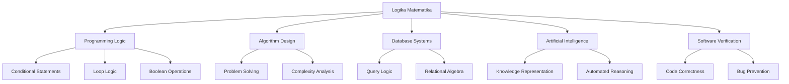
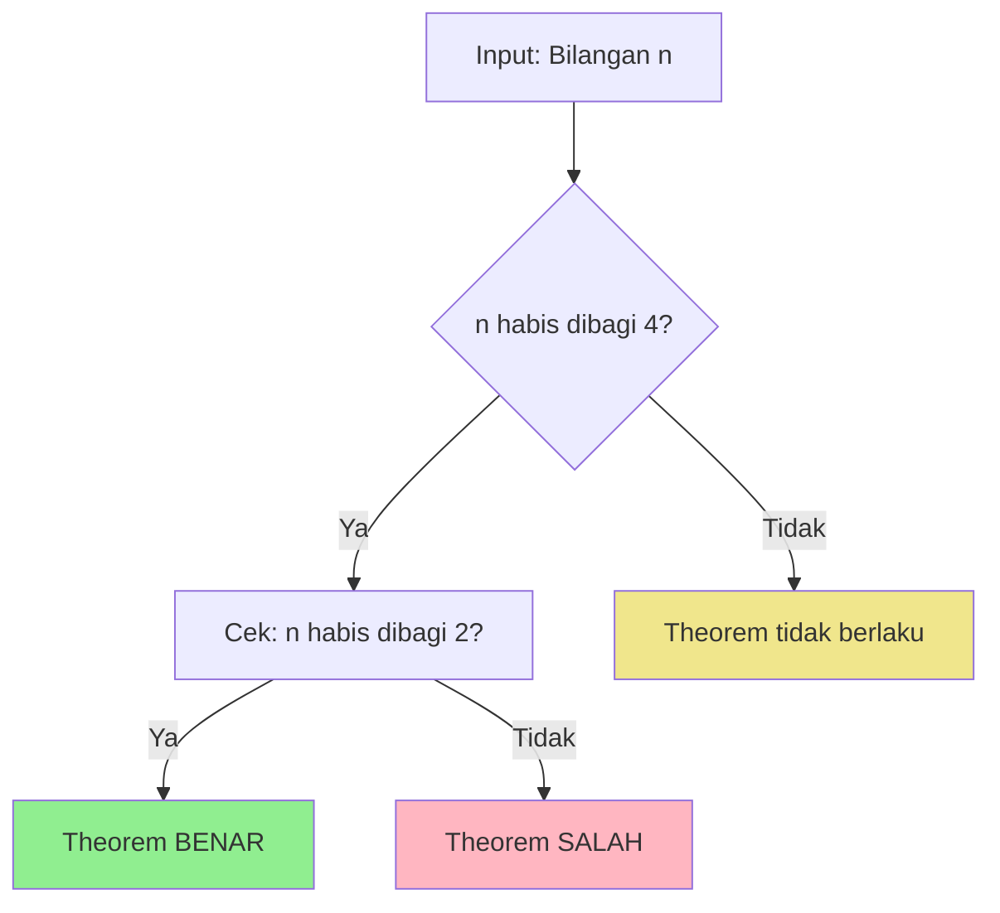
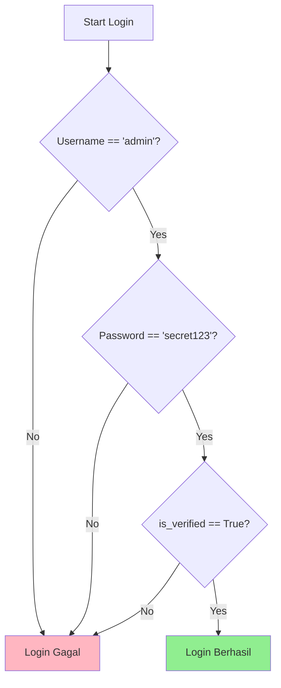
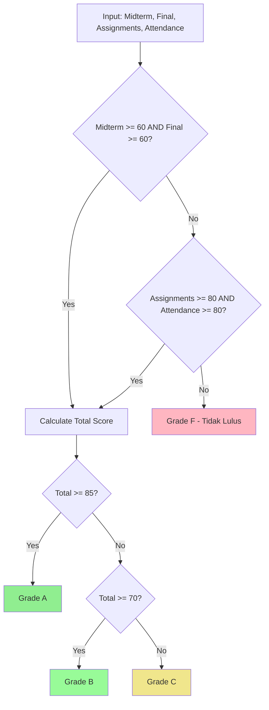
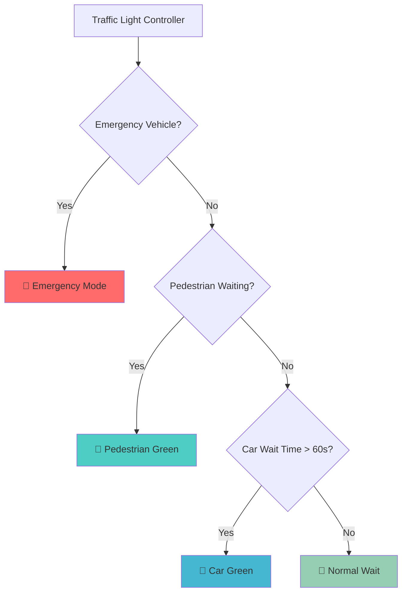
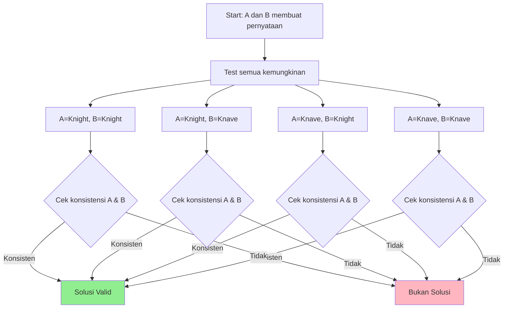

# 📚 Pertemuan 1: Pengenalan dan Dasar-dasar Logika Matematika


---

## 🎯 Tujuan Pembelajaran

Setelah mengikuti pertemuan ini, mahasiswa diharapkan mampu:

1. **Memahami** pentingnya logika matematika dalam bidang informatika
2. **Menjelaskan** konsep dasar mathematical reasoning dan logical thinking
3. **Mengidentifikasi** aplikasi logika dalam programming sehari-hari
4. **Menerapkan** pemikiran logis dalam penyelesaian masalah sederhana

---

## 📖 Materi Pembelajaran

### 1. Orientasi Mata Kuliah dan Relevansi untuk Informatika

#### 🔍 Apa itu Logika Matematika?

**Logika Matematika** adalah cabang matematika yang mempelajari sistem formal untuk penalaran yang benar. Dalam konteks informatika, logika matematika berfungsi sebagai:

- **"Kalkulus Ilmu Komputer"** - dasar untuk semua disiplin komputasi
- **Fondasi untuk Programming** - membangun pemikiran algoritmik yang terstruktur
- **Tools untuk Verifikasi** - memastikan kebenaran dan kehandalan sistem software

#### 💼 Mengapa Penting untuk Mahasiswa Informatika?



**Aplikasi Nyata dalam Industri:**

1. **Software Engineering**: Formal verification untuk sistem kritis (aerospace, medical devices)
2. **Cybersecurity**: Cryptographic protocols dan security analysis
3. **AI/Machine Learning**: Knowledge representation dan automated reasoning
4. **Database Systems**: Query optimization dan data integrity
5. **Blockchain**: Smart contract verification dan consensus mechanisms

---

### 2. Pengantar Mathematical Reasoning dan Logical Thinking

#### 🧠 Apa itu Mathematical Reasoning?

**Mathematical Reasoning** adalah proses berpikir sistematis yang menggunakan logika untuk:
- Menganalisis masalah secara terstruktur
- Membuat kesimpulan yang valid berdasarkan premis yang diberikan
- Membangun argumen yang koheren dan dapat diverifikasi

#### 🔄 Perbedaan Logical Thinking vs Intuitive Thinking

| **Logical Thinking** | **Intuitive Thinking** |
|---------------------|------------------------|
| Berdasarkan aturan formal | Berdasarkan feeling/instinct |
| Dapat diverifikasi | Sulit diverifikasi |
| Konsisten dan repeatable | Dapat bervariasi |
| Cocok untuk programming | Cocok untuk kreativitas |

#### 📝 Contoh Sederhana Mathematical Reasoning

**Masalah**: Buktikan bahwa jika suatu bilangan habis dibagi 4, maka bilangan tersebut juga habis dibagi 2.

**Solusi menggunakan Mathematical Reasoning:**

```python
# Contoh implementasi logical reasoning dalam Python
def is_divisible_by_4(n):
    """Mengecek apakah bilangan n habis dibagi 4"""
    return n % 4 == 0

def is_divisible_by_2(n):
    """Mengecek apakah bilangan n habis dibagi 2"""
    return n % 2 == 0

def verify_theorem(n):
    """
    Memverifikasi: Jika n habis dibagi 4, maka n habis dibagi 2
    """
    if is_divisible_by_4(n):
        return is_divisible_by_2(n)
    return True  # Theorem tidak berlaku jika premis salah

# Test dengan beberapa angka
test_numbers = [4, 8, 12, 16, 20, 5, 7, 9]

print("Verifikasi Theorem: Jika n habis dibagi 4, maka n habis dibagi 2")
print("-" * 60)
for num in test_numbers:
    div_by_4 = is_divisible_by_4(num)
    div_by_2 = is_divisible_by_2(num)
    theorem_holds = verify_theorem(num)
    
    print(f"n = {num:2d} | Habis dibagi 4: {div_by_4} | Habis dibagi 2: {div_by_2} | Theorem: {theorem_holds}")
```

**💡 Jalankan kode ini di: [www.onlineide.pro](https://www.onlineide.pro)**



---

### 3. Aplikasi Logic dalam Programming

#### 💻 Conditional Statements sebagai Logical Operations

Dalam programming, kita menggunakan logika setiap hari tanpa menyadarinya:

```python
# Contoh 1: Login System menggunakan Logical AND
def login_system(username, password, is_verified):
    """
    Sistem login dengan tiga kondisi:
    1. Username harus benar
    2. Password harus benar  
    3. Akun harus sudah diverifikasi
    """
    # Logical AND operation: semua kondisi harus TRUE
    if username == "admin" and password == "secret123" and is_verified:
        return "Login Berhasil!"
    else:
        return "Login Gagal!"

# Test cases
print("=== Test Login System ===")
print(login_system("admin", "secret123", True))   # Berhasil
print(login_system("admin", "wrong", True))       # Gagal: password salah
print(login_system("user", "secret123", True))    # Gagal: username salah
print(login_system("admin", "secret123", False))  # Gagal: belum verified
```



```python
# Contoh 2: Grading System menggunakan Logical OR dan AND
def calculate_grade(midterm, final, assignments, attendance):
    """
    Sistem penilaian dengan kondisi:
    - Lulus jika: (midterm >= 60 AND final >= 60) OR 
                  (assignments >= 80 AND attendance >= 80)
    """
    condition1 = midterm >= 60 and final >= 60
    condition2 = assignments >= 80 and attendance >= 80
    
    if condition1 or condition2:
        total_score = (midterm + final + assignments + attendance) / 4
        if total_score >= 85:
            return f"Grade A (Score: {total_score:.1f})"
        elif total_score >= 70:
            return f"Grade B (Score: {total_score:.1f})"
        else:
            return f"Grade C (Score: {total_score:.1f})"
    else:
        return "Grade F - Tidak Lulus"

# Test cases
print("\n=== Test Grading System ===")
print(calculate_grade(70, 75, 60, 90))  # Lulus: midterm & final >= 60
print(calculate_grade(50, 55, 85, 90))  # Lulus: assignments & attendance >= 80
print(calculate_grade(50, 55, 70, 70))  # Tidak lulus: kedua kondisi tidak terpenuhi
```



#### 🔄 Boolean Operations dalam Programming

```python
# Contoh 3: Traffic Light Controller
def traffic_light_controller(is_emergency, pedestrian_waiting, car_waiting_time):
    """
    Kontrol lampu lalu lintas berdasarkan:
    - Emergency vehicle: prioritas tertinggi
    - Pedestrian waiting: prioritas kedua
    - Car waiting time: prioritas ketiga
    """
    # NOT operation
    no_emergency = not is_emergency
    
    # Complex boolean logic
    if is_emergency:
        return "🚨 EMERGENCY - All lights RED except emergency lane"
    elif no_emergency and pedestrian_waiting:
        return "🚶 PEDESTRIAN - Green for pedestrians"
    elif no_emergency and not pedestrian_waiting and car_waiting_time > 60:
        return "🚗 CARS - Green for cars"
    else:
        return "🔴 WAIT - All red, normal timing"

# Test scenarios
print("\n=== Traffic Light Controller ===")
scenarios = [
    (True, False, 30),   # Emergency
    (False, True, 45),   # Pedestrian waiting
    (False, False, 90),  # Cars waiting long
    (False, False, 30),  # Normal timing
]

for i, (emergency, pedestrian, wait_time) in enumerate(scenarios, 1):
    result = traffic_light_controller(emergency, pedestrian, wait_time)
    print(f"Scenario {i}: {result}")
```



---

### 4. Latihan dan Aktivitas Interaktif

#### 🎮 Logic Puzzle: Knights and Knaves

**Aturan Permainan:**
- **Knights** selalu berkata jujur
- **Knaves** selalu berbohong
- Tentukan siapa Knight dan siapa Knave berdasarkan pernyataan mereka

**Puzzle 1:**
A berkata: "B adalah Knave"
B berkata: "A dan saya berbeda jenis"

```python
def solve_knights_knaves_puzzle():
    """
    Menyelesaikan puzzle Knights and Knaves menggunakan logical reasoning
    """
    # Kemungkinan: (A_type, B_type) where True = Knight, False = Knave
    possibilities = [
        (True, True),   # A=Knight, B=Knight
        (True, False),  # A=Knight, B=Knave
        (False, True),  # A=Knave, B=Knight
        (False, False)  # A=Knave, B=Knave
    ]
    
    solutions = []
    
    for a_is_knight, b_is_knight in possibilities:
        # A berkata: "B adalah Knave" (B is False)
        a_statement = not b_is_knight
        
        # B berkata: "A dan saya berbeda jenis"
        b_statement = a_is_knight != b_is_knight
        
        # Cek konsistensi
        a_consistent = (a_is_knight == a_statement)  # Knight jujur, Knave bohong
        b_consistent = (b_is_knight == b_statement)
        
        if a_consistent and b_consistent:
            a_type = "Knight" if a_is_knight else "Knave"
            b_type = "Knight" if b_is_knight else "Knave"
            solutions.append((a_type, b_type))
    
    return solutions

# Solve puzzle
print("\n=== Knights and Knaves Puzzle ===")
solutions = solve_knights_knaves_puzzle()
if solutions:
    for i, (a_type, b_type) in enumerate(solutions, 1):
        print(f"Solusi {i}: A adalah {a_type}, B adalah {b_type}")
else:
    print("Tidak ada solusi yang konsisten!")
```



---

## 📊 Assessment: Diagnostic Quiz

### Soal 1: Pemahaman Konsep Dasar
**Manakah pernyataan berikut yang merupakan contoh logical thinking?**

a) Memilih warna favorit berdasarkan perasaan
b) Menentukan rute tercepat berdasarkan data traffic
c) Memilih makanan berdasarkan selera
d) Menebak hasil undian

**Jawaban: b) Menentukan rute tercepat berdasarkan data traffic**

### Soal 2: Aplikasi dalam Programming
```python
# Lengkapi kode berikut untuk fungsi login
def secure_login(username, password, attempts):
    # Kondisi: username benar AND password benar AND attempts < 3
    if _______ and _______ and _______:
        return "Login berhasil"
    else:
        return "Login gagal"
```

**Jawaban:**
```python
if username == "admin" and password == "secret" and attempts < 3:
```

### Soal 3: Logical Reasoning
**Jika semua programmer menguasai Python, dan Ali adalah programmer, maka:**

a) Ali mungkin menguasai Python
b) Ali pasti menguasai Python
c) Ali tidak menguasai Python
d) Tidak dapat ditentukan

**Jawaban: b) Ali pasti menguasai Python**

---

## 📚 Daftar Istilah dan Singkatan

### 🔤 Istilah Penting

| **Istilah** | **Pengertian** |
|-------------|----------------|
| **Logical Reasoning** | Proses berpikir yang menggunakan aturan logika formal untuk mencapai kesimpulan |
| **Mathematical Reasoning** | Penggunaan metode matematika untuk menganalisis dan memecahkan masalah |
| **Boolean Logic** | Sistem logika yang hanya memiliki dua nilai: benar (true) atau salah (false) |
| **Conditional Statement** | Pernyataan "jika-maka" yang menghubungkan premis dengan kesimpulan |
| **Premise** | Pernyataan awal yang dianggap benar dalam suatu argumen |
| **Conclusion** | Hasil akhir yang diperoleh dari proses logical reasoning |
| **Consistency** | Sifat tidak bertentangan dalam suatu sistem logika |
| **Verification** | Proses membuktikan kebenaran suatu pernyataan atau sistem |

### 🔢 Singkatan

| **Singkatan** | **Kepanjangan** | **Pengertian** |
|---------------|-----------------|----------------|
| **CS** | Computer Science | Ilmu Komputer |
| **AI** | Artificial Intelligence | Kecerdasan Buatan |
| **ML** | Machine Learning | Pembelajaran Mesin |
| **DB** | Database | Basis Data |
| **API** | Application Programming Interface | Antarmuka Pemrograman Aplikasi |
| **IDE** | Integrated Development Environment | Lingkungan Pengembangan Terpadu |
| **SQL** | Structured Query Language | Bahasa Query Terstruktur |
| **AND** | Logical Conjunction | Operasi logika "dan" |
| **OR** | Logical Disjunction | Operasi logika "atau" |
| **NOT** | Logical Negation | Operasi logika "tidak" |

---

## 🔗 Referensi dan Sumber Pembelajaran

### 📖 Buku Teks Utama

1. **Rosen, K. H.** (2019). *Discrete Mathematics and Its Applications* (8th ed.). McGraw-Hill Education.

2. **Lehman, E., Leighton, F. T., & Meyer, A. R.** (2017). *Mathematics for Computer Science*. MIT Press. Available online: https://ocw.mit.edu/courses/6-042j-mathematics-for-computer-science-fall-2010/

3. **Ben-Ari, M.** (2012). *Mathematical Logic for Computer Science* (3rd ed.). Springer-Verlag London.

### 🌐 Sumber Online

4. **MIT OpenCourseWare.** (2010). *Mathematics for Computer Science*. Retrieved from https://ocw.mit.edu/courses/6-042j-mathematics-for-computer-science-fall-2010/

5. **Stanford University.** (2023). *CS103: Mathematical Foundations of Computing*. Retrieved from https://cs103.stanford.edu/

6. **Khan Academy.** (2024). *Logic and Reasoning*. Retrieved from https://www.khanacademy.org/

### 📰 Jurnal dan Publikasi Ilmiah

7. **ACM Transactions on Computing Education.** (2024). "The Importance of Teaching Logic to Computer Scientists and Electrical Engineers." *ACM Digital Library*. https://dl.acm.org/doi/10.1145/3721986

8. **ResearchGate.** (2023). "Integrating Logic into the Computer Science Curriculum." Retrieved from https://www.researchgate.net/publication/2332276_Integrating_Logic_into_the_Computer_Science_Curriculum

### 🛠️ Tools dan Platform

9. **Mathigon.** (2024). *Interactive Mathematics Platform*. Retrieved from https://mathigon.org/

10. **LogicThruPython.** (2024). *Mathematical Logic through Python*. Retrieved from https://www.logicthrupython.org/

---

## 📝 Tugas dan Persiapan Pertemuan Selanjutnya

### 🎯 Tugas Mandiri

1. **Praktik Programming Logic** (Deadline: Sebelum pertemuan 2)
   - Implementasikan 3 fungsi boolean yang berbeda menggunakan Python
   - Test setiap fungsi dengan minimal 5 test case
   - Upload ke platform learning management system

2. **Logic Puzzle Challenge**
   - Selesaikan 2 Knights and Knaves puzzle tambahan (akan diberikan terpisah)
   - Jelaskan step-by-step reasoning process

3. **Refleksi Pembelajaran**
   - Tulis 1 halaman tentang bagaimana logical thinking dapat diterapkan dalam project programming yang sedang Anda kerjakan

### 📖 Persiapan Pertemuan 2: Propositional Logic Fundamentals

**Materi yang akan dipelajari:**
- Proposisi dan logical connectives (∧, ∨, ¬, →, ↔)
- Truth tables dan logical operations
- Implementasi truth tables dengan Python

**Persiapan yang diperlukan:**
1. Baca Rosen Chapter 1.1-1.2
2. Install Python IDE atau siapkan akses ke www.onlineide.pro
3. Review kembali Boolean operations dalam programming

---

## 💡 Tips Sukses

### 🎓 Untuk Mahasiswa

1. **Practice Daily Logic**: Luangkan 15 menit setiap hari untuk latihan logic puzzle
2. **Connect to Programming**: Selalu hubungkan konsep logika dengan project programming Anda
3. **Ask Questions**: Jangan ragu bertanya jika ada konsep yang tidak jelas
4. **Form Study Groups**: Diskusi dengan teman dapat memperdalam pemahaman

### 🚀 Resources Tambahan

- **Online IDE Recommended**: [www.onlineide.pro](https://www.onlineide.pro) untuk menjalankan kode Python
- **Logic Games**: Download aplikasi "LogicLike" untuk latihan interaktif
- **Forum Discussion**: Join grup WhatsApp mata kuliah untuk diskusi peer-to-peer

---

*Semoga pertemuan pertama ini memberikan fondasi yang kuat untuk perjalanan pembelajaran Logika Matematika Anda! 🌟*

---

**© 2024 - Materi Pembelajaran Logika Matematika untuk Mahasiswa Informatika**
