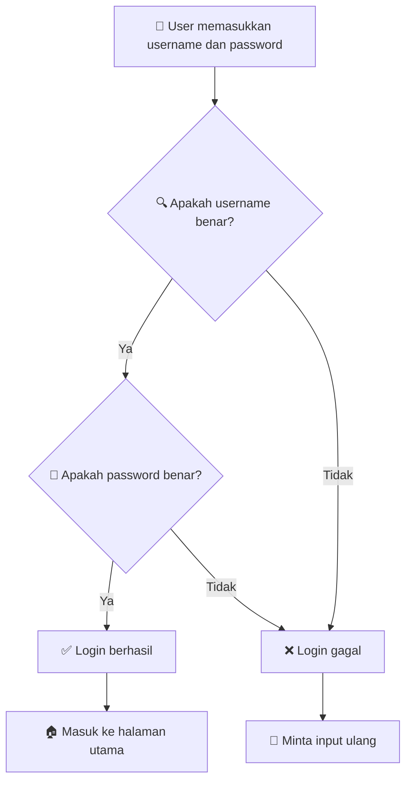
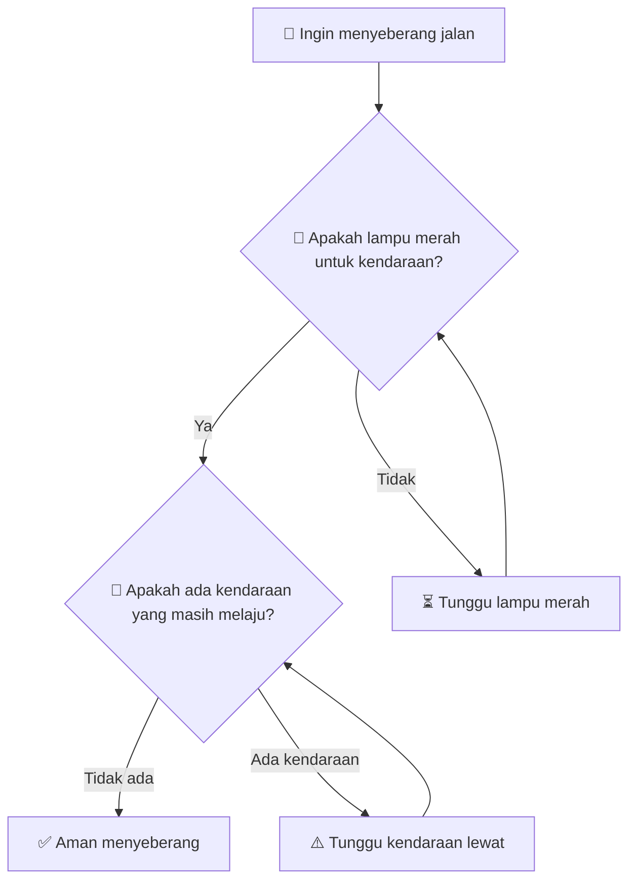
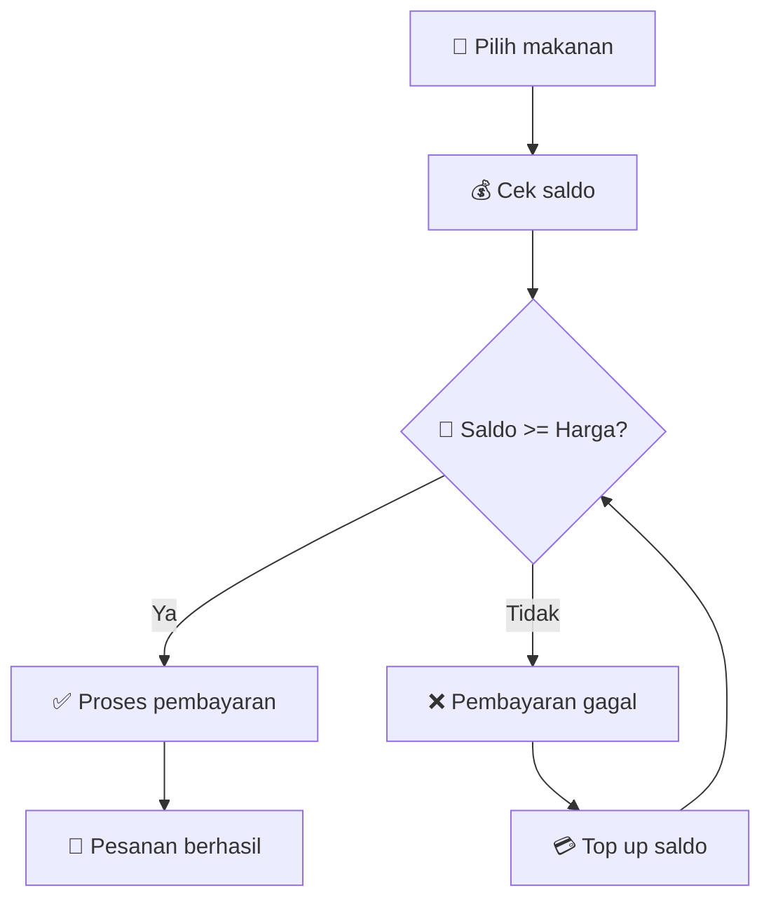
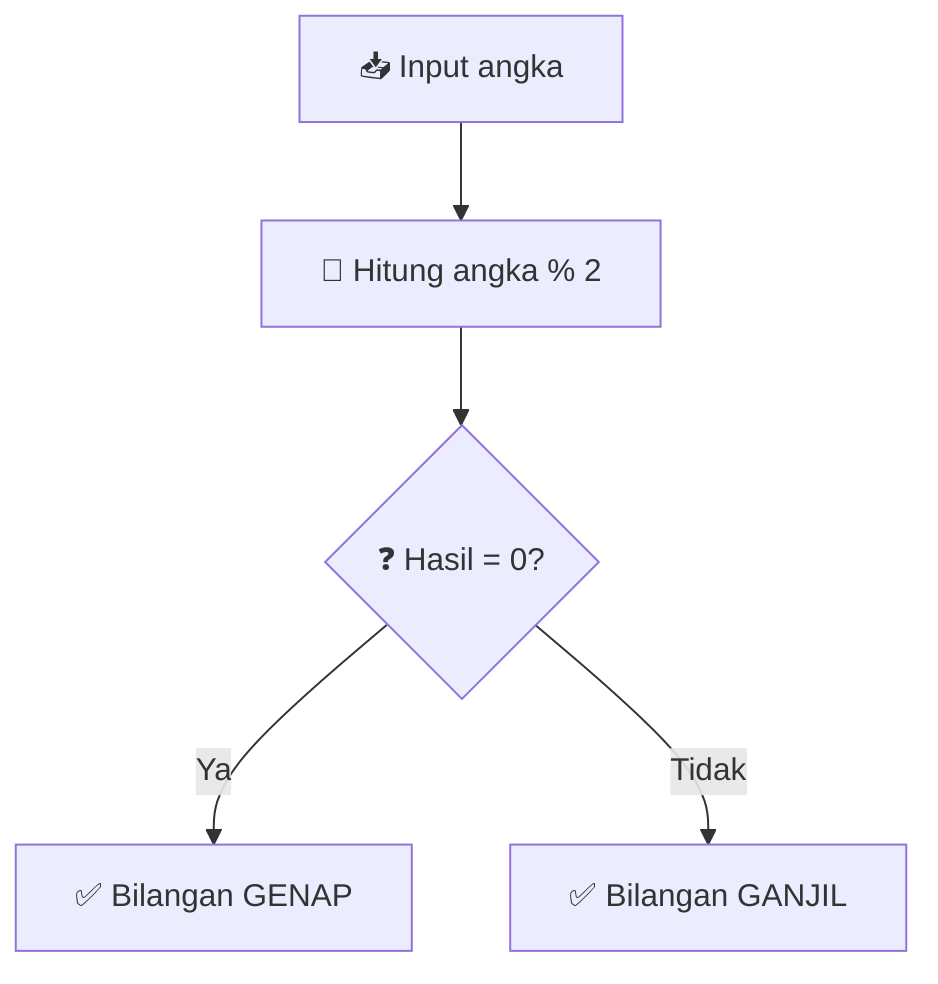
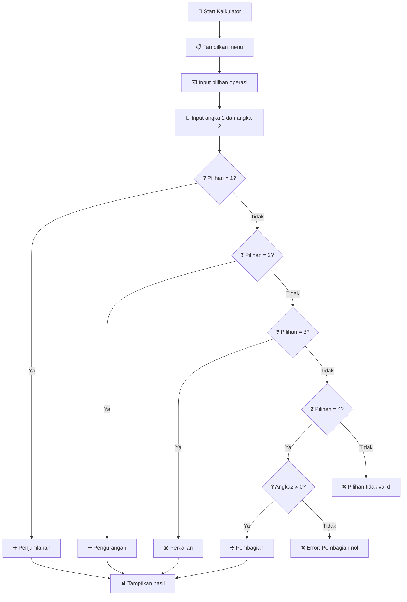

# 🎯 Pertemuan 1: Pengenalan dan Dasar-dasar Logika Matematika


---

## 📋 Informasi Pertemuan

| **Aspek** | **Detail** |
|-----------|------------|
| 🕐 **Durasi** | 3 x 50 menit |
| 🎯 **Capaian Pembelajaran** | Memahami konsep dasar logika dan aplikasinya dalam informatika |
| 📚 **Materi Utama** | Pengantar Logical Thinking & Mathematical Reasoning |
| 💻 **Tools** | Python (opsional), www.onlineide.pro |

---

## 🌟 Tujuan Pembelajaran

Setelah mengikuti pertemuan ini, mahasiswa diharapkan mampu:

1. **🧠 Memahami** pentingnya logika matematika dalam bidang informatika
2. **🔍 Menjelaskan** konsep dasar mathematical reasoning
3. **⚡ Mengidentifikasi** pola-pola logika dalam kehidupan sehari-hari
4. **💡 Menerapkan** logical thinking sederhana dalam pemecahan masalah

---

## 🤔 Mengapa Logika Matematika Penting?

### 💡 Analogi Sederhana
Bayangkan Anda sedang memasak nasi goreng. Ada urutan langkah yang harus Anda ikuti:

```
1. Siapkan bahan-bahan
2. Panaskan wajan
3. Tumis bumbu
4. Masukkan nasi
5. Aduk hingga matang
```

**Jika Anda tidak mengikuti urutan yang logis**, misalnya memasukkan nasi sebelum memanas wajan, hasilnya pasti tidak optimal. 

**Sama halnya dengan dunia komputer!** Setiap program komputer harus mengikuti urutan instruksi yang logis agar dapat bekerja dengan benar.

### 🏗️ Logika sebagai Fondasi Informatika

| **Bidang Informatika** | **Aplikasi Logika** | **Contoh Sederhana** |
|------------------------|---------------------|----------------------|
| **Pemrograman** | Struktur kondisi (if-else) | "Jika hujan, bawa payung" |
| **Database** | Query dan pencarian data | "Tampilkan semua mahasiswa yang IPK > 3.5" |
| **Artificial Intelligence** | Pengambilan keputusan | "Jika gejala X dan Y, maka kemungkinan penyakit Z" |
| **Keamanan Siber** | Enkripsi dan otentikasi | "Jika password benar, izinkan akses" |

---

## 🧠 Apa itu Mathematical Reasoning?

### 📖 Definisi Sederhana
**Mathematical Reasoning** adalah kemampuan untuk:
- Berpikir secara **sistematis** dan **terstruktur**
- Membuat **kesimpulan** berdasarkan informasi yang ada
- Menggunakan **logika** untuk memecahkan masalah

### 🎮 Contoh dalam Game
Pernahkah Anda bermain game teka-teki? Misalnya:

> "Terdapat 3 pintu. Di balik salah satu pintu ada hadiah. Anda harus memilih pintu yang tepat berdasarkan petunjuk yang diberikan."

Untuk menyelesaikan teka-teki ini, Anda menggunakan **logical reasoning**:
1. Menganalisis petunjuk
2. Membuat hipotesis
3. Menguji kemungkinan
4. Menarik kesimpulan

---

## 💻 Logika dalam Dunia Digital

### 🔄 Contoh Sederhana: Sistem Login

Mari kita lihat bagaimana logika bekerja dalam sistem login sederhana:

```python
# Contoh sederhana sistem login
username_benar = "admin"
password_benar = "12345"

# Input dari pengguna
username_input = input("Masukkan username: ")
password_input = input("Masukkan password: ")

# Logika pengecekan
if username_input == username_benar and password_input == password_benar:
    print("✅ Login berhasil! Selamat datang!")
else:
    print("❌ Login gagal! Username atau password salah.")
```

**🚀 Coba jalankan kode di atas di: [www.onlineide.pro](https://www.onlineide.pro)**

#### 📊 Alur Logika Login



### 📝 Penjelasan Detail Kode

1. **Variabel penyimpanan data**:
   ```python
   username_benar = "admin"
   password_benar = "12345"
   ```
   - Menyimpan data username dan password yang benar
   - Seperti "kunci" yang harus cocok untuk membuka "pintu"

2. **Input dari pengguna**:
   ```python
   username_input = input("Masukkan username: ")
   password_input = input("Masukkan password: ")
   ```
   - Meminta pengguna memasukkan data
   - Seperti seseorang yang mengetuk pintu dan memberikan identitas

3. **Logika pengecekan**:
   ```python
   if username_input == username_benar and password_input == password_benar:
   ```
   - Menggunakan operator logika `and` (DAN)
   - Kedua kondisi harus benar agar login berhasil

---

## 🔍 Logical Thinking dalam Kehidupan Sehari-hari

### 🚦 Contoh: Menyeberang Jalan



### 🍕 Contoh: Memesan Makanan Online

```python
# Logika sederhana memesan makanan
saldo = 50000  # Saldo dalam rupiah
harga_makanan = 35000

print(f"💰 Saldo Anda: Rp {saldo:,}")
print(f"🍕 Harga makanan: Rp {harga_makanan:,}")

if saldo >= harga_makanan:
    print("✅ Saldo cukup! Pesanan berhasil.")
    sisa_saldo = saldo - harga_makanan
    print(f"💵 Sisa saldo: Rp {sisa_saldo:,}")
else:
    print("❌ Saldo tidak cukup!")
    kurang = harga_makanan - saldo
    print(f"💸 Anda kekurangan: Rp {kurang:,}")
```

**🚀 Coba jalankan kode di atas di: [www.onlineide.pro](https://www.onlineide.pro)**

#### 📊 Alur Logika Pemesanan



---

## 🎯 Latihan Interaktif

### 🧩 Latihan 1: Menentukan Bilangan Ganjil atau Genap

```python
# Program menentukan ganjil atau genap
angka = int(input("Masukkan sebuah angka: "))

if angka % 2 == 0:
    print(f"🔢 {angka} adalah bilangan GENAP")
else:
    print(f"🔢 {angka} adalah bilangan GANJIL")
```

**🚀 Coba jalankan kode di atas di: [www.onlineide.pro](https://www.onlineide.pro)**

#### 📊 Alur Logika Ganjil/Genap



### 🧩 Latihan 2: Kalkulator Sederhana

```python
# Kalkulator sederhana dengan logika
print("🧮 KALKULATOR SEDERHANA")
print("1. Penjumlahan (+)")
print("2. Pengurangan (-)")
print("3. Perkalian (*)")
print("4. Pembagian (/)")

pilihan = input("Pilih operasi (1/2/3/4): ")
angka1 = float(input("Masukkan angka pertama: "))
angka2 = float(input("Masukkan angka kedua: "))

if pilihan == "1":
    hasil = angka1 + angka2
    print(f"✅ {angka1} + {angka2} = {hasil}")
elif pilihan == "2":
    hasil = angka1 - angka2
    print(f"✅ {angka1} - {angka2} = {hasil}")
elif pilihan == "3":
    hasil = angka1 * angka2
    print(f"✅ {angka1} × {angka2} = {hasil}")
elif pilihan == "4":
    if angka2 != 0:
        hasil = angka1 / angka2
        print(f"✅ {angka1} ÷ {angka2} = {hasil}")
    else:
        print("❌ Error: Tidak bisa membagi dengan nol!")
else:
    print("❌ Pilihan tidak valid!")
```

**🚀 Coba jalankan kode di atas di: [www.onlineide.pro](https://www.onlineide.pro)**

#### 📊 Alur Logika Kalkulator



---

## 📚 Konsep Dasar yang Perlu Dipahami

### 🔑 Elemen-elemen Logical Thinking

| **Elemen** | **Penjelasan** | **Contoh** |
|------------|----------------|------------|
| **Premis** | Pernyataan awal yang dianggap benar | "Semua mahasiswa harus mengikuti ujian" |
| **Logika** | Proses berpikir untuk menghubungkan premis | "Jika... maka..." |
| **Kesimpulan** | Hasil akhir dari proses logika | "Andi adalah mahasiswa, jadi Andi harus mengikuti ujian" |

### 🎯 Jenis-jenis Logical Reasoning

#### 1. **Deductive Reasoning** (Penalaran Deduktif)
- Dari umum ke khusus
- **Contoh**: 
  - Premis 1: Semua programmer harus bisa coding
  - Premis 2: Budi adalah programmer
  - Kesimpulan: Budi harus bisa coding

#### 2. **Inductive Reasoning** (Penalaran Induktif)
- Dari khusus ke umum
- **Contoh**:
  - Observasi: 10 mahasiswa informatika yang diwawancara semua suka matematika
  - Kesimpulan: Mahasiswa informatika umumnya suka matematika

#### 3. **Abductive Reasoning** (Penalaran Abduktif)
- Mencari penjelasan terbaik
- **Contoh**:
  - Observasi: Laptop tidak mau menyala
  - Kemungkinan 1: Baterai habis
  - Kemungkinan 2: Adaptor rusak
  - Kesimpulan: Penjelasan terbaik adalah baterai habis (karena paling umum)

---

## 🔍 Quiz Diagnostik Sederhana

### ❓ Pertanyaan 1
Jika semua kucing adalah hewan, dan Fluffy adalah kucing, maka:
- A) Fluffy adalah hewan ✅
- B) Fluffy bukan hewan
- C) Tidak bisa disimpulkan
- D) Fluffy adalah anjing

### ❓ Pertanyaan 2
Dalam sistem login, apa yang terjadi jika username benar tapi password salah?
- A) Login berhasil
- B) Login gagal ✅
- C) Sistem error
- D) Otomatis reset password

### ❓ Pertanyaan 3
Urutan langkah logis untuk membuat kopi instan:
- A) Tuang air panas → Masukkan kopi → Aduk
- B) Masukkan kopi → Tuang air panas → Aduk ✅
- C) Aduk → Masukkan kopi → Tuang air panas
- D) Tuang air panas → Aduk → Masukkan kopi

---

## 🎯 Aplikasi Logika dalam Teknologi Modern

### 🤖 Artificial Intelligence (AI)
```python
# Contoh sederhana AI untuk rekomendasi film
def rekomendasi_film(genre_favorit, rating_minimum):
    """
    Fungsi sederhana untuk merekomendasikan film
    """
    database_film = [
        {"judul": "The Avengers", "genre": "action", "rating": 8.0},
        {"judul": "Frozen", "genre": "animation", "rating": 7.4},
        {"judul": "Inception", "genre": "sci-fi", "rating": 8.8},
        {"judul": "The Dark Knight", "genre": "action", "rating": 9.0}
    ]
    
    film_rekomendasi = []
    
    for film in database_film:
        if film["genre"] == genre_favorit and film["rating"] >= rating_minimum:
            film_rekomendasi.append(film["judul"])
    
    return film_rekomendasi

# Penggunaan
genre = "action"
rating_min = 8.0
hasil = rekomendasi_film(genre, rating_min)
print(f"🎬 Film {genre} dengan rating ≥ {rating_min}: {hasil}")
```

**🚀 Coba jalankan kode di atas di: [www.onlineide.pro](https://www.onlineide.pro)**

### 📱 Aplikasi dalam Smartphone

| **Fitur** | **Logika yang Digunakan** |
|-----------|---------------------------|
| **GPS Navigation** | "Jika terjadi kemacetan di rute A, maka cari rute alternatif B" |
| **Face Recognition** | "Jika pola wajah cocok dengan database, maka buka kunci" |
| **Battery Saver** | "Jika baterai < 20%, maka aktifkan mode hemat daya" |
| **Auto Brightness** | "Jika cahaya lingkungan terang, maka naikkan kecerahan layar" |

---

## 📖 Daftar Istilah dan Singkatan

| **Istilah/Singkatan** | **Pengertian** |
|----------------------|----------------|
| **AI** | Artificial Intelligence - Kecerdasan buatan |
| **Algorithm** | Urutan langkah-langkah logis untuk menyelesaikan masalah |
| **Boolean** | Tipe data yang hanya memiliki dua nilai: True atau False |
| **Conditional Statement** | Pernyataan bersyarat (if-else) |
| **Deductive Reasoning** | Penalaran dari umum ke khusus |
| **Flowchart** | Diagram alur yang menggambarkan proses secara visual |
| **Inductive Reasoning** | Penalaran dari khusus ke umum |
| **Logic** | Ilmu tentang penalaran yang benar |
| **Mathematical Reasoning** | Kemampuan berpikir secara matematis dan logis |
| **Premise** | Pernyataan awal yang menjadi dasar penalaran |

---

## 🏆 Rangkuman Pertemuan 1

### ✅ Apa yang Sudah Kita Pelajari?

1. **🧠 Konsep Dasar**: Logika matematika adalah fondasi berpikir sistematis
2. **🔗 Relevansi**: Aplikasi logika dalam dunia informatika sangat luas
3. **💡 Praktis**: Logical thinking dapat diterapkan dalam kehidupan sehari-hari
4. **💻 Teknologi**: Setiap program komputer menggunakan logika

### 🎯 Poin Penting

- **Logika = Urutan berpikir yang sistematis**
- **Programming = Implementasi logika dalam komputer**
- **Problem Solving = Penerapan logical reasoning**

### 🚀 Persiapan Pertemuan Selanjutnya

Pada pertemuan berikutnya, kita akan mempelajari:
- **Proposisi dan Logical Connectives**
- **Truth Tables**
- **Operasi Logika Dasar**

---

## 📚 Referensi dan Sumber Belajar

### 📖 Buku Referensi Utama

1. **Rosen, K. H.** (2019). *Discrete Mathematics and Its Applications* (8th ed.). McGraw-Hill Education.

2. **Lehman, E., Leighton, F. T., & Meyer, A. R.** (2017). *Mathematics for Computer Science*. MIT Press. 
   - 🔗 Online: https://ocw.mit.edu/courses/6-042j-mathematics-for-computer-science-fall-2010/

3. **Ben-Ari, M.** (2012). *Mathematical Logic for Computer Science* (3rd ed.). Springer.

### 🌐 Sumber Online

1. **MIT OpenCourseWare**: Mathematics for Computer Science
   - 🔗 https://ocw.mit.edu/courses/6-042j-mathematics-for-computer-science-fall-2010/

2. **Khan Academy**: Introduction to Logic and Reasoning
   - 🔗 https://www.khanacademy.org/

3. **GeeksforGeeks**: Mathematical Logic
   - 🔗 https://www.geeksforgeeks.org/maths/introduction-to-mathematical-logic/

### 🛠️ Tools dan Platform

1. **Online IDE**: www.onlineide.pro
2. **Logic Games**: LogicLike (mobile app)
3. **Interactive Learning**: Brilliant.org

---

## 💡 Tips Sukses Belajar Logika Matematika

### 🎯 Strategi Belajar Efektif

1. **🧩 Latihan Rutin**: Kerjakan latihan logika setiap hari (15-30 menit)
2. **🤝 Diskusi**: Diskusikan konsep dengan teman sekelas
3. **🔄 Praktik**: Terapkan logika dalam kehidupan sehari-hari
4. **❓ Bertanya**: Jangan ragu bertanya jika ada yang tidak dipahami

### 🚀 Motivasi

> *"Logic is the beginning of wisdom, not the end."* - Mr. Spock

Ingatlah bahwa setiap ahli teknologi terkemuka dimulai dari pemahaman logika dasar. Steve Jobs, Bill Gates, dan Mark Zuckerberg semuanya memulai dengan belajar berpikir logis!

---

## 📝 Tugas Mandiri

### 🎯 Tugas 1: Observasi Logika Sehari-hari
1. Identifikasi **3 situasi** dalam kehidupan sehari-hari yang menggunakan logika
2. Jelaskan **langkah-langkah logis** dalam setiap situasi
3. Buat **flowchart sederhana** untuk salah satu situasi tersebut

### 🎯 Tugas 2: Eksplorasi Kode
1. Jalankan semua kode Python yang ada dalam materi ini di www.onlineide.pro
2. Modifikasi **satu kode** dengan menambahkan fitur baru
3. Dokumentasikan **perubahan** yang Anda buat

### 📅 Deadline: Sebelum pertemuan berikutnya

---

*🎓 Selamat belajar! Logika matematika adalah kunci sukses di dunia informatika. Keep calm and think logically! 🚀*
