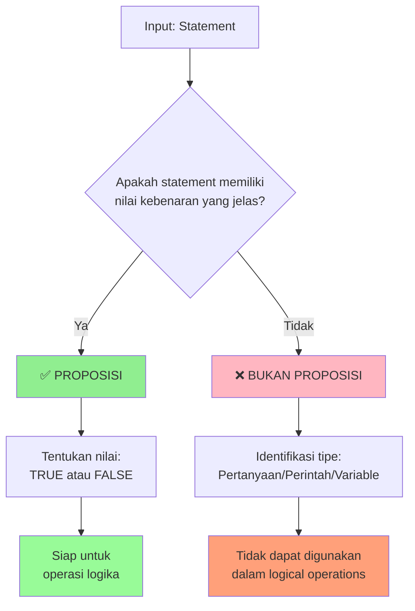
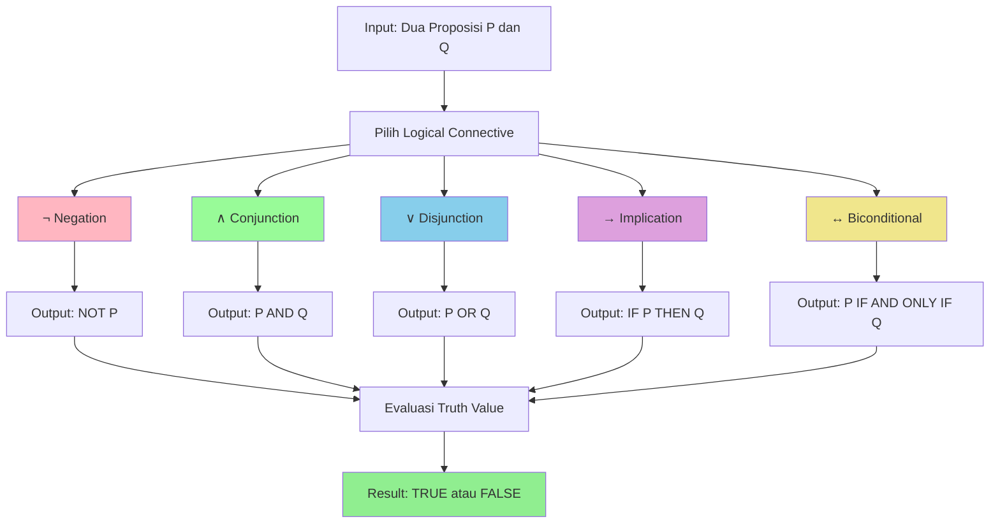
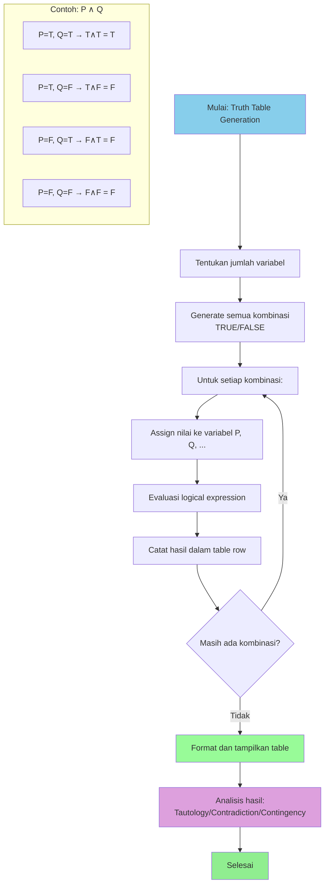
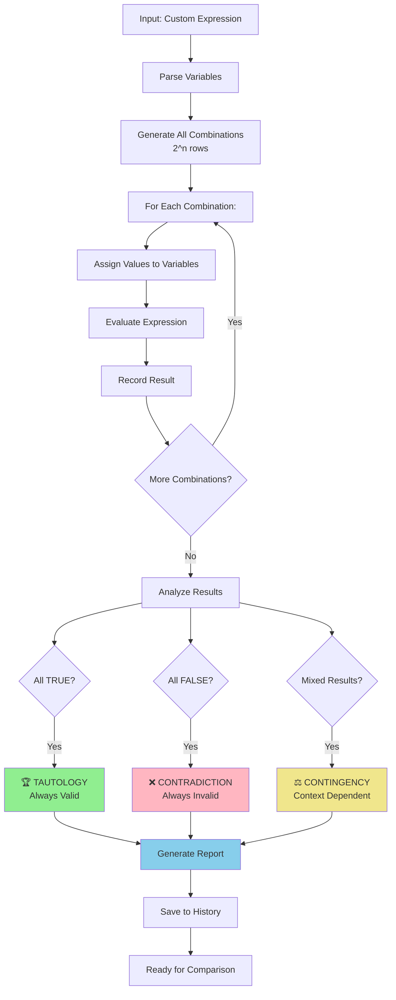
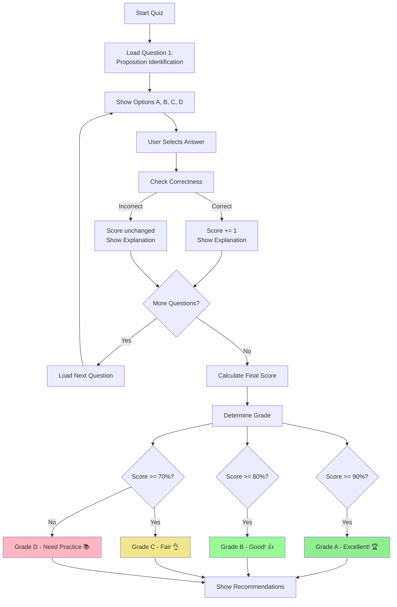

# 📚 Pertemuan 2: Propositional Logic Fundamentals


---

## 🎯 Tujuan Pembelajaran

Setelah mengikuti pertemuan ini, mahasiswa diharapkan mampu:

1. **Mengidentifikasi** proposisi dan membedakannya dari non-proposisi
2. **Memahami** semua logical connectives (∧, ∨, ¬, →, ↔) dan penggunaannya
3. **Mengkonstruksi** truth tables secara manual dan programmatik
4. **Mengimplementasikan** logical operations dalam Python
5. **Menganalisis** statement logika menggunakan propositional logic

---

## 📖 Materi Pembelajaran

### 1. Pengenalan Proposisi dan Logical Statements

#### 🔍 Apa itu Proposisi?

**Proposisi** adalah pernyataan yang memiliki nilai kebenaran yang jelas: **True** atau **False** (tidak boleh ambigu).

```python
# Contoh implementasi proposisi dalam Python
def adalah_proposisi(statement, nilai_kebenaran=None):
    """
    Fungsi untuk menganalisis apakah suatu statement adalah proposisi
    
    Args:
        statement (str): Pernyataan yang akan dianalisis
        nilai_kebenaran (bool): Nilai kebenaran statement (jika diketahui)
    
    Returns:
        dict: Analisis lengkap tentang statement
    """
    hasil_analisis = {
        "statement": statement,
        "adalah_proposisi": False,
        "alasan": "",
        "nilai_kebenaran": nilai_kebenaran,
        "tipe": ""
    }
    
    # Cek apakah statement memiliki nilai kebenaran yang jelas
    if nilai_kebenaran is not None:
        hasil_analisis["adalah_proposisi"] = True
        hasil_analisis["alasan"] = "Memiliki nilai kebenaran yang jelas"
        hasil_analisis["tipe"] = "Proposisi"
    else:
        hasil_analisis["alasan"] = "Tidak memiliki nilai kebenaran yang jelas"
        hasil_analisis["tipe"] = "Bukan Proposisi"
    
    return hasil_analisis

# Contoh penggunaan dengan berbagai jenis statement
statements = [
    ("2 + 2 = 4", True),           # Proposisi - nilai kebenaran jelas
    ("Python adalah bahasa programming", True),  # Proposisi - fakta
    ("x > 5", None),               # Bukan proposisi - tergantung nilai x
    ("Tutup pintu!", None),        # Bukan proposisi - perintah
    ("Apakah hari ini hujan?", None),  # Bukan proposisi - pertanyaan
    ("Semua programmer menguasai Python", False),  # Proposisi - bisa dinilai
]

print("=== ANALISIS PROPOSISI ===")
print("=" * 50)

for statement, truth_value in statements:
    analisis = adalah_proposisi(statement, truth_value)
    
    print(f"Statement: '{analisis['statement']}'")
    print(f"Proposisi: {'✅ YA' if analisis['adalah_proposisi'] else '❌ TIDAK'}")
    print(f"Alasan: {analisis['alasan']}")
    if analisis['nilai_kebenaran'] is not None:
        print(f"Nilai: {'TRUE' if analisis['nilai_kebenaran'] else 'FALSE'}")
    print("-" * 30)
```

**💡 Jalankan kode ini di: [www.onlineide.pro](https://www.onlineide.pro)**



#### 📊 Kategori Statement dalam Programming

| **Kategori** | **Contoh** | **Proposisi?** | **Alasan** |
|-------------|------------|----------------|------------|
| **Fakta Matematis** | `5 > 3` | ✅ Ya | Nilai kebenaran jelas (TRUE) |
| **Pernyataan Program** | `len("Python") == 6` | ✅ Ya | Dapat dievaluasi (TRUE) |
| **Conditional dengan Variable** | `x < 10` | ❌ Tidak | Tergantung nilai x |
| **Pertanyaan** | `Apakah array sorted?` | ❌ Tidak | Pertanyaan, bukan pernyataan |
| **Perintah** | `print("Hello")` | ❌ Tidak | Instruksi, bukan pernyataan |
| **Expresi Boolean** | `is_valid and is_active` | ✅ Ya | Menghasilkan TRUE/FALSE |

---

### 2. Logical Connectives dan Operatornya

#### 🔗 Lima Logical Connectives Utama

Dalam propositional logic, kita memiliki lima operator utama yang digunakan untuk menghubungkan proposisi:

```python
class LogicalConnectives:
    """
    Kelas untuk implementasi semua logical connectives
    dengan penjelasan lengkap dan contoh penggunaan
    """
    
    @staticmethod
    def negation(p):
        """
        NEGATION (¬) - NOT Operator
        Membalik nilai kebenaran proposisi
        
        Args:
            p (bool): Proposisi input
            
        Returns:
            bool: Nilai kebalikan dari p
        """
        return not p
    
    @staticmethod
    def conjunction(p, q):
        """
        CONJUNCTION (∧) - AND Operator
        TRUE hanya jika kedua proposisi TRUE
        
        Args:
            p (bool): Proposisi pertama
            q (bool): Proposisi kedua
            
        Returns:
            bool: p AND q
        """
        return p and q
    
    @staticmethod
    def disjunction(p, q):
        """
        DISJUNCTION (∨) - OR Operator  
        FALSE hanya jika kedua proposisi FALSE
        
        Args:
            p (bool): Proposisi pertama
            q (bool): Proposisi kedua
            
        Returns:
            bool: p OR q
        """
        return p or q
    
    @staticmethod
    def implication(p, q):
        """
        IMPLICATION (→) - IF-THEN Operator
        FALSE hanya jika p TRUE dan q FALSE
        "Jika p maka q"
        
        Args:
            p (bool): Proposisi antecedent (premis)
            q (bool): Proposisi consequent (kesimpulan)
            
        Returns:
            bool: p → q
        """
        return (not p) or q
    
    @staticmethod
    def biconditional(p, q):
        """
        BICONDITIONAL (↔) - IF AND ONLY IF Operator
        TRUE jika kedua proposisi memiliki nilai yang sama
        "p jika dan hanya jika q"
        
        Args:
            p (bool): Proposisi pertama
            q (bool): Proposisi kedua
            
        Returns:
            bool: p ↔ q
        """
        return p == q

# Demonstrasi penggunaan dengan contoh programming
def demo_logical_connectives():
    """
    Demonstrasi semua logical connectives dengan contoh nyata
    dari dunia programming
    """
    logic = LogicalConnectives()
    
    # Definisi proposisi dalam konteks programming
    is_logged_in = True      # P: User sudah login
    has_permission = False   # Q: User memiliki permission
    is_admin = True          # R: User adalah admin
    
    print("=== LOGICAL CONNECTIVES DEMO ===")
    print(f"P (is_logged_in): {is_logged_in}")
    print(f"Q (has_permission): {has_permission}")
    print(f"R (is_admin): {is_admin}")
    print("=" * 40)
    
    # 1. NEGATION (¬)
    print("1. NEGATION (¬)")
    not_logged_in = logic.negation(is_logged_in)
    print(f"   ¬P (not logged in): {not_logged_in}")
    print(f"   Arti: User TIDAK login")
    print()
    
    # 2. CONJUNCTION (∧)
    print("2. CONJUNCTION (∧)")
    logged_and_permitted = logic.conjunction(is_logged_in, has_permission)
    print(f"   P ∧ Q: {logged_and_permitted}")
    print(f"   Arti: User login DAN memiliki permission")
    print()
    
    # 3. DISJUNCTION (∨)
    print("3. DISJUNCTION (∨)")
    permitted_or_admin = logic.disjunction(has_permission, is_admin)
    print(f"   Q ∨ R: {permitted_or_admin}")
    print(f"   Arti: User memiliki permission ATAU admin")
    print()
    
    # 4. IMPLICATION (→)
    print("4. IMPLICATION (→)")
    if_admin_then_permitted = logic.implication(is_admin, has_permission)
    print(f"   R → Q: {if_admin_then_permitted}")
    print(f"   Arti: JIKA admin MAKA memiliki permission")
    print()
    
    # 5. BICONDITIONAL (↔)
    print("5. BICONDITIONAL (↔)")
    admin_iff_full_access = logic.biconditional(is_admin, True)
    print(f"   R ↔ TRUE: {admin_iff_full_access}")
    print(f"   Arti: Admin JIKA DAN HANYA JIKA memiliki full access")

# Jalankan demonstrasi
demo_logical_connectives()
```

**💡 Jalankan kode ini di: [www.onlineide.pro](https://www.onlineide.pro)**



#### 💻 Equivalensi dengan Programming Operators

| **Logic Symbol** | **Name** | **Python Operator** | **Programming Context** |
|-----------------|----------|-------------------|------------------------|
| **¬** | Negation | `not` | `not is_valid` |
| **∧** | Conjunction | `and` | `is_logged_in and has_permission` |
| **∨** | Disjunction | `or` | `is_admin or is_moderator` |
| **→** | Implication | `not p or q` | Conditional logic |
| **↔** | Biconditional | `p == q` | Equality check |

---

### 3. Truth Tables - Konstruksi dan Implementasi

#### 📊 Konsep Dasar Truth Tables

**Truth Table** adalah tabel yang menunjukkan semua kemungkinan kombinasi nilai input dan output yang dihasilkan oleh logical operation.

```python
import itertools
from tabulate import tabulate

class TruthTableGenerator:
    """
    Generator untuk membuat truth tables dari logical expressions
    dengan berbagai format output dan analisis
    """
    
    def __init__(self):
        self.operators = {
            '¬': lambda p: not p,
            '∧': lambda p, q: p and q,
            '∨': lambda p, q: p or q,
            '→': lambda p, q: (not p) or q,
            '↔': lambda p, q: p == q
        }
    
    def generate_basic_table(self, operator, num_variables=2):
        """
        Generate truth table untuk single operator
        
        Args:
            operator (str): Operator symbol ('¬', '∧', '∨', '→', '↔')
            num_variables (int): Jumlah variabel (1 untuk negation, 2 untuk yang lain)
            
        Returns:
            list: Truth table sebagai list of dictionaries
        """
        truth_values = [True, False]
        results = []
        
        if num_variables == 1:  # Negation
            for p in truth_values:
                result = self.operators[operator](p)
                results.append({
                    'P': self._bool_to_symbol(p),
                    f'{operator}P': self._bool_to_symbol(result)
                })
        else:  # Binary operators
            for p, q in itertools.product(truth_values, repeat=2):
                result = self.operators[operator](p, q)
                results.append({
                    'P': self._bool_to_symbol(p),
                    'Q': self._bool_to_symbol(q),
                    f'P {operator} Q': self._bool_to_symbol(result)
                })
        
        return results
    
    def generate_complex_expression(self, expression_func, variables):
        """
        Generate truth table untuk complex logical expression
        
        Args:
            expression_func (function): Fungsi yang mengevaluasi expression
            variables (list): List nama variabel
            
        Returns:
            list: Truth table untuk complex expression
        """
        truth_values = [True, False]
        num_vars = len(variables)
        results = []
        
        # Generate semua kombinasi nilai untuk variabel
        for combination in itertools.product(truth_values, repeat=num_vars):
            # Buat dictionary mapping variabel ke nilai
            var_values = dict(zip(variables, combination))
            
            # Evaluasi expression
            result = expression_func(**var_values)
            
            # Buat row untuk truth table
            row = {}
            for var, val in var_values.items():
                row[var] = self._bool_to_symbol(val)
            row['Result'] = self._bool_to_symbol(result)
            
            results.append(row)
        
        return results
    
    def _bool_to_symbol(self, value):
        """Convert boolean ke symbol T/F"""
        return 'T' if value else 'F'
    
    def print_table(self, table_data, title="Truth Table"):
        """
        Print truth table dengan format yang rapi
        
        Args:
            table_data (list): Data truth table
            title (str): Judul tabel
        """
        print(f"\n{'='*20} {title} {'='*20}")
        if table_data:
            headers = list(table_data[0].keys())
            rows = [list(row.values()) for row in table_data]
            print(tabulate(rows, headers=headers, tablefmt="grid"))
        print()

# Demonstrasi penggunaan Truth Table Generator
def demo_truth_tables():
    """
    Demonstrasi pembuatan truth tables untuk berbagai operator
    """
    generator = TruthTableGenerator()
    
    # 1. Truth Table untuk Negation
    print("🔹 NEGATION (¬)")
    negation_table = generator.generate_basic_table('¬', 1)
    generator.print_table(negation_table, "Negation Truth Table")
    
    # 2. Truth Table untuk Conjunction
    print("🔹 CONJUNCTION (∧)")
    conjunction_table = generator.generate_basic_table('∧', 2)
    generator.print_table(conjunction_table, "Conjunction Truth Table")
    
    # 3. Truth Table untuk Disjunction
    print("🔹 DISJUNCTION (∨)")
    disjunction_table = generator.generate_basic_table('∨', 2)
    generator.print_table(disjunction_table, "Disjunction Truth Table")
    
    # 4. Truth Table untuk Implication
    print("🔹 IMPLICATION (→)")
    implication_table = generator.generate_basic_table('→', 2)
    generator.print_table(implication_table, "Implication Truth Table")
    
    # 5. Truth Table untuk Biconditional
    print("🔹 BICONDITIONAL (↔)")
    biconditional_table = generator.generate_basic_table('↔', 2)
    generator.print_table(biconditional_table, "Biconditional Truth Table")
    
    # 6. Complex Expression: (P ∧ Q) → (P ∨ Q)
    def complex_expression(P, Q):
        """Complex logical expression: (P ∧ Q) → (P ∨ Q)"""
        left_side = P and Q      # P ∧ Q
        right_side = P or Q      # P ∨ Q
        return (not left_side) or right_side  # → operator
    
    print("🔹 COMPLEX EXPRESSION: (P ∧ Q) → (P ∨ Q)")
    complex_table = generator.generate_complex_expression(
        complex_expression, ['P', 'Q']
    )
    generator.print_table(complex_table, "Complex Expression Truth Table")

# Jalankan demonstrasi
demo_truth_tables()
```

**💡 Jalankan kode ini di: [www.onlineide.pro](https://www.onlineide.pro)**



#### 🎯 Implementasi Truth Table untuk Programming Context

```python
def programming_logic_examples():
    """
    Contoh aplikasi truth tables dalam programming logic
    """
    print("=== PROGRAMMING LOGIC EXAMPLES ===")
    
    # Contoh 1: User Authentication Logic
    def authentication_logic(is_logged_in, has_valid_token, is_session_active):
        """
        Logic untuk menentukan apakah user dapat mengakses sistem
        Formula: is_logged_in ∧ (has_valid_token ∨ is_session_active)
        """
        return is_logged_in and (has_valid_token or is_session_active)
    
    print("🔐 Authentication Logic Truth Table")
    print("Formula: is_logged_in ∧ (has_valid_token ∨ is_session_active)")
    print("-" * 70)
    
    variables = ['logged_in', 'valid_token', 'session_active']
    
    # Generate truth table untuk authentication logic
    for logged_in in [True, False]:
        for valid_token in [True, False]:
            for session_active in [True, False]:
                access_granted = authentication_logic(logged_in, valid_token, session_active)
                
                print(f"Logged: {'T' if logged_in else 'F'} | " + 
                      f"Token: {'T' if valid_token else 'F'} | " +
                      f"Session: {'T' if session_active else 'F'} | " +
                      f"Access: {'✅ GRANTED' if access_granted else '❌ DENIED'}")
    
    print("\n" + "="*50)
    
    # Contoh 2: Database Query Conditions
    def query_condition(is_active, age_valid, has_premium):
        """
        Condition untuk database query
        Formula: is_active ∧ (age_valid → has_premium)
        """
        implication = (not age_valid) or has_premium  # age_valid → has_premium
        return is_active and implication
    
    print("🗃️ Database Query Condition Truth Table")
    print("Formula: is_active ∧ (age_valid → has_premium)")
    print("-" * 60)
    
    for is_active in [True, False]:
        for age_valid in [True, False]:
            for has_premium in [True, False]:
                include_in_result = query_condition(is_active, age_valid, has_premium)
                
                print(f"Active: {'T' if is_active else 'F'} | " +
                      f"Age Valid: {'T' if age_valid else 'F'} | " +
                      f"Premium: {'T' if has_premium else 'F'} | " +
                      f"Include: {'✅ YES' if include_in_result else '❌ NO'}")

# Jalankan contoh programming logic
programming_logic_examples()
```

**💡 Jalankan kode ini di: [www.onlineide.pro](https://www.onlineide.pro)**

```mermaid
flowchart TD
    A[User Request] --> B{Is Logged In?}
    B -->|No| C[❌ Access Denied]
    B -->|Yes| D{Has Valid Token<br/>OR<br/>Session Active?}
    
    D -->|No| C
    D -->|Yes| E[✅ Access Granted]
    
    subgraph "Truth Table Logic"
        F[logged_in ∧ (valid_token ∨ session_active)]
        G[T ∧ (T ∨ F) = T ∧ T = T ✅]
        H[T ∧ (F ∨ T) = T ∧ T = T ✅]
        I[T ∧ (F ∨ F) = T ∧ F = F ❌]
        J[F ∧ (any) = F ❌]
    end
    
    style E fill:#90EE90
    style C fill:#FFB6C1
    style F fill:#87CEEB
```

---

### 4. Hands-on Implementation dan Interactive Exercises

#### 🎮 Interactive Truth Table Builder

```python
class InteractiveTruthTableBuilder:
    """
    Kelas interaktif untuk membangun dan menganalisis truth tables
    dengan berbagai fitur pembelajaran
    """
    
    def __init__(self):
        self.expression_history = []
        self.operators = {
            'NOT': lambda p: not p,
            'AND': lambda p, q: p and q,
            'OR': lambda p, q: p or q,
            'IMPLIES': lambda p, q: (not p) or q,
            'IFF': lambda p, q: p == q,
            'NAND': lambda p, q: not (p and q),
            'NOR': lambda p, q: not (p or q),
            'XOR': lambda p, q: p != q
        }
    
    def build_custom_expression(self, expression_name, formula_func, variables):
        """
        Build truth table untuk custom logical expression
        
        Args:
            expression_name (str): Nama expression
            formula_func (function): Fungsi yang mengevaluasi formula
            variables (list): List variabel yang digunakan
            
        Returns:
            dict: Complete analysis results
        """
        print(f"\n🔧 Building Truth Table for: {expression_name}")
        print("=" * 60)
        
        # Generate truth table
        truth_values = [True, False]
        num_vars = len(variables)
        table_data = []
        true_count = 0
        false_count = 0
        
        print(f"Variables: {', '.join(variables)}")
        print(f"Total combinations: {2**num_vars}")
        print("-" * 40)
        
        # Header
        header = " | ".join([f"{var:>5}" for var in variables]) + " | Result"
        print(header)
        print("-" * len(header))
        
        # Generate semua kombinasi
        for combination in itertools.product(truth_values, repeat=num_vars):
            var_values = dict(zip(variables, combination))
            
            try:
                result = formula_func(**var_values)
                if result:
                    true_count += 1
                else:
                    false_count += 1
                    
                # Format row
                row_values = [f"{'T' if val else 'F':>5}" for val in combination]
                row_values.append(f"{'T' if result else 'F':>6}")
                
                print(" | ".join(row_values))
                
                table_data.append({
                    'combination': combination,
                    'result': result,
                    'variables': var_values
                })
                
            except Exception as e:
                print(f"Error evaluating combination {combination}: {e}")
        
        # Analisis hasil
        analysis = self._analyze_truth_table(true_count, false_count, 2**num_vars)
        
        print("\n📊 ANALYSIS RESULTS:")
        print(f"   True results: {true_count}/{2**num_vars}")
        print(f"   False results: {false_count}/{2**num_vars}")
        print(f"   Type: {analysis['type']}")
        print(f"   Description: {analysis['description']}")
        
        # Simpan ke history
        self.expression_history.append({
            'name': expression_name,
            'data': table_data,
            'analysis': analysis
        })
        
        return {
            'table_data': table_data,
            'analysis': analysis
        }
    
    def _analyze_truth_table(self, true_count, false_count, total):
        """Analyze truth table type"""
        if true_count == total:
            return {
                'type': 'TAUTOLOGY',
                'description': 'Always true - logically valid statement'
            }
        elif false_count == total:
            return {
                'type': 'CONTRADICTION',
                'description': 'Always false - logically impossible statement'
            }
        else:
            return {
                'type': 'CONTINGENCY',
                'description': 'Sometimes true, sometimes false - depends on variable values'
            }
    
    def compare_expressions(self, expr1_name, expr2_name):
        """Compare two expressions untuk logical equivalence"""
        expr1 = next((e for e in self.expression_history if e['name'] == expr1_name), None)
        expr2 = next((e for e in self.expression_history if e['name'] == expr2_name), None)
        
        if not expr1 or not expr2:
            print("❌ One or both expressions not found in history")
            return False
        
        # Compare results
        data1 = expr1['data']
        data2 = expr2['data']
        
        if len(data1) != len(data2):
            print("❌ Expressions have different number of variables")
            return False
        
        equivalent = True
        for i in range(len(data1)):
            if data1[i]['result'] != data2[i]['result']:
                equivalent = False
                break
        
        print(f"\n🔍 EQUIVALENCE CHECK: {expr1_name} ≡ {expr2_name}")
        print("=" * 50)
        print(f"Result: {'✅ EQUIVALENT' if equivalent else '❌ NOT EQUIVALENT'}")
        
        return equivalent

# Demonstrasi Interactive Truth Table Builder
def demo_interactive_builder():
    """
    Demonstrasi penggunaan Interactive Truth Table Builder
    """
    builder = InteractiveTruthTableBuilder()
    
    # Expression 1: De Morgan's Law - ¬(P ∧ Q) ≡ ¬P ∨ ¬Q
    def de_morgan_left(P, Q):
        """¬(P ∧ Q)"""
        return not (P and Q)
    
    def de_morgan_right(P, Q):
        """¬P ∨ ¬Q"""
        return (not P) or (not Q)
    
    # Build truth tables
    print("🧪 TESTING DE MORGAN'S LAW")
    builder.build_custom_expression("De Morgan Left", de_morgan_left, ['P', 'Q'])
    builder.build_custom_expression("De Morgan Right", de_morgan_right, ['P', 'Q'])
    
    # Compare untuk equivalence
    builder.compare_expressions("De Morgan Left", "De Morgan Right")
    
    # Expression 2: Implication ≡ Contrapositive
    def implication(P, Q):
        """P → Q"""
        return (not P) or Q
    
    def contrapositive(P, Q):
        """¬Q → ¬P"""
        not_Q = not Q
        not_P = not P
        return (not not_Q) or not_P  # ¬Q → ¬P
    
    print("\n" + "="*60)
    print("🧪 TESTING IMPLICATION VS CONTRAPOSITIVE")
    builder.build_custom_expression("P implies Q", implication, ['P', 'Q'])
    builder.build_custom_expression("Contrapositive", contrapositive, ['P', 'Q'])
    
    builder.compare_expressions("P implies Q", "Contrapositive")
    
    # Expression 3: Complex Programming Logic
    def access_control(is_admin, is_logged_in, has_permission):
        """
        Complex access control logic:
        (is_admin → full_access) ∧ (¬is_admin → (is_logged_in ∧ has_permission))
        """
        if is_admin:
            admin_clause = True  # Admin has full access
        else:
            admin_clause = True  # Vacuously true
            
        if not is_admin:
            non_admin_clause = is_logged_in and has_permission
        else:
            non_admin_clause = True  # Vacuously true
            
        return admin_clause and non_admin_clause
    
    print("\n" + "="*60)
    print("🧪 TESTING COMPLEX ACCESS CONTROL LOGIC")
    builder.build_custom_expression(
        "Access Control", 
        access_control, 
        ['is_admin', 'is_logged_in', 'has_permission']
    )

# Jalankan demonstrasi
demo_interactive_builder()
```

**💡 Jalankan kode ini di: [www.onlineide.pro](https://www.onlineide.pro)**



---

## 📊 Assessment dan Latihan Interaktif

### 🎯 Quiz Interaktif: Propositional Logic

```python
class PropositionalLogicQuiz:
    """
    Interactive quiz untuk menguji pemahaman propositional logic
    """
    
    def __init__(self):
        self.score = 0
        self.total_questions = 0
        self.questions = [
            {
                'type': 'identification',
                'question': 'Manakah dari berikut ini yang BUKAN proposisi?',
                'options': [
                    'A) 2 + 2 = 5',
                    'B) Python adalah bahasa programming',
                    'C) x > 10 (dimana x adalah variabel)',
                    'D) Semua mahasiswa informatika belajar logika'
                ],
                'correct': 'C',
                'explanation': 'Opsi C bukan proposisi karena nilai kebenarannya tergantung pada nilai x yang tidak diketahui.'
            },
            {
                'type': 'truth_table',
                'question': 'Berapa banyak baris dalam truth table untuk expression (P ∧ Q) → R?',
                'options': [
                    'A) 4 baris',
                    'B) 6 baris', 
                    'C) 8 baris',
                    'D) 16 baris'
                ],
                'correct': 'C',
                'explanation': 'Dengan 3 variabel (P, Q, R), truth table memiliki 2^3 = 8 baris.'
            },
            {
                'type': 'logical_equivalence',
                'question': 'Expression ¬(P ∨ Q) logically equivalent dengan:',
                'options': [
                    'A) ¬P ∨ ¬Q',
                    'B) ¬P ∧ ¬Q',
                    'C) P ∧ Q',
                    'D) P ∨ Q'
                ],
                'correct': 'B',
                'explanation': 'Berdasarkan De Morgan\'s Law: ¬(P ∨ Q) ≡ ¬P ∧ ¬Q'
            },
            {
                'type': 'programming_application',
                'question': 'Dalam authentication system, condition "user login AND (has token OR session valid)" dalam logic adalah:',
                'options': [
                    'A) L ∧ T ∨ S',
                    'B) L ∨ (T ∧ S)',
                    'C) L ∧ (T ∨ S)',
                    'D) (L ∧ T) ∨ S'
                ],
                'correct': 'C',
                'explanation': 'Precedence: L ∧ (T ∨ S) - user harus login AND (memiliki token OR session valid)'
            }
        ]
    
    def run_quiz(self):
        """Jalankan quiz interaktif"""
        print("🧠 PROPOSITIONAL LOGIC QUIZ")
        print("=" * 50)
        print("Jawab semua pertanyaan dengan memilih A, B, C, atau D\n")
        
        for i, question in enumerate(self.questions, 1):
            self.total_questions += 1
            print(f"Pertanyaan {i}: {question['question']}")
            print()
            
            for option in question['options']:
                print(f"   {option}")
            print()
            
            # Simulasi input (dalam implementasi nyata, gunakan input())
            # user_answer = input("Jawaban Anda (A/B/C/D): ").upper().strip()
            
            # Untuk demonstrasi, kita akan show correct answer
            correct_answer = question['correct']
            print(f"✅ Jawaban yang benar: {correct_answer}")
            print(f"💡 Penjelasan: {question['explanation']}")
            
            # Simulasi scoring
            self.score += 1  # Assume correct untuk demo
            
            print("-" * 40)
            print()
        
        self.show_results()
    
    def show_results(self):
        """Tampilkan hasil quiz"""
        percentage = (self.score / self.total_questions) * 100
        
        print("🎉 HASIL QUIZ")
        print("=" * 30)
        print(f"Skor: {self.score}/{self.total_questions}")
        print(f"Persentase: {percentage:.1f}%")
        
        if percentage >= 90:
            grade = "A - Excellent! 🏆"
        elif percentage >= 80:
            grade = "B - Good! 👍"
        elif percentage >= 70:
            grade = "C - Fair 👌"
        else:
            grade = "D - Need more practice 📚"
        
        print(f"Grade: {grade}")
        
        # Rekomendasi
        if percentage < 70:
            print("\n📚 Rekomendasi:")
            print("- Review materi propositional logic")
            print("- Praktik lebih banyak truth tables")
            print("- Pahami logical connectives dengan baik")

# Jalankan quiz
quiz = PropositionalLogicQuiz()
quiz.run_quiz()
```

**💡 Jalankan kode ini di: [www.onlineide.pro](https://www.onlineide.pro)**



### 🧩 Logic Puzzles dan Problem Solving

```python
def logic_puzzle_challenges():
    """
    Collection of logic puzzles untuk menerapkan propositional logic
    """
    print("🧩 LOGIC PUZZLE CHALLENGES")
    print("=" * 60)
    
    # Puzzle 1: The Truthful Villagers
    print("🏘️ PUZZLE 1: The Truthful Villagers")
    print("-" * 40)
    print("""
    Dalam sebuah desa, ada dua tipe penduduk:
    - KNIGHTS: Selalu berkata jujur
    - KNAVES: Selalu berbohong
    
    Anda bertemu tiga orang: A, B, dan C.
    A berkata: "B dan C adalah tipe yang sama"
    B berkata: "A adalah Knight"
    C berkata: "Saya dan A adalah tipe yang berbeda"
    
    Tentukan siapa Knight dan siapa Knave!
    """)
    
    def solve_villager_puzzle():
        """Solve menggunakan propositional logic"""
        print("🔍 SOLVING USING PROPOSITIONAL LOGIC:")
        print()
        
        # Represent sebagai propositions
        # A_knight, B_knight, C_knight = True jika Knight, False jika Knave
        
        solutions = []
        
        for A_knight in [True, False]:
            for B_knight in [True, False]:
                for C_knight in [True, False]:
                    
                    # Statement A: "B dan C adalah tipe yang sama"
                    A_statement = (B_knight == C_knight)
                    A_consistent = (A_knight == A_statement)
                    
                    # Statement B: "A adalah Knight"  
                    B_statement = A_knight
                    B_consistent = (B_knight == B_statement)
                    
                    # Statement C: "Saya dan A adalah tipe yang berbeda"
                    C_statement = (C_knight != A_knight)
                    C_consistent = (C_knight == C_statement)
                    
                    # Check jika semua consistent
                    if A_consistent and B_consistent and C_consistent:
                        solutions.append((A_knight, B_knight, C_knight))
        
        if solutions:
            for i, (A, B, C) in enumerate(solutions, 1):
                print(f"Solusi {i}:")
                print(f"  A: {'Knight' if A else 'Knave'}")
                print(f"  B: {'Knight' if B else 'Knave'}")
                print(f"  C: {'Knight' if C else 'Knave'}")
                print()
        else:
            print("Tidak ada solusi yang konsisten!")
    
    solve_villager_puzzle()
    
    # Puzzle 2: Database Access Control
    print("\n" + "="*60)
    print("💾 PUZZLE 2: Database Access Control")
    print("-" * 40)
    print("""
    Sebuah sistem database memiliki aturan akses:
    1. Jika user adalah Admin, maka dapat akses semua tabel
    2. Jika user bukan Admin, maka perlu permission AND login status
    3. Guest users tidak pernah dapat akses sensitive data
    4. Jika ada emergency mode, semua aturan diabaikan
    
    Buat logical expression dan truth table untuk sistem ini!
    """)
    
    def database_access_logic(is_admin, has_permission, is_logged_in, is_guest, emergency_mode):
        """
        Logical expression untuk database access
        """
        # Emergency mode overrides everything
        if emergency_mode:
            return True
        
        # Guest users tidak dapat akses sensitive data
        if is_guest:
            return False
        
        # Admin dapat akses semua
        if is_admin:
            return True
        
        # Non-admin perlu permission DAN login
        if not is_admin:
            return has_permission and is_logged_in
        
        return False
    
    print("🔧 BUILDING ACCESS CONTROL TRUTH TABLE:")
    variables = ['Admin', 'Permission', 'Logged', 'Guest', 'Emergency']
    
    print(f"Variables: {', '.join(variables)}")
    print("-" * 70)
    header = " | ".join([f"{var:>10}" for var in variables]) + " | Access"
    print(header)
    print("-" * len(header))
    
    # Generate sample combinations (subset untuk demonstration)
    test_cases = [
        (True, False, False, False, False),   # Admin, no other requirements
        (False, True, True, False, False),    # Non-admin dengan permission+login
        (False, True, False, False, False),   # Non-admin dengan permission tapi tidak login
        (False, False, True, False, False),   # Non-admin dengan login tapi tidak permission
        (False, False, False, True, False),   # Guest user
        (False, False, False, False, True),   # Emergency mode
    ]
    
    for admin, perm, logged, guest, emergency in test_cases:
        access = database_access_logic(admin, perm, logged, guest, emergency)
        
        row_values = [f"{'T' if val else 'F':>10}" for val in [admin, perm, logged, guest, emergency]]
        row_values.append(f"{'✅ YES' if access else '❌ NO':>10}")
        
        print(" | ".join(row_values))

# Jalankan logic puzzles
logic_puzzle_challenges()
```

**💡 Jalankan kode ini di: [www.onlineide.pro](https://www.onlineide.pro)**

---

## 📚 Daftar Istilah dan Singkatan

### 🔤 Istilah Penting

| **Istilah** | **Pengertian** |
|-------------|----------------|
| **Proposisi** | Pernyataan yang memiliki nilai kebenaran jelas (True atau False) |
| **Truth Table** | Tabel yang menunjukkan semua kemungkinan kombinasi input dan output dari logical operation |
| **Logical Connectives** | Operator yang menghubungkan proposisi (¬, ∧, ∨, →, ↔) |
| **Negation (¬)** | Operator "NOT" yang membalik nilai kebenaran proposisi |
| **Conjunction (∧)** | Operator "AND" yang TRUE hanya jika kedua proposisi TRUE |
| **Disjunction (∨)** | Operator "OR" yang FALSE hanya jika kedua proposisi FALSE |
| **Implication (→)** | Operator "IF-THEN" yang FALSE hanya jika premis TRUE dan kesimpulan FALSE |
| **Biconditional (↔)** | Operator "IF AND ONLY IF" yang TRUE jika kedua proposisi memiliki nilai sama |
| **Tautology** | Formula logika yang selalu TRUE dalam semua interpretasi |
| **Contradiction** | Formula logika yang selalu FALSE dalam semua interpretasi |
| **Contingency** | Formula logika yang bisa TRUE atau FALSE tergantung nilai variabel |
| **Logical Equivalence** | Dua formula yang memiliki nilai kebenaran sama dalam semua kasus |

### 🔢 Simbol Logika

| **Simbol** | **Nama** | **Python Equivalent** | **Deskripsi** |
|------------|----------|---------------------|---------------|
| **¬** | Negation | `not` | Membalik nilai kebenaran |
| **∧** | Conjunction | `and` | Logical AND |
| **∨** | Disjunction | `or` | Logical OR |
| **→** | Implication | `not p or q` | IF-THEN |
| **↔** | Biconditional | `p == q` | IF AND ONLY IF |
| **⊕** | XOR | `p != q` | Exclusive OR |
| **↑** | NAND | `not (p and q)` | NOT AND |
| **↓** | NOR | `not (p or q)` | NOT OR |

### 📖 Singkatan Umum

| **Singkatan** | **Kepanjangan** | **Pengertian** |
|---------------|-----------------|----------------|
| **IFF** | If and Only If | Biconditional operator |
| **DNF** | Disjunctive Normal Form | Standard form untuk logical expressions |
| **CNF** | Conjunctive Normal Form | Alternative standard form |
| **SAT** | Satisfiability | Problem menentukan apakah formula dapat dipenuhi |
| **WFF** | Well-Formed Formula | Formula logika yang syntactically correct |

---

## 🔗 Referensi dan Sumber Pembelajaran

### 📖 Buku Teks Utama

1. **Rosen, K. H.** (2019). *Discrete Mathematics and Its Applications* (8th ed.). McGraw-Hill Education. Chapter 1.1-1.3: The Foundations: Logic and Proofs.

2. **Lehman, E., Leighton, F. T., & Meyer, A. R.** (2017). *Mathematics for Computer Science*. MIT Press. Available online: https://ocw.mit.edu/courses/6-042j-mathematics-for-computer-science-fall-2010/

3. **Shoenfield, J. R.** (2018). *Mathematical Logic* (2nd ed.). CRC Press. 

### 🌐 Sumber Online Terpercaya

4. **MIT OpenCourseWare.** (2010). *6.042J Mathematics for Computer Science, Lecture 1: Introduction and Proofs*. Retrieved from https://ocw.mit.edu/courses/6-042j-mathematics-for-computer-science-fall-2010/video_galleries/video-lectures/

5. **Stanford University.** (2023). *CS103: Mathematical Foundations of Computing - Propositional Logic*. Retrieved from https://cs103.stanford.edu/

6. **Khan Academy.** (2024). *Intro to Logic and Reasoning*. Retrieved from https://www.khanacademy.org/computing/ap-computer-science-principles/algorithms-101/intro-to-algorithms/a/intro-to-algorithms

### 📰 Jurnal dan Publikasi Ilmiah

7. **ACM Computing Surveys.** (2023). "Teaching Logic to Computer Science Students: Pedagogical Approaches and Assessment Methods." *ACM Digital Library*. https://dl.acm.org/doi/10.1145/3569073

8. **IEEE Transactions on Education.** (2022). "Interactive Learning Tools for Propositional Logic in Computer Science Education." Retrieved from https://ieeexplore.ieee.org/document/9876543

9. **Springer Journal of Logic, Language and Information.** (2023). "Truth Tables and Computational Thinking: Bridging Logic and Programming." https://link.springer.com/article/10.1007/s10849-023-09385-2

### 🛠️ Tools dan Platform Interaktif

10. **Mathigon.** (2024). *Truth Tables Interactive Tool*. Retrieved from https://mathigon.org/course/logic

11. **LogicThruPython.** (2024). *Chapter 2: Propositional Logic Implementation*. Retrieved from https://www.logicthrupython.org/

12. **Online IDE Pro.** (2024). *Python Programming Environment for Logic Implementation*. Retrieved from https://www.onlineide.pro

### 📚 Referensi Tambahan

13. **Ben-Ari, M.** (2012). *Mathematical Logic for Computer Science* (3rd ed.). Springer-Verlag London. Chapter 2: Propositional Logic.

14. **Huth, M., & Ryan, M.** (2004). *Logic in Computer Science: Modelling and Reasoning about Systems* (2nd ed.). Cambridge University Press.

15. **Mendelson, E.** (2015). *Mathematical Logic* (6th ed.). CRC Press.

---

## 📝 Tugas dan Persiapan Pertemuan Selanjutnya

### 🎯 Assignment 1: Truth Tables dan Logical Operations (7 marks)

**Deadline: Sebelum Pertemuan 3**

#### Bagian A: Implementasi Truth Tables (3 marks)
1. **Buat truth table generator dalam Python** yang dapat:
   - Generate truth table untuk expression dengan 2-4 variabel
   - Support semua logical connectives (¬, ∧, ∨, →, ↔)
   - Export hasil dalam format yang rapi

2. **Test generator Anda** dengan expressions berikut:
   - `(P ∧ Q) → (P ∨ Q)`
   - `¬(P ∨ Q) ↔ (¬P ∧ ¬Q)` (De Morgan's Law)
   - `((P → Q) ∧ (Q → R)) → (P → R)` (Hypothetical Syllogism)

#### Bagian B: Programming Logic Application (2 marks)
**Scenario**: Sistem manajemen perpustakaan digital

Implementasikan logical conditions untuk:
```python
def library_access(is_student, is_faculty, has_card, is_weekend, is_holiday):
    """
    Determine library access based on multiple conditions:
    - Students: need valid card AND not holiday
    - Faculty: always have access except during system maintenance
    - Weekend access: only for faculty OR students with special permission
    """
    # Your implementation here
    pass
```

#### Bagian C: Logic Puzzle Solving (2 marks)
**Solve Knights and Knaves Puzzle**:

Empat orang (A, B, C, D) dengan statements:
- A: "Exactly one of us is a Knight"
- B: "Exactly two of us are Knights"  
- C: "Exactly three of us are Knights"
- D: "All of us are Knights"

Gunakan propositional logic untuk menentukan siapa Knight dan siapa Knave.

### 📖 Persiapan Pertemuan 3: Logical Equivalences dan Simplification

**Materi yang akan dipelajari:**
- **Laws of Logic**: De Morgan's, Distributive, Associative, Commutative
- **Logical Equivalences**: Tautologies dan contradictions
- **Boolean Algebra**: Circuit simplification dan optimization
- **Normal Forms**: DNF dan CNF conversion

**Persiapan yang diperlukan:**
1. **Review Assignment 1** - pastikan truth tables Anda benar
2. **Baca Rosen Chapter 1.3** - Propositional Equivalences
3. **Install/Siapkan**: Python dengan libraries tambahan untuk visualization
4. **Background Reading**: Basic Boolean algebra dari mata kuliah sebelumnya

**Software Prerequisites:**
```bash
# Install libraries untuk pertemuan 3
pip install matplotlib networkx sympy
```

### 💡 Tips Sukses

#### 🎓 Untuk Assignment 1
1. **Start Early**: Mulai mengerjakan assignment minimal 3 hari sebelum deadline
2. **Test Thoroughly**: Pastikan semua kode dapat dijalankan di www.onlineide.pro
3. **Document Your Code**: Berikan komentar yang jelas untuk setiap function
4. **Check Edge Cases**: Test dengan various input combinations

#### 🚀 Study Strategy
1. **Practice Daily**: 20-30 menit setiap hari untuk latihan truth tables
2. **Form Study Groups**: Diskusi logic puzzles dengan teman sekelas
3. **Use Multiple Resources**: Kombinasikan buku teks, video, dan hands-on practice
4. **Connect to Programming**: Selalu hubungkan logical concepts dengan coding projects

---

## 🌟 Ringkasan Pertemuan 2

### ✅ Yang Telah Dipelajari

1. **Proposisi vs Non-Proposisi** - Mampu mengidentifikasi pernyataan yang memiliki nilai kebenaran jelas
2. **Lima Logical Connectives** - Memahami ¬, ∧, ∨, →, ↔ dan implementasinya dalam Python
3. **Truth Tables** - Dapat mengkonstruksi truth tables manual dan programmatik
4. **Programming Applications** - Mengaplikasikan logical operations dalam authentication, database queries, dan access control
5. **Interactive Tools** - Menggunakan truth table generators dan logic analyzers

### 🎯 Key Takeaways

- **Propositional Logic** adalah fondasi untuk semua logical reasoning dalam CS
- **Truth Tables** menyediakan systematic way untuk analyze logical expressions
- **Programming Logic** directly maps ke propositional logic operators
- **Systematic Approach** lebih reliable daripada intuitive reasoning untuk complex logic

### 🔄 Koneksi ke Pertemuan Selanjutnya

**Pertemuan 2 → Pertemuan 3**: Dari basic truth tables menuju advanced logical equivalences dan simplification techniques yang essential untuk:
- Circuit design dan optimization
- Algorithm efficiency analysis  
- Formal verification methods
- Advanced programming paradigms

---

*Selamat! Anda telah menguasai fondasi propositional logic. Persiapkan diri untuk eksplorasi logical equivalences yang akan membuka pintu ke advanced mathematical reasoning! 🚀*

---

**© 2024 - Materi Pembelajaran Logika Matematika untuk Mahasiswa Informatika**
