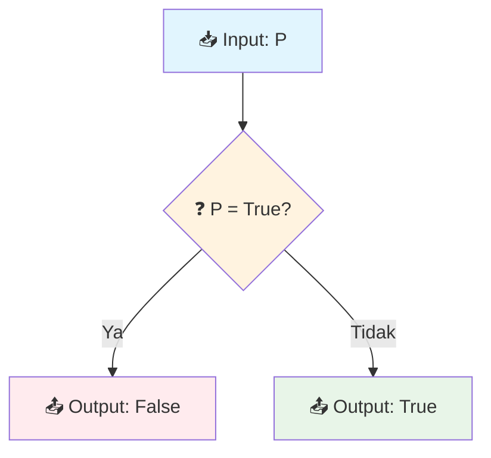
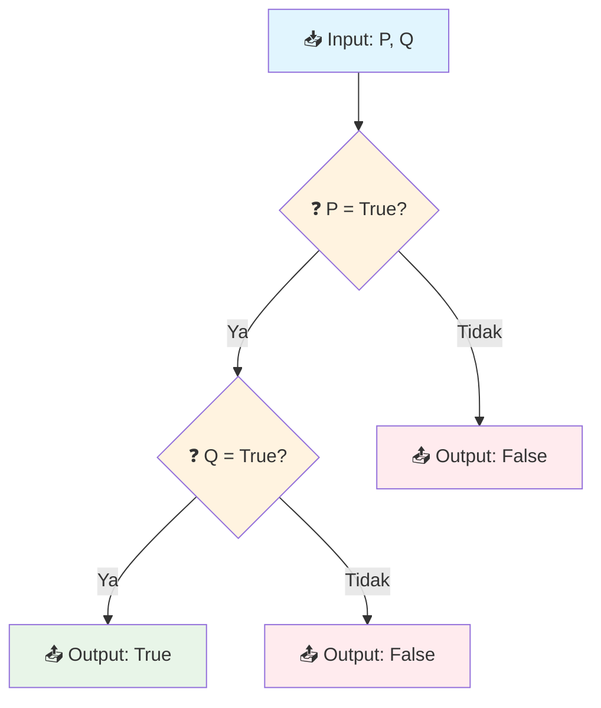
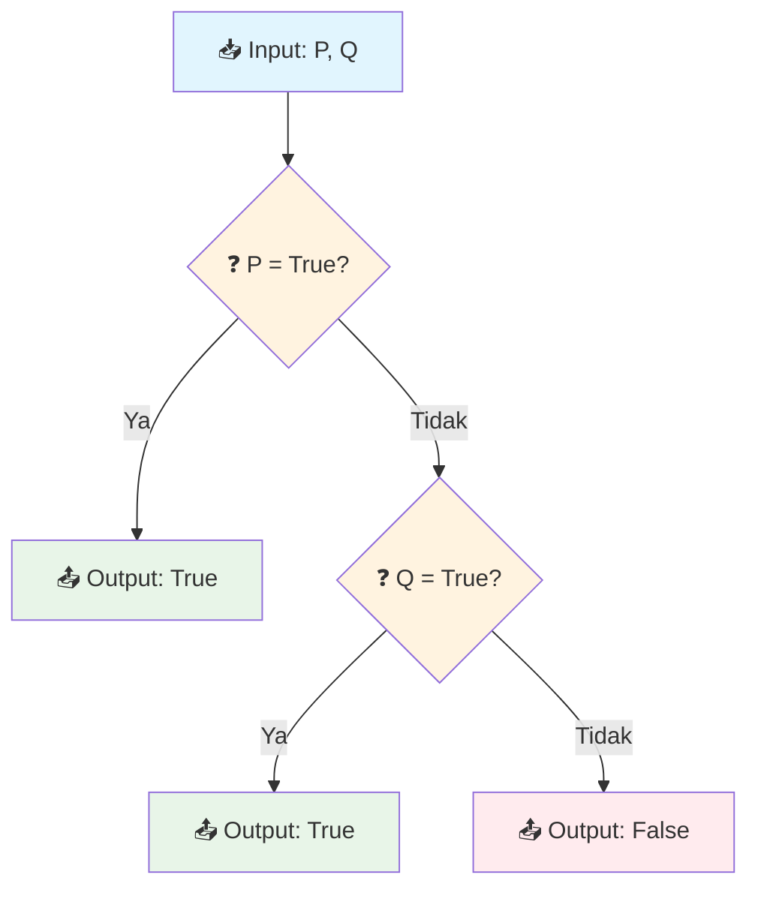
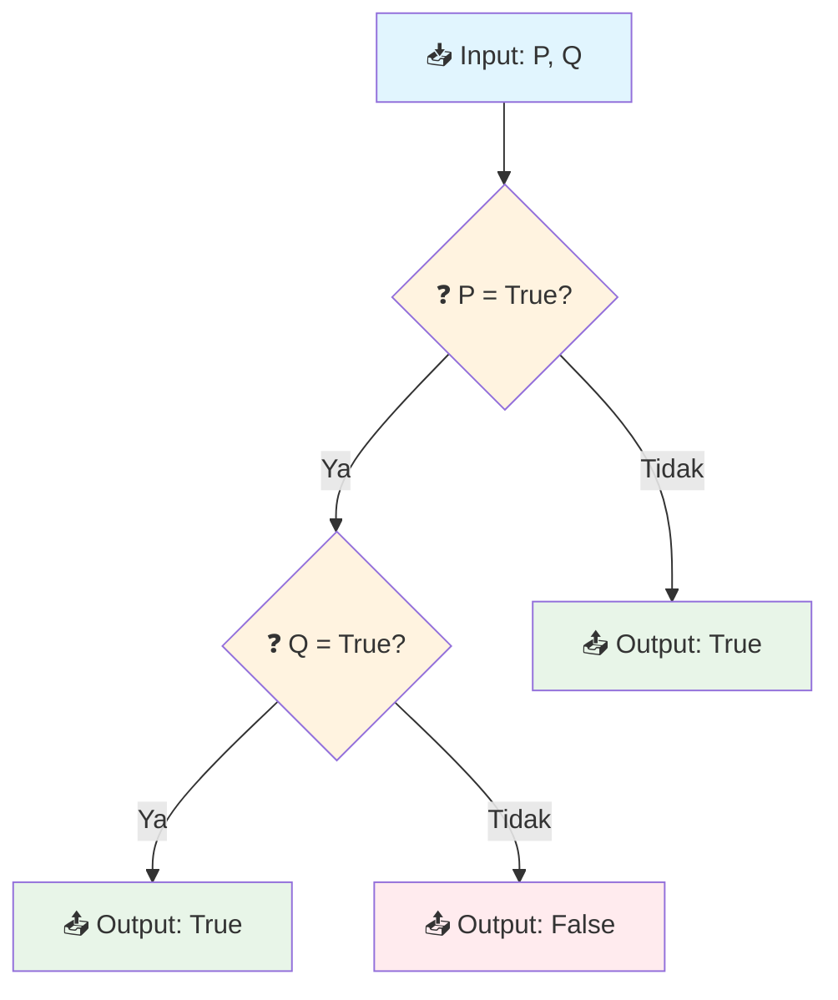
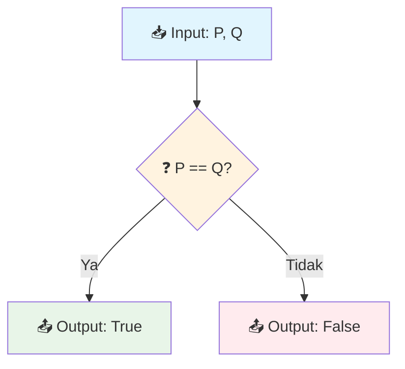
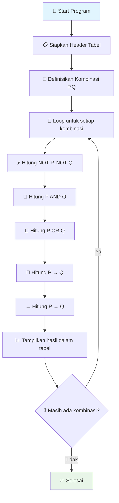
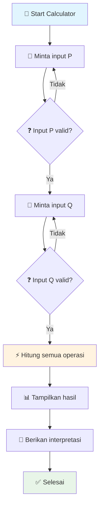

# 🎯 Pertemuan 2: Propositional Logic Fundamentals


---

## 📋 Informasi Pertemuan

| **Aspek** | **Detail** |
|-----------|------------|
| 🕐 **Durasi** | 3 x 50 menit |
| 🎯 **Capaian Pembelajaran** | Memahami proposisi dan operator logika dasar |
| 📚 **Materi Utama** | Proposisi, Truth Tables, Logical Connectives |
| 💻 **Tools** | Python, www.onlineide.pro |
| 📖 **Prasyarat** | Pemahaman dasar dari pertemuan 1 |

---

## 🌟 Tujuan Pembelajaran

Setelah mengikuti pertemuan ini, mahasiswa diharapkan mampu:

1. **🔍 Mengidentifikasi** proposisi dan non-proposisi dalam pernyataan
2. **⚡ Menggunakan** operator logika dasar (∧, ∨, ¬, →, ↔)
3. **📊 Membuat** tabel kebenaran (truth tables) dengan benar
4. **💻 Mengimplementasikan** operasi logika dalam Python
5. **🧠 Menerapkan** logical connectives dalam pemecahan masalah

---

## 🤔 Apa itu Proposisi?

### 📖 Definisi Sederhana
**Proposisi** adalah pernyataan yang memiliki nilai kebenaran yang pasti - **BENAR** atau **SALAH**, tidak keduanya.

### ✅ Contoh Proposisi (Pernyataan yang Valid)

| **Pernyataan** | **Nilai Kebenaran** | **Penjelasan** |
|----------------|---------------------|----------------|
| "Jakarta adalah ibu kota Indonesia" | **BENAR** | Fakta yang dapat diverifikasi |
| "2 + 2 = 5" | **SALAH** | Operasi matematika yang salah |
| "Semua mahasiswa suka matematika" | **SALAH** | Generalisasi yang tidak benar |
| "Python adalah bahasa pemrograman" | **BENAR** | Fakta teknologi yang benar |

### ❌ Contoh Non-Proposisi (Pernyataan yang Tidak Valid)

| **Pernyataan** | **Mengapa Bukan Proposisi?** |
|----------------|------------------------------|
| "Siapa nama Anda?" | Pertanyaan, bukan pernyataan |
| "Tutup pintu itu!" | Perintah, bukan pernyataan |
| "Semoga berhasil" | Harapan, tidak bisa dinilai benar/salah |
| "x + 5 = 10" | Mengandung variabel, nilai kebenaran tergantung x |

### 🎮 Analogi Mudah: Lampu ON/OFF
Bayangkan proposisi seperti **saklar lampu**:
- **ON (1)** = BENAR (True)
- **OFF (0)** = SALAH (False)
- Tidak ada posisi "setengah nyala" - hanya ada dua kemungkinan!

---

## ⚡ Logical Connectives (Operator Logika)

Logical connectives adalah "kata penghubung" yang menggabungkan proposisi untuk membentuk proposisi baru.

### 🚫 1. Negation (NOT) - ¬

**Simbol**: ¬ atau ~  
**Fungsi**: Membalik nilai kebenaran

```python
# Implementasi Negation dalam Python
def negation(p):
    """
    Fungsi untuk operasi NOT (negation)
    Input: p (boolean) - nilai proposisi
    Output: boolean - kebalikan dari p
    """
    return not p

# Contoh penggunaan
p = True   # "Hari ini hujan"
print(f"P = {p}")                    # P = True
print(f"¬P (NOT P) = {negation(p)}")  # ¬P (NOT P) = False
print()

# Contoh lain
q = False  # "Saya suka matematika"
print(f"Q = {q}")                    # Q = False  
print(f"¬Q (NOT Q) = {negation(q)}")  # ¬Q (NOT Q) = True
```

**🚀 Coba jalankan kode di atas di: [www.onlineide.pro](https://www.onlineide.pro)**

#### 📊 Truth Table untuk Negation

| **P** | **¬P** |
|-------|--------|
| T     | F      |
| F     | T      |



### 🤝 2. Conjunction (AND) - ∧

**Simbol**: ∧  
**Fungsi**: BENAR hanya jika kedua proposisi BENAR

```python
# Implementasi Conjunction dalam Python
def conjunction(p, q):
    """
    Fungsi untuk operasi AND (conjunction)
    Input: p, q (boolean) - dua proposisi
    Output: boolean - True hanya jika kedua input True
    """
    return p and q

# Contoh penggunaan
print("=== CONJUNCTION (AND) ===")
print("P: 'Saya rajin belajar'")
print("Q: 'Saya mengerjakan tugas'")
print()

# Test semua kemungkinan
test_cases = [
    (True, True),    # Rajin belajar DAN mengerjakan tugas
    (True, False),   # Rajin belajar DAN TIDAK mengerjakan tugas  
    (False, True),   # TIDAK rajin belajar DAN mengerjakan tugas
    (False, False)   # TIDAK rajin belajar DAN TIDAK mengerjakan tugas
]

for p, q in test_cases:
    result = conjunction(p, q)
    print(f"P={p}, Q={q} → P∧Q = {result}")
```

**🚀 Coba jalankan kode di atas di: [www.onlineide.pro](https://www.onlineide.pro)**

#### 📊 Truth Table untuk Conjunction

| **P** | **Q** | **P ∧ Q** |
|-------|-------|-----------|
| T     | T     | **T**     |
| T     | F     | F         |
| F     | T     | F         |
| F     | F     | F         |



### 🎯 3. Disjunction (OR) - ∨

**Simbol**: ∨  
**Fungsi**: BENAR jika minimal salah satu proposisi BENAR

```python
# Implementasi Disjunction dalam Python
def disjunction(p, q):
    """
    Fungsi untuk operasi OR (disjunction)
    Input: p, q (boolean) - dua proposisi
    Output: boolean - True jika minimal salah satu True
    """
    return p or q

# Contoh penggunaan dengan skenario nyata
print("=== DISJUNCTION (OR) ===")
print("P: 'Cuaca cerah'")
print("Q: 'Membawa payung'")
print("Kondisi untuk jalan-jalan: P ∨ Q")
print()

# Test semua kemungkinan
scenarios = [
    (True, True, "Cerah DAN bawa payung"),
    (True, False, "Cerah tapi TIDAK bawa payung"),  
    (False, True, "Tidak cerah tapi bawa payung"),
    (False, False, "Tidak cerah DAN tidak bawa payung")
]

for p, q, description in scenarios:
    result = disjunction(p, q)
    decision = "✅ Jadi jalan-jalan" if result else "❌ Tidak jadi jalan-jalan"
    print(f"{description}: P∨Q = {result} → {decision}")
```

**🚀 Coba jalankan kode di atas di: [www.onlineide.pro](https://www.onlineide.pro)**

#### 📊 Truth Table untuk Disjunction

| **P** | **Q** | **P ∨ Q** |
|-------|-------|-----------|
| T     | T     | **T**     |
| T     | F     | **T**     |
| F     | T     | **T**     |
| F     | F     | F         |



### 🔄 4. Implication (IF-THEN) - →

**Simbol**: → atau ⊃  
**Fungsi**: "Jika P maka Q" - SALAH hanya jika P benar dan Q salah

```python
# Implementasi Implication dalam Python
def implication(p, q):
    """
    Fungsi untuk operasi IF-THEN (implication)
    Input: p (antecedent), q (consequent) 
    Output: boolean - False hanya jika p=True dan q=False
    """
    return (not p) or q  # Ekuivalen dengan: jika p salah atau q benar

# Contoh penggunaan dengan analogi sederhana
print("=== IMPLICATION (IF-THEN) ===")
print("P: 'Saya belajar dengan rajin'")
print("Q: 'Saya mendapat nilai bagus'")
print("Implikasi: 'Jika saya belajar rajin, maka saya mendapat nilai bagus'")
print()

# Analisis semua kemungkinan
scenarios = [
    (True, True, "Belajar rajin → Nilai bagus"),
    (True, False, "Belajar rajin → Nilai jelek"),  
    (False, True, "Tidak belajar rajin → Nilai bagus"),
    (False, False, "Tidak belajar rajin → Nilai jelek")
]

for p, q, description in scenarios:
    result = implication(p, q)
    explanation = "✅ Wajar/Masuk akal" if result else "❌ Tidak masuk akal"
    print(f"{description}: P→Q = {result} ({explanation})")
```

**🚀 Coba jalankan kode di atas di: [www.onlineide.pro](https://www.onlineide.pro)**

#### 📊 Truth Table untuk Implication

| **P** | **Q** | **P → Q** | **Penjelasan** |
|-------|-------|-----------|----------------|
| T     | T     | **T**     | Janji ditepati |
| T     | F     | F         | Janji dilanggar |
| F     | T     | **T**     | Tidak ada janji, tapi hasilnya baik |
| F     | F     | **T**     | Tidak ada janji, hasil sesuai |



### ↔️ 5. Biconditional (IF AND ONLY IF) - ↔

**Simbol**: ↔ atau ≡  
**Fungsi**: "P jika dan hanya jika Q" - BENAR jika kedua proposisi memiliki nilai yang sama

```python
# Implementasi Biconditional dalam Python
def biconditional(p, q):
    """
    Fungsi untuk operasi IF AND ONLY IF (biconditional)
    Input: p, q (boolean) - dua proposisi
    Output: boolean - True jika kedua input memiliki nilai sama
    """
    return p == q  # True jika keduanya sama (T,T atau F,F)

# Contoh penggunaan
print("=== BICONDITIONAL (IF AND ONLY IF) ===")
print("P: 'Lampu menyala'")
print("Q: 'Saklar dalam posisi ON'")
print("Biconditional: 'Lampu menyala jika dan hanya jika saklar ON'")
print()

# Test semua kemungkinan
scenarios = [
    (True, True, "Lampu nyala DAN saklar ON"),
    (True, False, "Lampu nyala tapi saklar OFF"),  
    (False, True, "Lampu mati tapi saklar ON"),
    (False, False, "Lampu mati DAN saklar OFF")
]

for p, q, description in scenarios:
    result = biconditional(p, q)
    status = "✅ Normal" if result else "❌ Ada masalah"
    print(f"{description}: P↔Q = {result} ({status})")
```

**🚀 Coba jalankan kode di atas di: [www.onlineide.pro](https://www.onlineide.pro)**

#### 📊 Truth Table untuk Biconditional

| **P** | **Q** | **P ↔ Q** |
|-------|-------|-----------|
| T     | T     | **T**     |
| T     | F     | F         |
| F     | T     | F         |
| F     | F     | **T**     |



---

## 📊 Truth Table Generator - Project Hands-on

Mari kita buat program yang dapat menghasilkan truth table untuk berbagai operasi logika!

```python
# Truth Table Generator - Program Lengkap
def print_truth_table():
    """
    Program untuk menampilkan truth table lengkap
    untuk semua operator logika dasar
    """
    print("=" * 60)
    print("🔍 TRUTH TABLE GENERATOR")
    print("=" * 60)
    
    # Header tabel
    print(f"{'P':<5} {'Q':<5} {'¬P':<5} {'¬Q':<5} {'P∧Q':<5} {'P∨Q':<5} {'P→Q':<5} {'P↔Q':<5}")
    print("-" * 60)
    
    # Semua kombinasi nilai P dan Q
    combinations = [
        (True, True),
        (True, False), 
        (False, True),
        (False, False)
    ]
    
    # Hitung dan tampilkan hasil untuk setiap kombinasi
    for p, q in combinations:
        not_p = not p
        not_q = not q
        and_pq = p and q
        or_pq = p or q
        impl_pq = (not p) or q  # implication
        bicond_pq = p == q      # biconditional
        
        # Format output (T/F lebih mudah dibaca)
        p_str = 'T' if p else 'F'
        q_str = 'T' if q else 'F'
        not_p_str = 'T' if not_p else 'F'
        not_q_str = 'T' if not_q else 'F'
        and_str = 'T' if and_pq else 'F'
        or_str = 'T' if or_pq else 'F'
        impl_str = 'T' if impl_pq else 'F'
        bicond_str = 'T' if bicond_pq else 'F'
        
        print(f"{p_str:<5} {q_str:<5} {not_p_str:<5} {not_q_str:<5} {and_str:<5} {or_str:<5} {impl_str:<5} {bicond_str:<5}")
    
    print("-" * 60)
    print("📝 Keterangan:")
    print("¬P  = NOT P (Negation)")
    print("P∧Q = P AND Q (Conjunction)")  
    print("P∨Q = P OR Q (Disjunction)")
    print("P→Q = P implies Q (Implication)")
    print("P↔Q = P if and only if Q (Biconditional)")

# Jalankan program
print_truth_table()
```

**🚀 Coba jalankan kode di atas di: [www.onlineide.pro](https://www.onlineide.pro)**



---

## 💻 Program Interaktif: Logic Calculator

```python
# Logic Calculator - Program Interaktif
def logic_calculator():
    """
    Kalkulator logika interaktif untuk menghitung
    berbagai operasi proposisi
    """
    print("🧮 LOGIC CALCULATOR")
    print("="*40)
    
    # Input nilai proposisi
    print("Masukkan nilai proposisi (True/False atau T/F):")
    
    while True:
        try:
            # Input P
            p_input = input("P = ").strip().upper()
            if p_input in ['TRUE', 'T', '1']:
                p = True
            elif p_input in ['FALSE', 'F', '0']:
                p = False
            else:
                print("❌ Input tidak valid! Gunakan True/False atau T/F")
                continue
            
            # Input Q  
            q_input = input("Q = ").strip().upper()
            if q_input in ['TRUE', 'T', '1']:
                q = True
            elif q_input in ['FALSE', 'F', '0']:
                q = False
            else:
                print("❌ Input tidak valid! Gunakan True/False atau T/F")
                continue
                
            break
            
        except KeyboardInterrupt:
            print("\n👋 Program dihentikan.")
            return
    
    # Hitung semua operasi
    print(f"\n📊 HASIL PERHITUNGAN:")
    print(f"P = {p}")
    print(f"Q = {q}")
    print("-"*30)
    print(f"¬P (NOT P) = {not p}")
    print(f"¬Q (NOT Q) = {not q}")
    print(f"P ∧ Q (P AND Q) = {p and q}")
    print(f"P ∨ Q (P OR Q) = {p or q}")
    print(f"P → Q (P implies Q) = {(not p) or q}")
    print(f"P ↔ Q (P iff Q) = {p == q}")
    
    # Interpretasi hasil
    print(f"\n🎯 INTERPRETASI:")
    if p and q:
        print("✅ Kedua proposisi benar")
    elif not p and not q:
        print("❌ Kedua proposisi salah")
    else:
        print("⚡ Proposisi memiliki nilai berbeda")

# Jalankan kalkulator
logic_calculator()
```

**🚀 Coba jalankan kode di atas di: [www.onlineide.pro](https://www.onlineide.pro)**



---

## 🎯 Latihan Interaktif

### 🧩 Latihan 1: Identifikasi Proposisi

**Instruksi**: Tentukan mana yang merupakan proposisi dan mana yang bukan!

1. "Apakah 5 > 3?"
2. "Jakarta adalah ibu kota Indonesia"
3. "Belajarlah dengan giat!"
4. "x + y = 10"
5. "Python adalah bahasa pemrograman"
6. "Semoga lulus dengan nilai A"
7. "2 + 2 = 4"
8. "Tutup jendela itu!"

**Jawaban**:
- **Proposisi**: 2, 5, 7
- **Bukan Proposisi**: 1 (pertanyaan), 3 (perintah), 4 (mengandung variabel), 6 (harapan), 8 (perintah)

### 🧩 Latihan 2: Evaluasi Logical Operations

```python
# Latihan evaluasi operasi logika
def practice_evaluation():
    """
    Latihan untuk mengevaluasi operasi logika
    """
    print("🎯 LATIHAN EVALUASI OPERASI LOGIKA")
    print("="*45)
    
    # Definisikan proposisi
    propositions = {
        'P': True,   # "Hari ini cerah"
        'Q': False,  # "Saya membawa payung" 
        'R': True    # "Saya pergi keluar"
    }
    
    print("📝 Nilai Proposisi:")
    for prop, value in propositions.items():
        print(f"{prop} = {value}")
    
    print("\n🧮 Evaluasi Ekspresi:")
    print("-"*30)
    
    # Ekspresi yang akan dievaluasi
    expressions = [
        ("¬P", not propositions['P']),
        ("P ∧ Q", propositions['P'] and propositions['Q']),
        ("P ∨ Q", propositions['P'] or propositions['Q']),
        ("¬P ∨ R", not propositions['P'] or propositions['R']),
        ("(P ∧ Q) ∨ R", (propositions['P'] and propositions['Q']) or propositions['R']),
        ("P → (Q ∨ R)", (not propositions['P']) or (propositions['Q'] or propositions['R']))
    ]
    
    for expr, result in expressions:
        print(f"{expr:<12} = {result}")
    
    print("\n💡 Coba ubah nilai P, Q, R dan lihat perubahannya!")

# Jalankan latihan
practice_evaluation()
```

**🚀 Coba jalankan kode di atas di: [www.onlineide.pro](https://www.onlineide.pro)**

### 🧩 Latihan 3: Programming Logic Challenges

```python
# Tantangan Logika Pemrograman
def programming_logic_challenge():
    """
    Tantangan untuk mengaplikasikan logika dalam pemrograman
    """
    print("🏆 PROGRAMMING LOGIC CHALLENGE")
    print("="*40)
    
    # Challenge 1: Login System
    print("🔐 Challenge 1: Login System")
    username_correct = True
    password_correct = False
    
    login_success = username_correct and password_correct
    print(f"Username benar: {username_correct}")
    print(f"Password benar: {password_correct}")
    print(f"Login berhasil: {login_success}")
    print()
    
    # Challenge 2: File Access Permission
    print("📁 Challenge 2: File Access")
    is_owner = False
    has_read_permission = True
    is_admin = True
    
    can_access = is_owner or has_read_permission or is_admin
    print(f"Is owner: {is_owner}")
    print(f"Has read permission: {has_read_permission}") 
    print(f"Is admin: {is_admin}")
    print(f"Can access file: {can_access}")
    print()
    
    # Challenge 3: Shopping Cart Logic
    print("🛒 Challenge 3: Shopping Cart")
    has_items = True
    has_payment = True
    address_valid = False
    
    can_checkout = has_items and has_payment and address_valid
    print(f"Has items in cart: {has_items}")
    print(f"Has payment method: {has_payment}")
    print(f"Address is valid: {address_valid}")
    print(f"Can proceed to checkout: {can_checkout}")

# Jalankan challenge
programming_logic_challenge()
```

**🚀 Coba jalankan kode di atas di: [www.onlineide.pro](https://www.onlineide.pro)**

---

## 🔍 Aplikasi dalam Dunia Nyata

### 🤖 Database Query (SQL)
Operasi logika sangat penting dalam database:

```python
# Simulasi Database Query Logic
def database_query_simulation():
    """
    Simulasi cara kerja query database menggunakan logika
    """
    print("🗄️ DATABASE QUERY SIMULATION")
    print("="*35)
    
    # Data mahasiswa (simulasi)
    students = [
        {"name": "Alice", "gpa": 3.8, "major": "CS", "active": True},
        {"name": "Bob", "gpa": 3.2, "major": "Math", "active": True},
        {"name": "Carol", "gpa": 3.9, "major": "CS", "active": False},
        {"name": "David", "gpa": 2.8, "major": "CS", "active": True}
    ]
    
    print("📊 Data Mahasiswa:")
    for student in students:
        print(f"  {student['name']}: GPA={student['gpa']}, Major={student['major']}, Active={student['active']}")
    
    print(f"\n🔍 Query: Mahasiswa CS dengan GPA > 3.5 DAN masih aktif")
    print("SQL equivalent: SELECT * FROM students WHERE major='CS' AND gpa > 3.5 AND active=True")
    print()
    
    # Logika query: major='CS' AND gpa > 3.5 AND active=True
    print("📋 Hasil:")
    for student in students:
        is_cs = student['major'] == 'CS'
        high_gpa = student['gpa'] > 3.5
        is_active = student['active']
        
        meets_criteria = is_cs and high_gpa and is_active
        
        if meets_criteria:
            print(f"✅ {student['name']} - Memenuhi kriteria")
        else:
            print(f"❌ {student['name']} - Tidak memenuhi kriteria")
            reason = []
            if not is_cs: reason.append("bukan CS")
            if not high_gpa: reason.append("GPA ≤ 3.5")
            if not is_active: reason.append("tidak aktif")
            print(f"   Alasan: {', '.join(reason)}")

# Jalankan simulasi
database_query_simulation()
```

**🚀 Coba jalankan kode di atas di: [www.onlineide.pro](https://www.onlineide.pro)**

### 🔒 Digital Circuit Logic
```python
# Simulasi Digital Circuit menggunakan Logic Gates
def digital_circuit_simulation():
    """
    Simulasi rangkaian digital sederhana
    """
    print("⚡ DIGITAL CIRCUIT SIMULATION")
    print("="*35)
    
    # Input signals
    A = True   # Switch A
    B = False  # Switch B
    C = True   # Switch C
    
    print(f"📥 Input Signals:")
    print(f"A = {A}, B = {B}, C = {C}")
    print()
    
    # Logic Gates
    and_gate = A and B        # AND gate
    or_gate = A or B          # OR gate  
    not_gate = not A          # NOT gate
    nand_gate = not (A and B) # NAND gate
    
    # Complex circuit: (A AND B) OR (NOT C)
    complex_output = (A and B) or (not C)
    
    print(f"🔌 Logic Gates Output:")
    print(f"A AND B = {and_gate}")
    print(f"A OR B = {or_gate}")
    print(f"NOT A = {not_gate}")
    print(f"NAND(A,B) = {nand_gate}")
    print(f"(A AND B) OR (NOT C) = {complex_output}")

# Jalankan simulasi
digital_circuit_simulation()
```

**🚀 Coba jalankan kode di atas di: [www.onlineide.pro](https://www.onlineide.pro)**

---

## 📚 Daftar Istilah dan Singkatan

| **Istilah/Singkatan** | **Pengertian** |
|----------------------|----------------|
| **Antecedent** | Bagian "jika" dalam pernyataan implikasi (P dalam P→Q) |
| **Biconditional** | Operator logika "jika dan hanya jika" (↔) |
| **Boolean** | Tipe data dengan nilai True atau False |
| **Conjunction** | Operator logika "dan" (∧) |
| **Consequent** | Bagian "maka" dalam pernyataan implikasi (Q dalam P→Q) |
| **Disjunction** | Operator logika "atau" (∨) |
| **Implication** | Operator logika "jika...maka" (→) |
| **Logic Gate** | Komponen elektronik yang melakukan operasi logika |
| **Logical Connectives** | Operator untuk menghubungkan proposisi |
| **NAND** | NOT AND - kebalikan dari AND |
| **Negation** | Operator logika "tidak" (¬) |
| **NOR** | NOT OR - kebalikan dari OR |
| **Proposition** | Pernyataan yang memiliki nilai kebenaran pasti |
| **Truth Table** | Tabel yang menunjukkan semua kemungkinan nilai kebenaran |
| **Truth Value** | Nilai kebenaran: True (benar) atau False (salah) |

---

## 🏆 Rangkuman Pertemuan 2

### ✅ Apa yang Sudah Kita Pelajari?

1. **🎯 Proposisi**: Pernyataan dengan nilai kebenaran pasti (True/False)
2. **⚡ Logical Connectives**: Lima operator dasar (¬, ∧, ∨, →, ↔)
3. **📊 Truth Tables**: Cara sistematis mengevaluasi operasi logika
4. **💻 Implementation**: Mengimplementasikan logika dalam Python

### 🔑 Poin Kunci

- **Proposisi = Pernyataan dengan nilai kebenaran jelas**
- **AND (∧) = True hanya jika keduanya True**
- **OR (∨) = True jika minimal satu True**
- **NOT (¬) = Membalik nilai kebenaran**
- **Implication (→) = False hanya jika True → False**
- **Biconditional (↔) = True jika keduanya sama**

### 🎯 Operator Logic dalam Programming

| **Logical Operator** | **Python** | **Deskripsi** |
|----------------------|------------|---------------|
| Negation (¬) | `not` | Membalik nilai boolean |
| Conjunction (∧) | `and` | Kedua kondisi harus True |
| Disjunction (∨) | `or` | Minimal satu kondisi True |
| Implication (→) | `not p or q` | Jika p maka q |
| Biconditional (↔) | `p == q` | P jika dan hanya jika Q |

### 🚀 Persiapan Pertemuan Selanjutnya

Pada pertemuan berikutnya (Pertemuan 3), kita akan mempelajari:
- **Logical Equivalences** - Hukum-hukum logika
- **Simplification Techniques** - Menyederhanakan ekspresi logika
- **De Morgan's Laws** - Aturan penting dalam logika
- **Boolean Algebra** - Aljabar Boolean untuk digital circuits

---

## 📚 Referensi dan Sumber Belajar

### 📖 Buku Referensi Utama

1. **Rosen, K. H.** (2019). *Discrete Mathematics and Its Applications* (8th ed.). McGraw-Hill Education.
   - Chapter 1: The Foundations of Logic

2. **Lehman, E., Leighton, F. T., & Meyer, A. R.** (2017). *Mathematics for Computer Science*. MIT Press.
   - 🔗 Online: https://ocw.mit.edu/courses/6-042j-mathematics-for-computer-science-fall-2010/

3. **Ben-Ari, M.** (2012). *Mathematical Logic for Computer Science* (3rd ed.). Springer.
   - Chapter 2: Propositional Logic

### 🌐 Sumber Online

1. **MIT OpenCourseWare**: Mathematics for Computer Science
   - 🔗 https://ocw.mit.edu/courses/6-042j-mathematics-for-computer-science-fall-2010/video_galleries/video-lectures/

2. **Stanford CS103**: Mathematical Foundations of Computing
   - 🔗 https://cs103.stanford.edu/

3. **GeeksforGeeks**: Propositional Logic
   - 🔗 https://www.geeksforgeeks.org/propositional-logic/

### 🛠️ Interactive Tools

1. **Truth Table Generator Online**: 
   - 🔗 https://web.stanford.edu/class/cs103/tools/truth-table-tool/
   
2. **Logic Circuit Simulator**:
   - 🔗 https://logic.ly/

3. **Mathigon Logic Course**:
   - 🔗 https://mathigon.org/course/logic

---

## 💡 Tips Sukses Menguasai Propositional Logic

### 🎯 Strategi Belajar

1. **🧩 Practice Daily**: Latihan evaluasi truth tables 15 menit setiap hari
2. **🔄 Connect to Programming**: Hubungkan setiap operator dengan kondisi dalam code
3. **📝 Write Examples**: Buat contoh proposisi dari kehidupan sehari-hari
4. **🤝 Study Groups**: Diskusi truth tables dengan teman sekelas

### 🚀 Memory Techniques

**Mnemonics untuk mengingat operator:**
- **AND (∧)**: "**A**ll must be true" - Semua harus benar
- **OR (∨)**: "**O**ne or more true" - Satu atau lebih benar  
- **NOT (¬)**: "**N**egate the truth" - Balik kebenarannya
- **IMPLICATION (→)**: "**I**f-then relationship" - Hubungan jika-maka
- **BICONDITIONAL (↔)**: "**B**oth same truth value" - Keduanya nilai sama

---

## 📝 Assignment 1: Basic Truth Table Exercises

### 🎯 Petunjuk Pengerjaan

**Deadline**: Sebelum pertemuan ke-3  
**Format**: Upload file Python (.py) dan screenshot hasil  
**Platform**: Submit di Learning Management System  
**Bobot**: 7 marks

### 📋 Soal-soal

#### **Soal 1** (2 marks): Truth Table Construction
Buat truth table lengkap untuk ekspresi: **(P ∧ Q) ∨ (¬P ∧ ¬Q)**

#### **Soal 2** (2 marks): Programming Implementation  
Buat program Python yang:
1. Menerima input dua proposisi P dan Q
2. Menghitung semua operator logika (¬, ∧, ∨, →, ↔)
3. Menampilkan hasil dalam format tabel yang rapi

#### **Soal 3** (2 marks): Real-world Application
Buatlah skenario nyata (minimal 3 proposisi) dan terapkan logical connectives untuk membuat keputusan. Contoh: Sistem rekomendasi film berdasarkan genre, rating, dan durasi.

#### **Soal 4** (1 mark): Analysis
Jelaskan mengapa implication (P → Q) menghasilkan True ketika P = False dan Q = True. Berikan analogi dalam kehidupan sehari-hari.

### 📤 Template Submission

```python
# Assignment 1: Basic Truth Table Exercises
# Nama: [Nama Lengkap]
# NIM: [Nomor Induk Mahasiswa]
# Kelas: [Kelas]

print("="*50)
print("ASSIGNMENT 1: BASIC TRUTH TABLE EXERCISES")
print("="*50)

# SOAL 1: Truth Table Construction
def soal_1():
    """
    Truth table untuk (P ∧ Q) ∨ (¬P ∧ ¬Q)
    """
    # Your code here
    pass

# SOAL 2: Programming Implementation  
def soal_2():
    """
    Program interactive logic calculator
    """
    # Your code here
    pass

# SOAL 3: Real-world Application
def soal_3():
    """
    Skenario nyata dengan logical connectives
    """
    # Your code here
    pass

# SOAL 4: Analysis (dalam comment)
"""
Analisis Soal 4:
[Tulis penjelasan Anda di sini]
"""

# Jalankan semua soal
if __name__ == "__main__":
    print("Soal 1:")
    soal_1()
    print("\nSoal 2:")
    soal_2()
    print("\nSoal 3:")
    soal_3()
```

---

*🎓 Selamat belajar! Propositional Logic adalah fondasi untuk memahami reasoning yang lebih kompleks. Master the basics, excel in advanced topics! 🚀*
