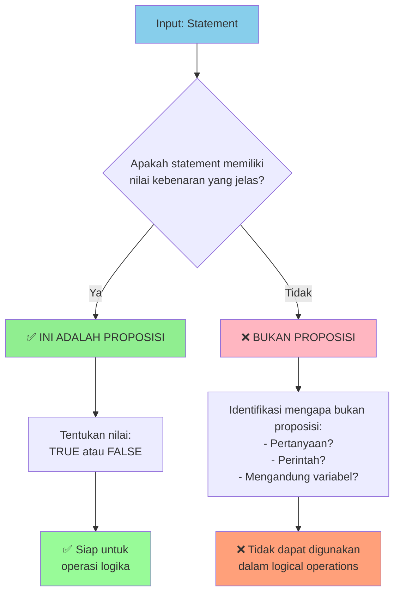
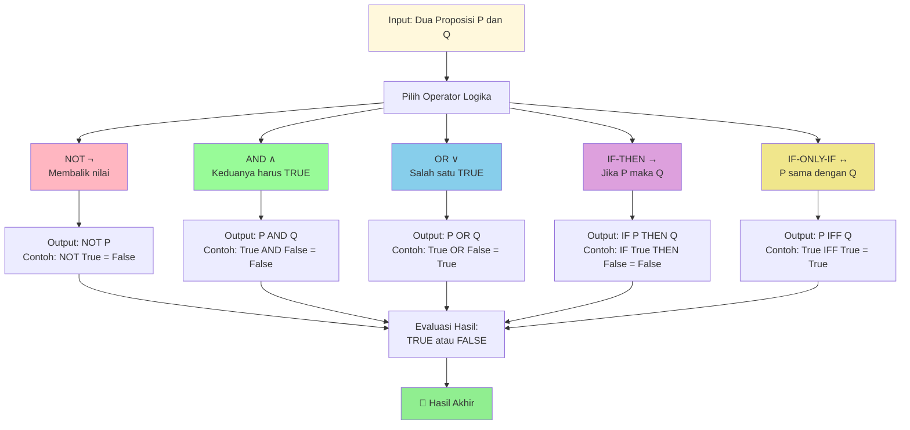
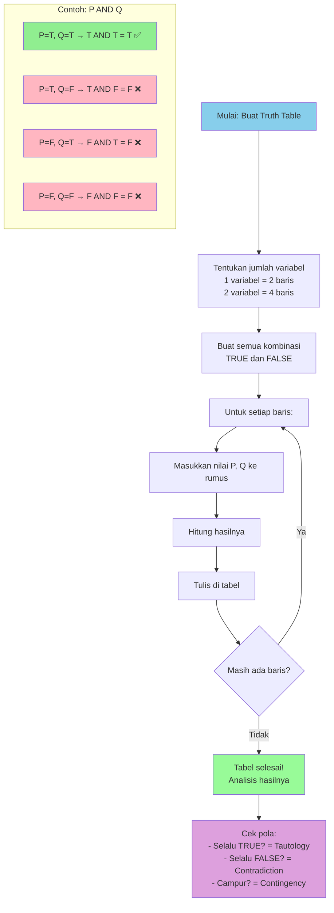
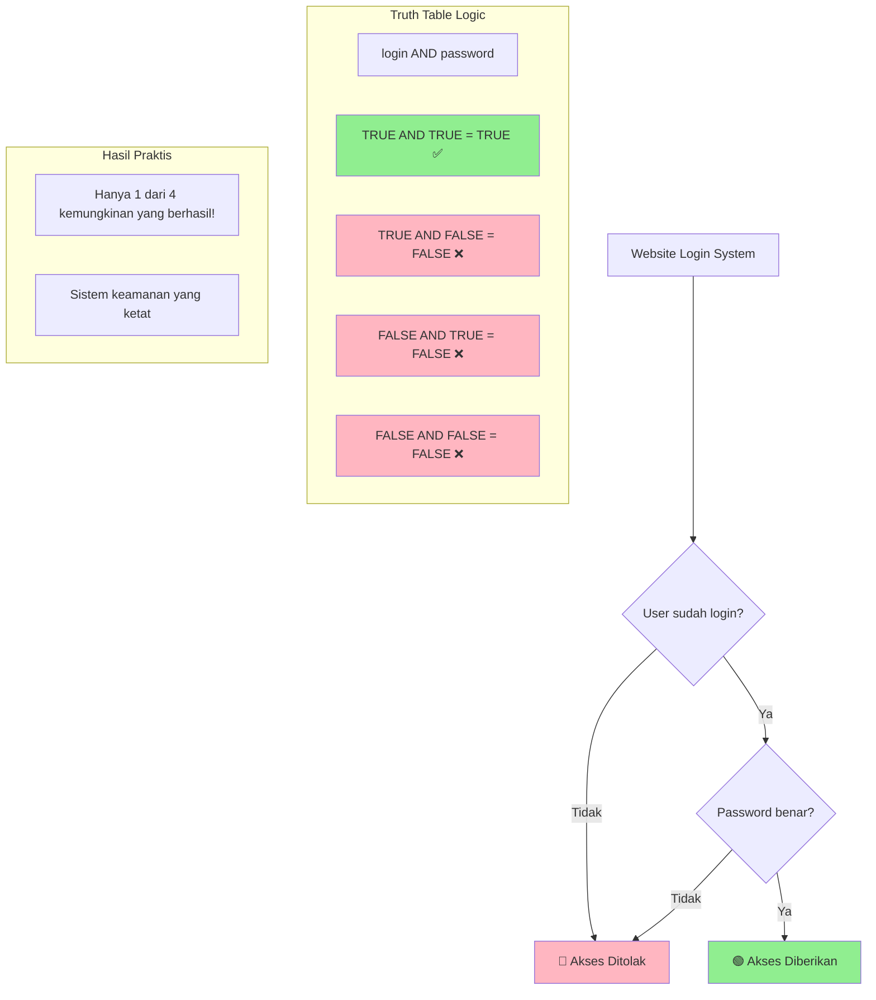
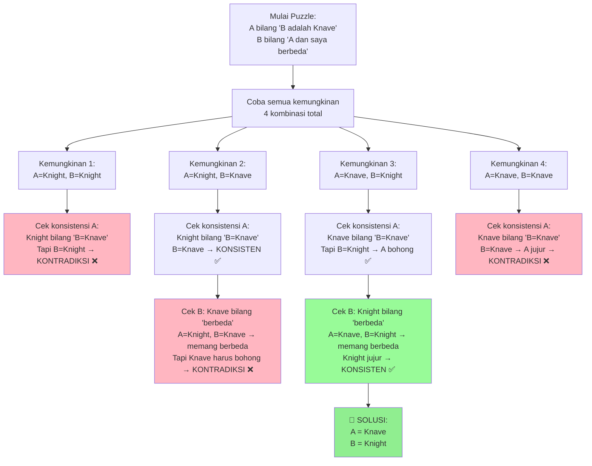

# 📚 Pertemuan 2: Propositional Logic Fundamentals


---

## 🎯 Tujuan Pembelajaran

Setelah mengikuti pertemuan ini, mahasiswa diharapkan mampu:

1. **Mengidentifikasi** proposisi dan membedakannya dari non-proposisi
2. **Memahami** semua logical connectives (∧, ∨, ¬, →, ↔) dan penggunaannya
3. **Mengkonstruksi** truth tables secara manual dan programmatic
4. **Mengimplementasikan** logical operations dalam Python
5. **Menganalisis** statement logika menggunakan propositional logic

---

## 📖 Materi Pembelajaran

### 1. Pengenalan Proposisi dan Logical Statements

#### 🔍 Apa itu Proposisi?

**Proposisi** adalah pernyataan yang memiliki nilai kebenaran yang jelas: **True** atau **False** (tidak boleh ambigu).

Bayangkan proposisi seperti **lampu** yang hanya bisa dalam kondisi **ON (True)** atau **OFF (False)**.

```python
# Contoh sederhana: Menganalisis proposisi
def adalah_proposisi(statement, nilai_kebenaran=None):
    """
    Fungsi untuk menganalisis apakah suatu statement adalah proposisi
    
    Cara kerja:
    1. Cek apakah statement memiliki nilai kebenaran yang jelas
    2. Jika ya, maka itu adalah proposisi
    3. Jika tidak, maka bukan proposisi
    
    Args:
        statement (str): Pernyataan yang akan dianalisis
        nilai_kebenaran (bool): Nilai kebenaran (True/False/None)
    
    Returns:
        dict: Hasil analisis lengkap
    """
    # Buat dictionary untuk menyimpan hasil analisis
    hasil = {
        "statement": statement,
        "adalah_proposisi": False,
        "alasan": "",
        "nilai_kebenaran": nilai_kebenaran,
        "tipe": ""
    }
    
    # Logika sederhana: jika nilai kebenaran jelas, maka proposisi
    if nilai_kebenaran is not None:
        hasil["adalah_proposisi"] = True
        hasil["alasan"] = "Memiliki nilai kebenaran yang jelas"
        hasil["tipe"] = "Proposisi ✅"
    else:
        hasil["alasan"] = "Tidak memiliki nilai kebenaran yang jelas"
        hasil["tipe"] = "Bukan Proposisi ❌"
    
    return hasil

# ========== CONTOH PENGGUNAAN ==========
print("🔍 ANALISIS PROPOSISI - CONTOH SEDERHANA")
print("=" * 50)

# Contoh berbagai jenis statement
contoh_statements = [
    ("2 + 2 = 4", True),                    # Proposisi: benar
    ("Python mudah dipelajari", True),      # Proposisi: bisa dinilai  
    ("x > 5", None),                        # Bukan proposisi: tergantung x
    ("Tutup pintu!", None),                 # Bukan proposisi: perintah
    ("Apakah hari ini hujan?", None),       # Bukan proposisi: pertanyaan
    ("Semua mahasiswa rajin", False)        # Proposisi: bisa dinilai
]

for statement, truth_value in contoh_statements:
    analisis = adalah_proposisi(statement, truth_value)
    
    print(f"📄 Statement: '{analisis['statement']}'")
    print(f"✅ Proposisi: {analisis['tipe']}")
    print(f"💭 Alasan: {analisis['alasan']}")
    
    if analisis['nilai_kebenaran'] is not None:
        status = "BENAR" if analisis['nilai_kebenaran'] else "SALAH"
        print(f"🎯 Nilai: {status}")
    
    print("-" * 30)
```

> 💡 **Jalankan kode ini di: [www.onlineide.pro](https://www.onlineide.pro)**  
> **Tip**: Copy kode di atas dengan menekan tombol copy, lalu paste ke onlineide.pro



#### 📊 Tabel Kategori Statement untuk Mahasiswa

| **Kategori** | **Contoh** | **Proposisi?** | **Alasan Sederhana** |
|-------------|------------|----------------|---------------------|
| **Fakta Matematis** | `5 > 3` | ✅ YA | Selalu benar |
| **Pernyataan Coding** | `len("Hello") == 5` | ✅ YA | Bisa dicek di Python |
| **Dengan Variabel** | `x < 10` | ❌ TIDAK | Tergantung nilai x |
| **Pertanyaan** | `Apakah array kosong?` | ❌ TIDAK | Ini pertanyaan, bukan pernyataan |
| **Perintah** | `print("Hello")` | ❌ TIDAK | Ini instruksi |
| **Boolean Expression** | `True and False` | ✅ YA | Menghasilkan True/False |

---

### 2. Logical Connectives (Penghubung Logika)

#### 🔗 Lima Operator Logika Penting

Dalam programming, kita sering menggunakan operator logika. Mari kita pelajari dengan cara yang mudah:

```python
class LogikaSederhana:
    """
    Kelas untuk belajar 5 operator logika dengan cara yang mudah dipahami
    """
    
    def __init__(self):
        print("🎓 Selamat datang di kelas Logika Sederhana!")
        print("Mari belajar 5 operator logika step by step\n")
    
    def negasi(self, p):
        """
        NEGASI (¬) - NOT Operator
        Seperti saklar lampu: ON menjadi OFF, OFF menjadi ON
        
        Args:
            p (bool): Input proposisi
        Returns:
            bool: Kebalikan dari p
        """
        hasil = not p
        print(f"🔄 NEGASI: NOT {p} = {hasil}")
        return hasil
    
    def konjungsi(self, p, q):
        """
        KONJUNGSI (∧) - AND Operator  
        Seperti gerbang: HANYA BUKA jika KEDUA kunci TRUE
        
        Args:
            p (bool): Proposisi pertama
            q (bool): Proposisi kedua
        Returns:
            bool: p AND q
        """
        hasil = p and q
        print(f"🤝 KONJUNGSI: {p} AND {q} = {hasil}")
        return hasil
    
    def disjungsi(self, p, q):
        """
        DISJUNGSI (∨) - OR Operator
        Seperti pintu darurat: BUKA jika SALAH SATU kunci TRUE
        
        Args:
            p (bool): Proposisi pertama  
            q (bool): Proposisi kedua
        Returns:
            bool: p OR q
        """
        hasil = p or q
        print(f"🚪 DISJUNGSI: {p} OR {q} = {hasil}")
        return hasil
        
    def implikasi(self, p, q):
        """
        IMPLIKASI (→) - IF-THEN Operator
        Seperti janji: "JIKA p MAKA q"
        Janji hanya SALAH jika p benar tapi q salah
        
        Args:
            p (bool): Kondisi IF (antecedent)
            q (bool): Hasil THEN (consequent)  
        Returns:
            bool: IF p THEN q
        """
        hasil = (not p) or q
        print(f"➡️ IMPLIKASI: IF {p} THEN {q} = {hasil}")
        return hasil
    
    def bikondisional(self, p, q):
        """
        BIKONDISIONAL (↔) - IF AND ONLY IF
        Seperti kembar identik: TRUE jika SAMA-SAMA true atau SAMA-SAMA false
        
        Args:
            p (bool): Proposisi pertama
            q (bool): Proposisi kedua
        Returns:
            bool: p IF AND ONLY IF q  
        """
        hasil = p == q
        print(f"🔄 BIKONDISIONAL: {p} IFF {q} = {hasil}")
        return hasil

# ========== DEMO LOGIKA DENGAN CONTOH NYATA ==========
def demo_logika_programming():
    """
    Demo operator logika dengan contoh programming sehari-hari
    """
    logika = LogikaSederhana()
    
    print("🖥️ CONTOH DALAM PROGRAMMING:")
    print("=" * 40)
    
    # Simulasi kondisi login system
    user_login = True       # P: User sudah login
    ada_token = False       # Q: Ada valid token
    is_admin = True         # R: User adalah admin
    
    print(f"📊 STATUS AWAL:")
    print(f"   User Login: {user_login}")
    print(f"   Ada Token: {ada_token}")  
    print(f"   Is Admin: {is_admin}")
    print()
    
    print("🔍 TESTING OPERATOR LOGIKA:")
    print("-" * 30)
    
    # 1. NEGASI: User TIDAK login
    print("1️⃣ NEGASI (NOT):")
    not_login = logika.negasi(user_login)
    print(f"   Arti: User TIDAK login = {not_login}\n")
    
    # 2. KONJUNGSI: Login DAN ada token
    print("2️⃣ KONJUNGSI (AND):")
    login_dan_token = logika.konjungsi(user_login, ada_token)
    print(f"   Arti: Login DAN ada token = {login_dan_token}")
    print(f"   System: {'AKSES DIBERIKAN ✅' if login_dan_token else 'AKSES DITOLAK ❌'}\n")
    
    # 3. DISJUNGSI: Ada token ATAU admin
    print("3️⃣ DISJUNGSI (OR):")
    token_atau_admin = logika.disjungsi(ada_token, is_admin)
    print(f"   Arti: Ada token ATAU admin = {token_atau_admin}")
    print(f"   System: {'BISA AKSES ✅' if token_atau_admin else 'TIDAK BISA ❌'}\n")
    
    # 4. IMPLIKASI: Jika admin maka bisa akses
    print("4️⃣ IMPLIKASI (IF-THEN):")
    if_admin_then_access = logika.implikasi(is_admin, True)
    print(f"   Arti: JIKA admin MAKA bisa akses = {if_admin_then_access}")
    print(f"   Logic: Janji sistem terpenuhi ✅\n")
    
    # 5. BIKONDISIONAL: Admin sama dengan full access
    print("5️⃣ BIKONDISIONAL (IF AND ONLY IF):")
    admin_iff_access = logika.bikondisional(is_admin, True)
    print(f"   Arti: Admin JIKA DAN HANYA JIKA full access = {admin_iff_access}")
    print(f"   Logic: Status konsisten ✅")

# Jalankan demo
demo_logika_programming()
```

> 💡 **Jalankan kode ini di: [www.onlineide.pro](https://www.onlineide.pro)**  
> **Tip**: Copy kode di atas dan paste ke onlineide.pro untuk melihat hasilnya!



#### 💻 Tabel Operator Python vs Logic Symbol

| **Symbol Logika** | **Nama** | **Operator Python** | **Contoh Programming** |
|------------------|----------|-------------------|----------------------|
| **¬** | Negation | `not` | `not is_logged_in` |
| **∧** | Conjunction | `and` | `is_user and has_permission` |
| **∨** | Disjunction | `or` | `is_admin or is_moderator` |
| **→** | Implication | `not p or q` | `(not error) or show_message` |
| **↔** | Biconditional | `p == q` | `is_premium == has_features` |

---

### 3. Truth Tables (Tabel Kebenaran)

#### 📊 Apa itu Truth Table?

**Truth Table** adalah seperti **tabel perkalian** dalam matematika, tapi untuk logika. Menunjukkan semua kemungkinan kombinasi input dan outputnya.

```python
def belajar_truth_table():
    """
    Belajar Truth Table dengan cara yang mudah dipahami mahasiswa baru
    """
    print("📊 BELAJAR TRUTH TABLE STEP BY STEP")
    print("=" * 50)
    print("Truth Table = Tabel yang menunjukkan SEMUA kemungkinan")
    print("Seperti tabel perkalian, tapi untuk logika!\n")
    
    # Mulai dari yang paling sederhana: NOT
    print("1️⃣ TRUTH TABLE UNTUK NOT (¬)")
    print("-" * 30)
    print("| P | NOT P |")
    print("|---|-------|")
    
    for p in [True, False]:
        not_p = not p
        print(f"| {str(p):5} | {str(not_p):5} |")
    
    print("\n💡 Penjelasan: NOT selalu membalik nilai!\n")
    
    # AND operator
    print("2️⃣ TRUTH TABLE UNTUK AND (∧)")
    print("-" * 30)
    print("| P | Q | P AND Q |")
    print("|---|---|---------|")
    
    for p in [True, False]:
        for q in [True, False]:
            result = p and q
            print(f"| {str(p):5} | {str(q):5} | {str(result):7} |")
    
    print("\n💡 Penjelasan: AND hanya TRUE jika KEDUA input TRUE!\n")
    
    # OR operator  
    print("3️⃣ TRUTH TABLE UNTUK OR (∨)")
    print("-" * 30)
    print("| P | Q | P OR Q |")
    print("|---|---|--------|")
    
    for p in [True, False]:
        for q in [True, False]:
            result = p or q
            print(f"| {str(p):5} | {str(q):5} | {str(result):6} |")
            
    print("\n💡 Penjelasan: OR hanya FALSE jika KEDUA input FALSE!")

# Jalankan fungsi belajar
belajar_truth_table()
```



#### 🎯 Truth Table Generator untuk Mahasiswa

```python
class TruthTableMudah:
    """
    Generator Truth Table yang mudah dipahami mahasiswa semester 1
    """
    
    def __init__(self):
        print("🎓 Truth Table Generator untuk Mahasiswa")
        print("Buat truth table dengan mudah!")
        
    def buat_tabel_and(self):
        """Buat truth table untuk operator AND"""
        print("\n📊 TRUTH TABLE: P AND Q")
        print("=" * 25)
        print("| P     | Q     | Result |")
        print("|-------|-------|--------|")
        
        # List untuk menyimpan hasil
        hasil = []
        
        # Coba semua kombinasi
        for p in [True, False]:
            for q in [True, False]:
                result = p and q
                hasil.append((p, q, result))
                
                # Format output yang rapi
                p_str = "TRUE " if p else "FALSE"
                q_str = "TRUE " if q else "FALSE"
                r_str = "TRUE  " if result else "FALSE "
                
                print(f"| {p_str} | {q_str} | {r_str} |")
        
        # Analisis sederhana
        true_count = sum(1 for _, _, r in hasil if r)
        print(f"\n📈 ANALISIS:")
        print(f"   Total kombinasi: {len(hasil)}")
        print(f"   Hasil TRUE: {true_count}")
        print(f"   Hasil FALSE: {len(hasil) - true_count}")
        print(f"   Kesimpulan: AND strict - butuh KEDUA input TRUE")
        
        return hasil
    
    def buat_tabel_or(self):
        """Buat truth table untuk operator OR"""
        print("\n📊 TRUTH TABLE: P OR Q")
        print("=" * 25)
        print("| P     | Q     | Result |")
        print("|-------|-------|--------|")
        
        hasil = []
        
        for p in [True, False]:
            for q in [True, False]:
                result = p or q
                hasil.append((p, q, result))
                
                p_str = "TRUE " if p else "FALSE"
                q_str = "TRUE " if q else "FALSE"
                r_str = "TRUE  " if result else "FALSE "
                
                print(f"| {p_str} | {q_str} | {r_str} |")
        
        # Analisis
        true_count = sum(1 for _, _, r in hasil if r)
        print(f"\n📈 ANALISIS:")
        print(f"   Total kombinasi: {len(hasil)}")
        print(f"   Hasil TRUE: {true_count}")
        print(f"   Hasil FALSE: {len(hasil) - true_count}")
        print(f"   Kesimpulan: OR fleksibel - cukup SATU input TRUE")
        
        return hasil
    
    def demo_aplikasi_nyata(self):
        """Demo aplikasi truth table dalam programming"""
        print("\n🖥️ APLIKASI TRUTH TABLE DALAM PROGRAMMING")
        print("=" * 50)
        
        print("Contoh: Sistem Login Website")
        print("-" * 30)
        
        # Variabel kondisi
        conditions = [
            (True, True, "User login", "Password benar"),    # Berhasil
            (True, False, "User login", "Password salah"),   # Gagal  
            (False, True, "User belum login", "Password benar"),  # Gagal
            (False, False, "User belum login", "Password salah")  # Gagal
        ]
        
        print("| User Login | Password OK | Bisa Akses? | Keterangan |")
        print("|------------|-------------|-------------|------------|")
        
        for login, password, login_desc, pass_desc in conditions:
            # Logic: User bisa akses HANYA JIKA login AND password benar
            bisa_akses = login and password
            
            login_str = "✅ Ya" if login else "❌ Tidak"
            pass_str = "✅ Ya" if password else "❌ Tidak"  
            akses_str = "🟢 YA" if bisa_akses else "🔴 TIDAK"
            
            print(f"| {login_str:10} | {pass_str:11} | {akses_str:11} | {login_desc} + {pass_desc} |")
        
        print(f"\n💡 INSIGHT: Website menggunakan AND logic")
        print(f"   KEDUA kondisi harus TRUE untuk akses!")

# Demo penggunaan
generator = TruthTableMudah()
generator.buat_tabel_and()
generator.buat_tabel_or()
generator.demo_aplikasi_nyata()
```

> 💡 **Jalankan kode ini di: [www.onlineide.pro](https://www.onlineide.pro)**



---

### 4. Latihan Interaktif dan Problem Solving

#### 🎮 Logic Puzzle: Knights and Knaves (Versi Mudah)

Mari kita selesaikan puzzle logika yang famous dengan cara step-by-step!

```python
def puzzle_knights_knaves_mudah():
    """
    Puzzle Knights and Knaves versi mudah untuk mahasiswa semester 1
    
    ATURAN GAME:
    - KNIGHTS selalu berkata JUJUR (TRUE)
    - KNAVES selalu BOHONG (FALSE)
    - Kita harus cari tahu siapa KNIGHT dan siapa KNAVE
    """
    print("🎮 LOGIC PUZZLE: KNIGHTS AND KNAVES")
    print("=" * 40)
    print("📝 ATURAN:")
    print("   - KNIGHTS selalu jujur ✅")
    print("   - KNAVES selalu bohong ❌")
    print("   - Cari tahu siapa Knight dan siapa Knave!")
    print()
    
    print("🧩 PUZZLE:")
    print("Ada 2 orang: A dan B")
    print("A berkata: 'B adalah Knave'")
    print("B berkata: 'A dan saya berbeda jenis'")
    print()
    
    print("🔍 LANGKAH PENYELESAIAN:")
    print("-" * 30)
    
    # Kita coba semua kemungkinan
    possibilities = [
        (True, True),   # A=Knight, B=Knight
        (True, False),  # A=Knight, B=Knave  
        (False, True),  # A=Knave, B=Knight
        (False, False)  # A=Knave, B=Knave
    ]
    
    solusi = []
    
    for i, (a_knight, b_knight) in enumerate(possibilities, 1):
        print(f"\n{i}️⃣ KEMUNGKINAN {i}:")
        a_type = "Knight" if a_knight else "Knave"
        b_type = "Knight" if b_knight else "Knave"
        print(f"   Anggap A = {a_type}, B = {b_type}")
        
        # Cek statement A: "B adalah Knave"
        a_statement = not b_knight  # A bilang B adalah Knave
        a_konsisten = (a_knight == a_statement)  # Cek konsistensi
        
        print(f"   📢 A bilang: 'B adalah Knave' = {a_statement}")
        print(f"   🤔 Apakah A konsisten? {a_konsisten}")
        
        # Cek statement B: "A dan saya berbeda jenis"  
        b_statement = (a_knight != b_knight)  # A dan B berbeda
        b_konsisten = (b_knight == b_statement)
        
        print(f"   📢 B bilang: 'A dan saya berbeda' = {b_statement}")
        print(f"   🤔 Apakah B konsisten? {b_konsisten}")
        
        # Kalau keduanya konsisten, ini solusinya!
        if a_konsisten and b_konsisten:
            print(f"   ✅ SOLUSI DITEMUKAN!")
            solusi.append((a_type, b_type))
        else:
            print(f"   ❌ Tidak konsisten")
    
    print(f"\n🎯 HASIL AKHIR:")
    if solusi:
        for a_type, b_type in solusi:
            print(f"   A adalah {a_type}")
            print(f"   B adalah {b_type}")
    else:
        print("   Tidak ada solusi!")

# Jalankan puzzle
puzzle_knights_knaves_mudah()
```



#### 🎯 Mini Quiz Interaktif

```python
def mini_quiz_propositional_logic():
    """
    Mini quiz untuk test pemahaman mahasiswa
    """
    print("🎯 MINI QUIZ: PROPOSITIONAL LOGIC")
    print("=" * 40)
    print("Jawab dengan True atau False!")
    print()
    
    # Bank soal mudah
    soal = [
        {
            "pertanyaan": "Apakah 'x > 5' adalah proposisi?",
            "jawaban": False,
            "penjelasan": "Bukan proposisi karena nilai kebenaran tergantung nilai x"
        },
        {
            "pertanyaan": "Apakah True AND False = False?", 
            "jawaban": True,
            "penjelasan": "AND hanya TRUE jika kedua input TRUE"
        },
        {
            "pertanyaan": "Apakah False OR True = True?",
            "jawaban": True, 
            "penjelasan": "OR TRUE jika minimal satu input TRUE"
        },
        {
            "pertanyaan": "Apakah NOT False = True?",
            "jawaban": True,
            "penjelasan": "NOT membalik nilai: NOT False = True"
        }
    ]
    
    score = 0
    total = len(soal)
    
    for i, q in enumerate(soal, 1):
        print(f"❓ Soal {i}: {q['pertanyaan']}")
        
        # Simulasi jawaban (dalam praktik nyata pakai input())
        print("   Pilihan: True / False")
        
        # Untuk demo, kita tampilkan jawaban benar
        jawaban_benar = q['jawaban']
        print(f"   ✅ Jawaban benar: {jawaban_benar}")
        print(f"   💡 Penjelasan: {q['penjelasan']}")
        
        score += 1  # Assume correct untuk demo
        print()
    
    # Hasil
    print("🏆 HASIL QUIZ:")
    percentage = (score / total) * 100
    print(f"   Skor: {score}/{total}")
    print(f"   Persentase: {percentage:.0f}%")
    
    if percentage >= 80:
        print("   🌟 Excellent! Anda paham propositional logic!")
    elif percentage >= 60:
        print("   👍 Good! Terus belajar ya!")
    else:
        print("   📚 Perlu belajar lagi. Jangan menyerah!")

# Jalankan quiz
mini_quiz_propositional_logic()
```

> 💡 **Jalankan kode ini di: [www.onlineide.pro](https://www.onlineide.pro)**

---

## 📚 Daftar Istilah dan Singkatan

### 🔤 Istilah Penting untuk Mahasiswa

| **Istilah** | **Pengertian Sederhana** | **Contoh** |
|-------------|-------------------------|------------|
| **Proposisi** | Kalimat yang bisa dinilai benar/salah | "2 + 2 = 4" |
| **Truth Table** | Tabel yang menunjukkan semua kemungkinan hasil | Seperti tabel perkalian untuk logika |
| **Logical Connectives** | Kata penghubung logika (dan, atau, tidak, dll) | AND, OR, NOT |
| **Negation (¬)** | Operator "TIDAK" yang membalik nilai | NOT True = False |
| **Conjunction (∧)** | Operator "DAN" - butuh keduanya benar | login AND password |
| **Disjunction (∨)** | Operator "ATAU" - cukup salah satu benar | admin OR moderator |
| **Implication (→)** | Operator "JIKA-MAKA" | JIKA hujan MAKA bawa payung |
| **Biconditional (↔)** | Operator "JIKA DAN HANYA JIKA" | premium JIKA DAN HANYA JIKA bayar |
| **Tautology** | Formula yang selalu benar | "P OR NOT P" |
| **Contradiction** | Formula yang selalu salah | "P AND NOT P" |
| **Contingency** | Formula yang kadang benar kadang salah | "P AND Q" |

### 🔢 Simbol Logika vs Python

| **Simbol** | **Nama** | **Python** | **Arti Sederhana** |
|------------|----------|------------|-------------------|
| **¬** | NOT | `not` | Kebalikan |
| **∧** | AND | `and` | Keduanya |
| **∨** | OR | `or` | Salah satu |
| **→** | IMPLIES | `not p or q` | Jika-maka |
| **↔** | IFF | `p == q` | Sama-sama |

### 📖 Singkatan Umum

| **Singkatan** | **Kepanjangan** | **Arti** |
|---------------|-----------------|----------|
| **IFF** | If and Only If | Jika dan hanya jika |
| **DNF** | Disjunctive Normal Form | Bentuk normal disjungtif |
| **CNF** | Conjunctive Normal Form | Bentuk normal konjungtif |
| **WFF** | Well-Formed Formula | Formula yang benar |
| **CS** | Computer Science | Ilmu Komputer |

---

## 🔗 Referensi dan Sumber Pembelajaran

### 📖 Buku Teks Utama

1. **Rosen, K. H.** (2019). *Discrete Mathematics and Its Applications* (8th ed.). McGraw-Hill Education. Bab 1.1-1.3: The Foundations: Logic and Proofs.

2. **Lehman, E., Leighton, F. T., & Meyer, A. R.** (2017). *Mathematics for Computer Science*. MIT Press. Tersedia online: [MIT OpenCourseWare](https://ocw.mit.edu/courses/6-042j-mathematics-for-computer-science-fall-2010/)

3. **Ben-Ari, M.** (2012). *Mathematical Logic for Computer Science* (3rd ed.). Springer-Verlag London.

### 🌐 Sumber Online Terpercaya

4. **MIT OpenCourseWare.** (2010). *6.042J Mathematics for Computer Science*. Retrieved from https://ocw.mit.edu/courses/6-042j-mathematics-for-computer-science-fall-2010/video_galleries/video-lectures/

5. **Stanford University.** (2023). *CS103: Mathematical Foundations of Computing*. Retrieved from https://cs103.stanford.edu/

6. **Khan Academy.** (2024). *Logic and Reasoning*. Retrieved from https://www.khanacademy.org/

### 📰 Jurnal dan Publikasi Ilmiah

7. **ACM Transactions on Computing Education.** (2024). "The Importance of Teaching Logic to Computer Scientists and Electrical Engineers." *ACM Digital Library*. https://dl.acm.org/doi/10.1145/3721986

8. **ResearchGate.** (2023). "Integrating Logic into the Computer Science Curriculum." Retrieved from https://www.researchgate.net/publication/2332276_Integrating_Logic_into_the_Computer_Science_Curriculum

### 🛠️ Tools dan Platform Interaktif

9. **Mathigon.** (2024). *Truth Tables Interactive Tool*. Retrieved from https://mathigon.org/

10. **LogicThruPython.** (2024). *Mathematical Logic through Python*. Retrieved from https://www.logicthrupython.org/

11. **Online IDE Pro.** (2024). *Python Programming Environment*. Retrieved from https://www.onlineide.pro

---

## 📝 Tugas dan Persiapan Pertemuan Selanjutnya

### 🎯 Assignment 1: Truth Tables dan Basic Logic (7 marks)

**Deadline: Sebelum Pertemuan 3**

#### Bagian A: Implementasi Truth Tables (3 marks)
1. **Buat truth table generator sederhana** dalam Python:
   ```python
   def buat_truth_table(operator, p_values, q_values):
       # Implementasi Anda di sini
       pass
   ```
   - Test dengan operator: AND, OR, NOT
   - Output format yang rapi dan mudah dibaca

2. **Test dengan expressions**:
   - `P AND Q`
   - `P OR Q` 
   - `NOT P`

#### Bagian B: Programming Logic Application (2 marks)
**Scenario**: Sistem perpustakaan online

```python
def akses_perpustakaan(is_student, has_card, is_weekend):
    """
    Tentukan akses perpustakaan berdasarkan:
    - Mahasiswa: perlu kartu DAN bukan weekend
    - Staff: selalu bisa akses
    - Weekend: hanya staff yang bisa
    """
    # Implementasi Anda
    pass
```

#### Bagian C: Logic Puzzle (2 marks)
Selesaikan puzzle sederhana:
- Ada 2 orang: X dan Y
- X berkata: "Saya dan Y sama-sama Knight"
- Y berkata: "X adalah Knave"
- Tentukan siapa Knight dan siapa Knave menggunakan truth table

### 📖 Persiapan Pertemuan 3: Logical Equivalences

**Materi yang akan dipelajari:**
- **De Morgan's Laws**: Hukum logika fundamental
- **Distributive Laws**: Cara menyederhanakan expression
- **Logical Equivalences**: Kapan dua formula sama
- **Boolean Simplification**: Optimasi circuit dan code

**Persiapan yang diperlukan:**
1. **Review Assignment 1** dan pastikan paham truth tables
2. **Baca Rosen Chapter 1.3** (halaman yang mudah dulu)
3. **Practice**: Buat truth table untuk `(P AND Q) OR (P AND R)`

### 💡 Tips Sukses untuk Mahasiswa Baru

#### 🎓 Study Tips
1. **15 menit setiap hari**: Latihan truth table harian
2. **Gunakan analogi**: Hubungkan dengan kehidupan sehari-hari
3. **Practice makes perfect**: Kerjakan banyak contoh sederhana
4. **Jangan malu bertanya**: Dosen dan teman siap membantu!

#### 🚀 Resources Tambahan
- **Online IDE**: [www.onlineide.pro](https://www.onlineide.pro) untuk practice Python
- **Logic Games**: Download "Logic Puzzles" di Play Store/App Store
- **Study Group**: Bentuk kelompok belajar dengan teman sekelas

---

## 🌟 Ringkasan Pertemuan 2

### ✅ Yang Sudah Dipelajari

1. **Proposisi**: Kalimat yang bisa dinilai benar/salah ✅
2. **5 Logical Connectives**: NOT, AND, OR, IF-THEN, IF-AND-ONLY-IF ✅
3. **Truth Tables**: Cara sistematis untuk analyze logic ✅
4. **Programming Application**: Hubungan logic dengan coding ✅
5. **Problem Solving**: Knights and Knaves puzzle ✅

### 🎯 Key Takeaways

- **Logic ada di mana-mana**: Dari login website sampai AI
- **Truth Tables = GPS untuk logic**: Selalu tahu arah yang benar
- **Python = Logic**: Operator Python langsung dari logical connectives
- **Practice makes perfect**: Semakin sering latihan, semakin paham

### 🔄 Koneksi ke Pertemuan 3

**Pertemuan 2 → Pertemuan 3**: 
- Dari **basic truth tables** ke **advanced logical equivalences**
- Dari **manual calculation** ke **automatic simplification**
- Dari **understanding** ke **optimization**

---

*Selamat! Anda telah menguasai dasar-dasar propositional logic! 🎉*  
*Siap untuk menjadi logic master di pertemuan selanjutnya! 🚀*

---

**© 2024 - Materi Pembelajaran Logika Matematika untuk Mahasiswa Informatika**
**Dibuat dengan ❤️ untuk mahasiswa semester 1**
