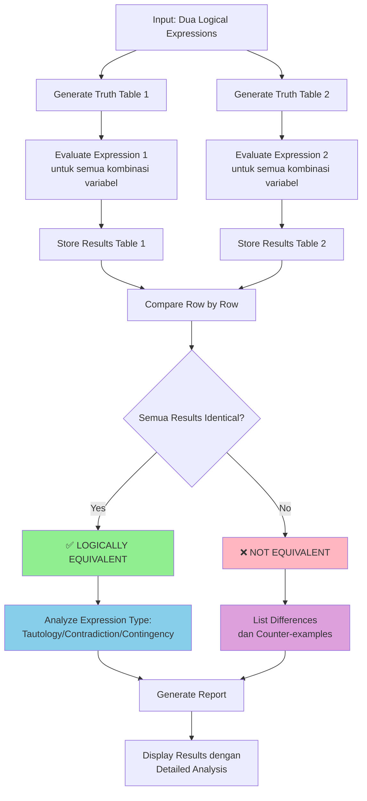
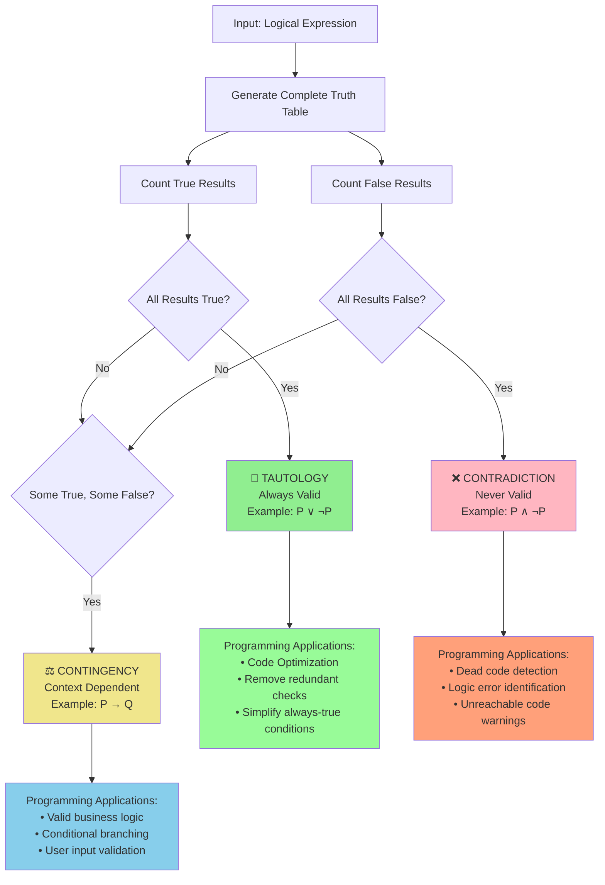
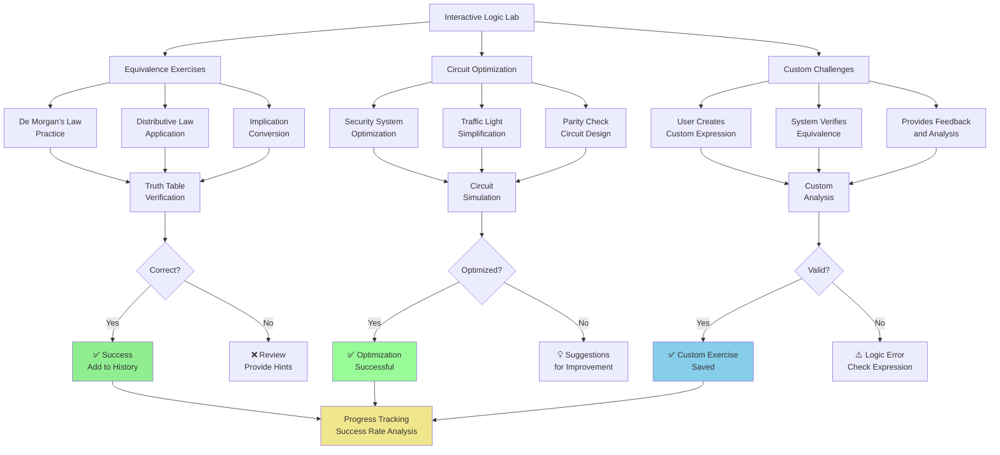
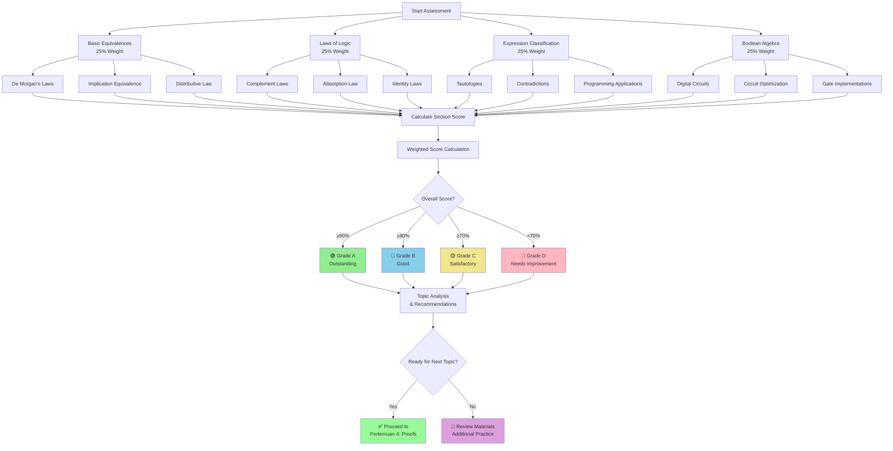

# 📚 Pertemuan 3: Logical Equivalences dan Simplification


---

## 🎯 Tujuan Pembelajaran

Setelah mengikuti pertemuan ini, mahasiswa diharapkan mampu:

1. **Memahami** konsep logical equivalences dan cara memverifikasinya
2. **Menerapkan** laws of logic (De Morgan's, Distributive, Associative, Commutative) untuk simplification
3. **Mengidentifikasi** tautologies, contradictions, dan contingencies secara sistematis
4. **Mengimplementasikan** Boolean algebra untuk circuit simplification
5. **Mengoptimalkan** logical expressions dalam programming contexts

---

## 📖 Materi Pembelajaran

### 1. Logical Equivalences Fundamentals

#### 🔍 Apa itu Logical Equivalence?

**Logical Equivalence** terjadi ketika dua logical expressions memiliki nilai kebenaran yang sama untuk semua kemungkinan kombinasi input. Dalam notasi: **P ≡ Q** berarti P dan Q logically equivalent.

```python
class LogicalEquivalenceChecker:
    """
    Kelas untuk mengecek logical equivalence antara dua expressions
    menggunakan truth table comparison dan symbolic manipulation
    """
    
    def __init__(self):
        self.truth_values = [True, False]
        self.operators = {
            'AND': lambda p, q: p and q,
            'OR': lambda p, q: p or q,
            'NOT': lambda p: not p,
            'IMPLIES': lambda p, q: (not p) or q,
            'IFF': lambda p, q: p == q,
            'XOR': lambda p, q: p != q,
            'NAND': lambda p, q: not (p and q),
            'NOR': lambda p, q: not (p or q)
        }
    
    def generate_truth_table(self, expression_func, variables):
        """
        Generate complete truth table untuk given expression
        
        Args:
            expression_func (function): Function yang mengevaluasi logical expression
            variables (list): List nama variabel yang digunakan
            
        Returns:
            list: Truth table sebagai list of dictionaries
        """
        import itertools
        
        truth_table = []
        num_vars = len(variables)
        
        # Generate semua kombinasi truth values
        for combination in itertools.product(self.truth_values, repeat=num_vars):
            var_assignments = dict(zip(variables, combination))
            
            try:
                result = expression_func(**var_assignments)
                
                # Store combination dan result
                row = var_assignments.copy()
                row['Result'] = result
                truth_table.append(row)
                
            except Exception as e:
                print(f"Error evaluating combination {combination}: {e}")
        
        return truth_table
    
    def check_equivalence(self, expr1_func, expr2_func, variables):
        """
        Check jika dua expressions logically equivalent
        
        Args:
            expr1_func (function): First logical expression
            expr2_func (function): Second logical expression  
            variables (list): Variables used dalam both expressions
            
        Returns:
            dict: Detailed equivalence analysis
        """
        # Generate truth tables untuk both expressions
        table1 = self.generate_truth_table(expr1_func, variables)
        table2 = self.generate_truth_table(expr2_func, variables)
        
        if len(table1) != len(table2):
            return {
                'equivalent': False,
                'reason': 'Different number of rows in truth tables',
                'analysis': None
            }
        
        # Compare results row by row
        equivalent = True
        differences = []
        
        for i in range(len(table1)):
            if table1[i]['Result'] != table2[i]['Result']:
                equivalent = False
                differences.append({
                    'row': i,
                    'variables': {var: table1[i][var] for var in variables},
                    'expr1_result': table1[i]['Result'],
                    'expr2_result': table2[i]['Result']
                })
        
        return {
            'equivalent': equivalent,
            'differences': differences,
            'table1': table1,
            'table2': table2,
            'analysis': self._analyze_expressions(table1, table2)
        }
    
    def _analyze_expressions(self, table1, table2):
        """Analyze properties dari expressions"""
        expr1_true_count = sum(1 for row in table1 if row['Result'])
        expr2_true_count = sum(1 for row in table2 if row['Result'])
        total_rows = len(table1)
        
        def classify_expression(true_count, total):
            if true_count == total:
                return 'TAUTOLOGY'
            elif true_count == 0:
                return 'CONTRADICTION'
            else:
                return 'CONTINGENCY'
        
        return {
            'expr1_type': classify_expression(expr1_true_count, total_rows),
            'expr2_type': classify_expression(expr2_true_count, total_rows),
            'expr1_true_ratio': expr1_true_count / total_rows,
            'expr2_true_ratio': expr2_true_count / total_rows
        }
    
    def print_equivalence_result(self, result, expr1_name, expr2_name):
        """Print detailed hasil equivalence check"""
        print(f"\n🔍 EQUIVALENCE CHECK: {expr1_name} ≡ {expr2_name}")
        print("=" * 70)
        
        if result['equivalent']:
            print("✅ RESULT: The expressions are LOGICALLY EQUIVALENT")
            
            analysis = result['analysis']
            print(f"📊 ANALYSIS:")
            print(f"   Expression Type: {analysis['expr1_type']}")
            print(f"   True Ratio: {analysis['expr1_true_ratio']:.2%}")
            
        else:
            print("❌ RESULT: The expressions are NOT equivalent")
            print(f"📊 DIFFERENCES FOUND: {len(result['differences'])} row(s)")
            
            for diff in result['differences'][:3]:  # Show first 3 differences
                vars_str = ", ".join([f"{k}={diff['variables'][k]}" for k in diff['variables']])
                print(f"   Row {diff['row']}: {vars_str}")
                print(f"      {expr1_name}: {diff['expr1_result']}")
                print(f"      {expr2_name}: {diff['expr2_result']}")

# Demonstrasi Equivalence Checking
def demo_logical_equivalences():
    """
    Demonstrasi comprehensive logical equivalence checking
    dengan berbagai contoh dari programming contexts
    """
    checker = LogicalEquivalenceChecker()
    
    print("=== LOGICAL EQUIVALENCE DEMONSTRATION ===")
    print("Testing various logical equivalences dan non-equivalences\n")
    
    # Test 1: De Morgan's Law - ¬(P ∧ Q) ≡ ¬P ∨ ¬Q
    def de_morgan_left(P, Q):
        """¬(P ∧ Q)"""
        return not (P and Q)
    
    def de_morgan_right(P, Q):
        """¬P ∨ ¬Q"""
        return (not P) or (not Q)
    
    result1 = checker.check_equivalence(de_morgan_left, de_morgan_right, ['P', 'Q'])
    checker.print_equivalence_result(result1, "¬(P ∧ Q)", "¬P ∨ ¬Q")
    
    # Test 2: Implication Equivalence - (P → Q) ≡ (¬P ∨ Q)
    def implication(P, Q):
        """P → Q"""
        return (not P) or Q
    
    def disjunction_form(P, Q):
        """¬P ∨ Q"""
        return (not P) or Q
    
    result2 = checker.check_equivalence(implication, disjunction_form, ['P', 'Q'])
    checker.print_equivalence_result(result2, "P → Q", "¬P ∨ Q")
    
    # Test 3: NON-Equivalence Example - (P ∧ Q) vs (P ∨ Q)
    def conjunction(P, Q):
        """P ∧ Q"""
        return P and Q
    
    def disjunction(P, Q):
        """P ∨ Q"""
        return P or Q
    
    result3 = checker.check_equivalence(conjunction, disjunction, ['P', 'Q'])
    checker.print_equivalence_result(result3, "P ∧ Q", "P ∨ Q")

# Jalankan demonstrasi
demo_logical_equivalences()
```

**💡 Jalankan kode ini di: [www.onlineide.pro](https://www.onlineide.pro)**



#### 💻 Programming Applications dari Logical Equivalences

```python
def programming_equivalence_examples():
    """
    Contoh real-world applications dari logical equivalences
    dalam programming dan software engineering
    """
    print("=== PROGRAMMING APPLICATIONS ===")
    print("Real-world examples dari logical equivalences dalam code\n")
    
    # Example 1: Conditional Optimization
    print("[OPTIMIZATION] CONDITIONAL STATEMENT OPTIMIZATION")
    print("-" * 50)
    
    # Original complex condition
    def complex_authentication(user_logged_in, has_token, session_valid, is_admin):
        """Original complex authentication logic"""
        return (user_logged_in and has_token) or (user_logged_in and session_valid) or is_admin
    
    # Optimized menggunakan distributive law: A∧B ∨ A∧C ≡ A∧(B∨C)
    def optimized_authentication(user_logged_in, has_token, session_valid, is_admin):
        """Optimized menggunakan distributive law"""
        return (user_logged_in and (has_token or session_valid)) or is_admin
    
    # Test equivalence
    checker = LogicalEquivalenceChecker()
    variables = ['user_logged_in', 'has_token', 'session_valid', 'is_admin']
    
    result = checker.check_equivalence(
        complex_authentication, 
        optimized_authentication, 
        variables
    )
    
    print(f"Optimization Valid: {'✅ YES' if result['equivalent'] else '❌ NO'}")
    print("Benefits: Fewer logical operations, clearer code structure\n")
    
    # Example 2: Error Handling Simplification
    print("[ERROR HANDLING] ERROR CONDITION SIMPLIFICATION")
    print("-" * 50)
    
    def complex_error_check(network_error, database_error, validation_error):
        """Complex error checking logic"""
        return not (not network_error and not database_error and not validation_error)
    
    def simple_error_check(network_error, database_error, validation_error):
        """Simplified using De Morgan's law"""
        return network_error or database_error or validation_error
    
    # Verify equivalence menggunakan De Morgan's law
    error_result = checker.check_equivalence(
        complex_error_check,
        simple_error_check,
        ['network_error', 'database_error', 'validation_error']
    )
    
    print(f"Simplification Valid: {'✅ YES' if error_result['equivalent'] else '❌ NO'}")
    print("Benefits: More readable, easier to understand error logic\n")
    
    # Example 3: Database Query Optimization
    print("[DATABASE] QUERY CONDITION OPTIMIZATION")
    print("-" * 50)
    
    def complex_query_condition(is_active, age_valid, has_subscription):
        """Complex database query condition"""
        return not (not is_active or (not age_valid and not has_subscription))
    
    def optimized_query_condition(is_active, age_valid, has_subscription):
        """Optimized condition menggunakan logical laws"""
        return is_active and (age_valid or has_subscription)
    
    query_result = checker.check_equivalence(
        complex_query_condition,
        optimized_query_condition,
        ['is_active', 'age_valid', 'has_subscription']
    )
    
    print(f"Query Optimization Valid: {'✅ YES' if query_result['equivalent'] else '❌ NO'}")
    print("Benefits: Faster database execution, clearer SQL generation")

# Jalankan contoh programming applications
programming_equivalence_examples()
```

**💡 Jalankan kode ini di: [www.onlineide.pro](https://www.onlineide.pro)**

```mermaid
flowchart TD
    A[Original Complex Logic] --> B[Apply Logical Laws]
    B --> C{Which Law Applies?}
    
    C -->|De Morgan's| D[¬(P ∧ Q) ≡ ¬P ∨ ¬Q<br/>¬(P ∨ Q) ≡ ¬P ∧ ¬Q]
    C -->|Distributive| E[P ∧ (Q ∨ R) ≡ (P ∧ Q) ∨ (P ∧ R)<br/>P ∨ (Q ∧ R) ≡ (P ∨ Q) ∧ (P ∨ R)]
    C -->|Associative| F[(P ∧ Q) ∧ R ≡ P ∧ (Q ∧ R)<br/>(P ∨ Q) ∨ R ≡ P ∨ (Q ∨ R)]
    
    D --> G[Simplified Logic]
    E --> G
    F --> G
    
    G --> H[Verify Equivalence<br/>with Truth Tables]
    H --> I{Equivalent?}
    
    I -->|Yes| J[✅ Optimization Valid<br/>Apply to Code]
    I -->|No| K[❌ Error in Transformation<br/>Review Logic]
    
    J --> L[Benefits:<br/>• Fewer operations<br/>• Better readability<br/>• Improved performance]
    
    style G fill:#90EE90
    style J fill:#98FB98
    style K fill:#FFB6C1
    style L fill:#87CEEB
```

---

### 2. Laws of Logic Implementation

#### 🔗 Fundamental Laws yang Harus Dikuasai

Dalam logical reasoning, ada beberapa fundamental laws yang sangat penting untuk simplification dan optimization:

```python
class LogicalLaws:
    """
    Comprehensive implementation dari fundamental logical laws
    dengan verification dan practical applications
    """
    
    def __init__(self):
        self.equivalence_checker = LogicalEquivalenceChecker()
    
    def demonstrate_de_morgans_laws(self):
        """
        De Morgan's Laws - fundamental untuk negation distribution
        Law 1: ¬(P ∧ Q) ≡ ¬P ∨ ¬Q
        Law 2: ¬(P ∨ Q) ≡ ¬P ∧ ¬Q
        """
        print("🔄 DE MORGAN'S LAWS")
        print("=" * 50)
        
        # De Morgan's Law 1
        def de_morgan_1_left(P, Q):
            return not (P and Q)
        
        def de_morgan_1_right(P, Q):
            return (not P) or (not Q)
        
        # De Morgan's Law 2  
        def de_morgan_2_left(P, Q):
            return not (P or Q)
        
        def de_morgan_2_right(P, Q):
            return (not P) and (not Q)
        
        # Verify both laws
        variables = ['P', 'Q']
        
        result1 = self.equivalence_checker.check_equivalence(
            de_morgan_1_left, de_morgan_1_right, variables
        )
        
        result2 = self.equivalence_checker.check_equivalence(
            de_morgan_2_left, de_morgan_2_right, variables
        )
        
        print("Law 1: ¬(P ∧ Q) ≡ ¬P ∨ ¬Q")
        print(f"   Status: {'✅ VERIFIED' if result1['equivalent'] else '❌ FAILED'}")
        
        print("Law 2: ¬(P ∨ Q) ≡ ¬P ∧ ¬Q") 
        print(f"   Status: {'✅ VERIFIED' if result2['equivalent'] else '❌ FAILED'}")
        
        # Programming application
        print("\n📝 PROGRAMMING APPLICATION:")
        print("   Original: if not (user_active and has_permission):")
        print("   Optimized: if not user_active or not has_permission:")
        print()
        
        return result1['equivalent'] and result2['equivalent']
    
    def demonstrate_distributive_laws(self):
        """
        Distributive Laws - fundamental untuk expression expansion/factoring
        Law 1: P ∧ (Q ∨ R) ≡ (P ∧ Q) ∨ (P ∧ R)
        Law 2: P ∨ (Q ∧ R) ≡ (P ∨ Q) ∧ (P ∨ R)
        """
        print("📦 DISTRIBUTIVE LAWS")
        print("=" * 50)
        
        # Distributive Law 1
        def distributive_1_left(P, Q, R):
            return P and (Q or R)
        
        def distributive_1_right(P, Q, R):
            return (P and Q) or (P and R)
        
        # Distributive Law 2
        def distributive_2_left(P, Q, R):
            return P or (Q and R)
        
        def distributive_2_right(P, Q, R):
            return (P or Q) and (P or R)
        
        variables = ['P', 'Q', 'R']
        
        result1 = self.equivalence_checker.check_equivalence(
            distributive_1_left, distributive_1_right, variables
        )
        
        result2 = self.equivalence_checker.check_equivalence(
            distributive_2_left, distributive_2_right, variables
        )
        
        print("Law 1: P ∧ (Q ∨ R) ≡ (P ∧ Q) ∨ (P ∧ R)")
        print(f"   Status: {'✅ VERIFIED' if result1['equivalent'] else '❌ FAILED'}")
        
        print("Law 2: P ∨ (Q ∧ R) ≡ (P ∨ Q) ∧ (P ∨ R)")
        print(f"   Status: {'✅ VERIFIED' if result2['equivalent'] else '❌ FAILED'}")
        
        print("\n📝 PROGRAMMING APPLICATION:")
        print("   Complex condition factoring untuk better readability")
        print("   Database query optimization menggunakan index distribution")
        print()
        
        return result1['equivalent'] and result2['equivalent']
    
    def demonstrate_associative_laws(self):
        """
        Associative Laws - grouping operations tidak mengubah hasil
        Law 1: (P ∧ Q) ∧ R ≡ P ∧ (Q ∧ R)
        Law 2: (P ∨ Q) ∨ R ≡ P ∨ (Q ∨ R)
        """
        print("🔗 ASSOCIATIVE LAWS")
        print("=" * 50)
        
        # Associative Law 1
        def associative_1_left(P, Q, R):
            return (P and Q) and R
        
        def associative_1_right(P, Q, R):
            return P and (Q and R)
        
        # Associative Law 2
        def associative_2_left(P, Q, R):
            return (P or Q) or R
        
        def associative_2_right(P, Q, R):
            return P or (Q or R)
        
        variables = ['P', 'Q', 'R']
        
        result1 = self.equivalence_checker.check_equivalence(
            associative_1_left, associative_1_right, variables
        )
        
        result2 = self.equivalence_checker.check_equivalence(
            associative_2_left, associative_2_right, variables
        )
        
        print("Law 1: (P ∧ Q) ∧ R ≡ P ∧ (Q ∧ R)")
        print(f"   Status: {'✅ VERIFIED' if result1['equivalent'] else '❌ FAILED'}")
        
        print("Law 2: (P ∨ Q) ∨ R ≡ P ∨ (Q ∨ R)")
        print(f"   Status: {'✅ VERIFIED' if result2['equivalent'] else '❌ FAILED'}")
        
        print("\n📝 PROGRAMMING APPLICATION:")
        print("   Chaining multiple conditions tanpa worry about parentheses")
        print("   Algorithm optimization dengan operator precedence")
        print()
        
        return result1['equivalent'] and result2['equivalent']
    
    def demonstrate_commutative_laws(self):
        """
        Commutative Laws - order operations tidak mengubah hasil
        Law 1: P ∧ Q ≡ Q ∧ P
        Law 2: P ∨ Q ≡ Q ∨ P
        """
        print("🔄 COMMUTATIVE LAWS")
        print("=" * 50)
        
        # Commutative Law 1
        def commutative_1_left(P, Q):
            return P and Q
        
        def commutative_1_right(P, Q):
            return Q and P
        
        # Commutative Law 2
        def commutative_2_left(P, Q):
            return P or Q
        
        def commutative_2_right(P, Q):
            return Q or P
        
        variables = ['P', 'Q']
        
        result1 = self.equivalence_checker.check_equivalence(
            commutative_1_left, commutative_1_right, variables
        )
        
        result2 = self.equivalence_checker.check_equivalence(
            commutative_2_left, commutative_2_right, variables
        )
        
        print("Law 1: P ∧ Q ≡ Q ∧ P")
        print(f"   Status: {'✅ VERIFIED' if result1['equivalent'] else '❌ FAILED'}")
        
        print("Law 2: P ∨ Q ≡ Q ∨ P")
        print(f"   Status: {'✅ VERIFIED' if result2['equivalent'] else '❌ FAILED'}")
        
        print("\n📝 PROGRAMMING APPLICATION:")
        print("   Flexible condition ordering untuk code optimization")
        print("   Short-circuit evaluation strategies")
        print()
        
        return result1['equivalent'] and result2['equivalent']
    
    def run_all_verifications(self):
        """Run complete verification dari semua fundamental laws"""
        print("🧪 COMPREHENSIVE LOGICAL LAWS VERIFICATION")
        print("=" * 60)
        print()
        
        laws_status = {
            'De Morgan\'s Laws': self.demonstrate_de_morgans_laws(),
            'Distributive Laws': self.demonstrate_distributive_laws(),
            'Associative Laws': self.demonstrate_associative_laws(),
            'Commutative Laws': self.demonstrate_commutative_laws()
        }
        
        print("📊 VERIFICATION SUMMARY")
        print("-" * 30)
        all_passed = True
        
        for law_name, status in laws_status.items():
            status_text = "✅ PASSED" if status else "❌ FAILED"
            print(f"{law_name:20}: {status_text}")
            if not status:
                all_passed = False
        
        print()
        if all_passed:
            print("🎉 ALL LOGICAL LAWS SUCCESSFULLY VERIFIED!")
            print("✨ Ready untuk practical applications dan optimizations")
        else:
            print("⚠️  Some laws failed verification - check implementation")

# Demonstrasi semua logical laws
laws_demo = LogicalLaws()
laws_demo.run_all_verifications()
```

**💡 Jalankan kode ini di: [www.onlineide.pro](https://www.onlineide.pro)**

```mermaid
flowchart TD
    A[Logical Laws Verification] --> B[De Morgan's Laws]
    A --> C[Distributive Laws]
    A --> D[Associative Laws]
    A --> E[Commutative Laws]
    
    B --> B1[¬(P ∧ Q) ≡ ¬P ∨ ¬Q]
    B --> B2[¬(P ∨ Q) ≡ ¬P ∧ ¬Q]
    
    C --> C1[P ∧ (Q ∨ R) ≡ (P ∧ Q) ∨ (P ∧ R)]
    C --> C2[P ∨ (Q ∧ R) ≡ (P ∨ Q) ∧ (P ∨ R)]
    
    D --> D1[(P ∧ Q) ∧ R ≡ P ∧ (Q ∧ R)]
    D --> D2[(P ∨ Q) ∨ R ≡ P ∨ (Q ∨ R)]
    
    E --> E1[P ∧ Q ≡ Q ∧ P]
    E --> E2[P ∨ Q ≡ Q ∨ P]
    
    B1 --> F[Truth Table Verification]
    B2 --> F
    C1 --> F
    C2 --> F
    D1 --> F
    D2 --> F
    E1 --> F
    E2 --> F
    
    F --> G{All Laws Verified?}
    
    G -->|Yes| H[✅ Ready for Applications:<br/>• Code Optimization<br/>• Circuit Simplification<br/>• Query Optimization]
    
    G -->|No| I[❌ Check Implementation<br/>Review Logic]
    
    style H fill:#90EE90
    style I fill:#FFB6C1
    style F fill:#87CEEB
```

---

### 3. Tautologies, Contradictions, dan Contingencies

#### 📊 Understanding Expression Types

Dalam logical analysis, kita dapat mengklasifikasikan expressions berdasarkan truth table patterns:

```python
class ExpressionClassifier:
    """
    Classifier untuk mengidentifikasi dan menganalisis
    tautologies, contradictions, dan contingencies
    """
    
    def __init__(self):
        self.equivalence_checker = LogicalEquivalenceChecker()
    
    def classify_expression(self, expression_func, variables, expression_name="Unknown"):
        """
        Classify logical expression berdasarkan truth table analysis
        
        Args:
            expression_func (function): Function yang mengevaluasi expression
            variables (list): Variables used dalam expression
            expression_name (str): Name untuk display purposes
            
        Returns:
            dict: Complete classification analysis
        """
        # Generate truth table
        truth_table = self.equivalence_checker.generate_truth_table(
            expression_func, variables
        )
        
        # Analyze results
        true_count = sum(1 for row in truth_table if row['Result'])
        false_count = len(truth_table) - true_count
        total_rows = len(truth_table)
        
        # Classify based pada pattern
        if true_count == total_rows:
            classification = 'TAUTOLOGY'
            description = 'Always true - logically valid statement'
            logical_value = 'Always TRUE'
        elif false_count == total_rows:
            classification = 'CONTRADICTION'
            description = 'Always false - logically impossible statement'
            logical_value = 'Always FALSE'
        else:
            classification = 'CONTINGENCY'
            description = 'Truth value depends pada variable assignments'
            logical_value = f'{true_count}/{total_rows} combinations true'
        
        return {
            'name': expression_name,
            'classification': classification,
            'description': description,
            'logical_value': logical_value,
            'true_count': true_count,
            'false_count': false_count,
            'total_rows': total_rows,
            'truth_ratio': true_count / total_rows,
            'truth_table': truth_table
        }
    
    def print_classification(self, analysis):
        """Print detailed classification analysis"""
        print(f"\n🔍 EXPRESSION ANALYSIS: {analysis['name']}")
        print("=" * 60)
        print(f"📋 Classification: {analysis['classification']}")
        print(f"📄 Description: {analysis['description']}")
        print(f"📊 Logical Value: {analysis['logical_value']}")
        print(f"📈 Statistics:")
        print(f"   True cases: {analysis['true_count']}/{analysis['total_rows']}")
        print(f"   False cases: {analysis['false_count']}/{analysis['total_rows']}")
        print(f"   Truth ratio: {analysis['truth_ratio']:.2%}")
        
        # Show truth table untuk small expressions
        if analysis['total_rows'] <= 8:
            print(f"\n📋 TRUTH TABLE:")
            self._print_compact_truth_table(analysis['truth_table'])
    
    def _print_compact_truth_table(self, truth_table):
        """Print compact truth table representation"""
        if not truth_table:
            return
        
        # Get variable names (exclude 'Result')
        variables = [key for key in truth_table[0].keys() if key != 'Result']
        
        # Header
        header = " | ".join([f"{var:>5}" for var in variables]) + " | Result"
        print(header)
        print("-" * len(header))
        
        # Rows
        for row in truth_table:
            row_values = [f"{'T' if row[var] else 'F':>5}" for var in variables]
            row_values.append(f"{'T' if row['Result'] else 'F':>6}")
            print(" | ".join(row_values))
    
    def demonstrate_all_types(self):
        """Demonstrate tautologies, contradictions, dan contingencies"""
        print("🎭 EXPRESSION TYPE DEMONSTRATION")
        print("=" * 70)
        
        # Tautology example: P ∨ ¬P (Law of Excluded Middle)
        def tautology_example(P):
            """P ∨ ¬P - always true"""
            return P or (not P)
        
        tautology_analysis = self.classify_expression(
            tautology_example, ['P'], "P ∨ ¬P (Tautology)"
        )
        self.print_classification(tautology_analysis)
        
        # Contradiction example: P ∧ ¬P
        def contradiction_example(P):
            """P ∧ ¬P - always false"""
            return P and (not P)
        
        contradiction_analysis = self.classify_expression(
            contradiction_example, ['P'], "P ∧ ¬P (Contradiction)"
        )
        self.print_classification(contradiction_analysis)
        
        # Contingency example: P → Q
        def contingency_example(P, Q):
            """P → Q - depends pada values"""
            return (not P) or Q
        
        contingency_analysis = self.classify_expression(
            contingency_example, ['P', 'Q'], "P → Q (Contingency)"
        )
        self.print_classification(contingency_analysis)
        
        return {
            'tautology': tautology_analysis,
            'contradiction': contradiction_analysis,
            'contingency': contingency_analysis
        }
    
    def programming_applications(self):
        """Show programming applications dari expression classification"""
        print("\n💻 PROGRAMMING APPLICATIONS")
        print("=" * 50)
        
        # Dead code detection (Contradiction)
        print("[DEAD CODE] CONTRADICTION DETECTION")
        print("-" * 35)
        
        def dead_code_condition(debug_mode, production_mode):
            """Impossible condition - both can't be true simultaneously"""
            return debug_mode and production_mode and (not debug_mode or not production_mode)
        
        dead_code_analysis = self.classify_expression(
            dead_code_condition, 
            ['debug_mode', 'production_mode'], 
            "Dead Code Condition"
        )
        
        if dead_code_analysis['classification'] == 'CONTRADICTION':
            print("⚠️  WARNING: Dead code detected!")
            print("   This condition will never execute")
            print("   Consider removing atau fixing logic")
        
        # Always-true conditions (Tautology)
        print("\n[OPTIMIZATION] TAUTOLOGY DETECTION")
        print("-" * 40)
        
        def always_true_condition(user_exists):
            """Always true condition - can be simplified"""
            return user_exists or (not user_exists)
        
        always_true_analysis = self.classify_expression(
            always_true_condition,
            ['user_exists'],
            "Always True Condition"
        )
        
        if always_true_analysis['classification'] == 'TAUTOLOGY':
            print("💡 OPTIMIZATION: Always-true condition found!")
            print("   Can be simplified atau removed")
            print("   Replace dengan constant True")
        
        # Valid business logic (Contingency)
        print("\n[VALIDATION] CONTINGENCY VERIFICATION")
        print("-" * 40)
        
        def business_logic(is_premium, has_trial, payment_valid):
            """Valid business logic - depends pada conditions"""
            return (is_premium and payment_valid) or (has_trial and not is_premium)
        
        business_analysis = self.classify_expression(
            business_logic,
            ['is_premium', 'has_trial', 'payment_valid'],
            "Business Logic Condition"
        )
        
        if business_analysis['classification'] == 'CONTINGENCY':
            print("✅ VALID: Business logic properly structured")
            print(f"   Covers {business_analysis['true_count']}/{business_analysis['total_rows']} scenarios")
            print("   No dead code atau unnecessary complexity")

# Demonstrasi expression classification
classifier = ExpressionClassifier()
results = classifier.demonstrate_all_types()
classifier.programming_applications()
```

**💡 Jalankan kode ini di: [www.onlineide.pro](https://www.onlineide.pro)**



---

### 4. Boolean Algebra dan Circuit Simplification

#### 🔌 Digital Logic dan Circuit Design

Boolean algebra memiliki aplikasi langsung dalam digital circuit design dan computer hardware:

```python
class BooleanAlgebraCircuitSimulator:
    """
    Simulator untuk Boolean algebra operations dan digital circuit simplification
    dengan visual representation dan optimization techniques
    """
    
    def __init__(self):
        self.gates = {
            'AND': lambda a, b: a and b,
            'OR': lambda a, b: a or b,
            'NOT': lambda a: not a,
            'NAND': lambda a, b: not (a and b),
            'NOR': lambda a, b: not (a or b),
            'XOR': lambda a, b: a != b,
            'XNOR': lambda a, b: a == b
        }
    
    def create_circuit(self, circuit_description):
        """
        Create circuit from textual description
        
        Args:
            circuit_description (dict): Circuit structure definition
            
        Returns:
            function: Evaluable circuit function
        """
        def evaluate_circuit(**inputs):
            """Evaluate circuit dengan given inputs"""
            values = inputs.copy()
            
            # Process gates dalam dependency order
            for gate_name, gate_def in circuit_description['gates'].items():
                gate_type = gate_def['type']
                gate_inputs = gate_def['inputs']
                
                if gate_type == 'NOT':
                    # Unary operation
                    input_val = values[gate_inputs[0]]
                    values[gate_name] = self.gates[gate_type](input_val)
                else:
                    # Binary operation
                    input_a = values[gate_inputs[0]]
                    input_b = values[gate_inputs[1]]
                    values[gate_name] = self.gates[gate_type](input_a, input_b)
            
            return values[circuit_description['output']]
        
        return evaluate_circuit
    
    def generate_circuit_truth_table(self, circuit_func, inputs):
        """Generate truth table untuk circuit"""
        import itertools
        
        truth_table = []
        
        for combination in itertools.product([True, False], repeat=len(inputs)):
            input_dict = dict(zip(inputs, combination))
            output = circuit_func(**input_dict)
            
            row = input_dict.copy()
            row['Output'] = output
            truth_table.append(row)
        
        return truth_table
    
    def simplify_circuit_expression(self, original_expression, simplified_expression, variables):
        """
        Verify circuit simplification menggunakan Boolean algebra
        """
        checker = LogicalEquivalenceChecker()
        
        result = checker.check_equivalence(
            original_expression, simplified_expression, variables
        )
        
        return {
            'equivalent': result['equivalent'],
            'original_complexity': self._calculate_complexity(original_expression, variables),
            'simplified_complexity': self._calculate_complexity(simplified_expression, variables),
            'analysis': result['analysis']
        }
    
    def _calculate_complexity(self, expression_func, variables):
        """Calculate expression complexity (number of operations)"""
        # Simplified complexity measure - count logical operations
        import itertools
        
        operation_count = 0
        
        # Test dengan sample inputs untuk estimate operations
        test_input = dict(zip(variables, [True] * len(variables)))
        
        try:
            # This is simplified - dalam real implementation,
            # kita perlu parse AST atau count operations
            result = expression_func(**test_input)
            
            # Estimate berdasarkan number of variables dan typical operations
            operation_count = len(variables) * 2  # Rough estimate
            
        except:
            operation_count = float('inf')  # Error dalam evaluation
        
        return operation_count
    
    def demonstrate_circuit_simplification(self):
        """
        Demonstrate complete circuit simplification process
        menggunakan Boolean algebra laws
        """
        print("🔌 DIGITAL CIRCUIT SIMPLIFICATION")
        print("=" * 60)
        
        # Example 1: Complex Security System
        print("[SECURITY] COMPLEX ACCESS CONTROL CIRCUIT")
        print("-" * 45)
        
        def complex_security_circuit(card_valid, pin_correct, biometric_ok, emergency_override):
            """
            Complex security logic:
            ((card_valid ∧ pin_correct) ∨ (card_valid ∧ biometric_ok)) ∨ emergency_override
            """
            return ((card_valid and pin_correct) or (card_valid and biometric_ok)) or emergency_override
        
        def simplified_security_circuit(card_valid, pin_correct, biometric_ok, emergency_override):
            """
            Simplified menggunakan distributive law:
            (card_valid ∧ (pin_correct ∨ biometric_ok)) ∨ emergency_override
            """
            return (card_valid and (pin_correct or biometric_ok)) or emergency_override
        
        variables = ['card_valid', 'pin_correct', 'biometric_ok', 'emergency_override']
        
        simplification_result = self.simplify_circuit_expression(
            complex_security_circuit,
            simplified_security_circuit,
            variables
        )
        
        print(f"✅ Simplification Valid: {simplification_result['equivalent']}")
        print("📉 Complexity Reduction:")
        print(f"   Original gates: ~{simplification_result['original_complexity']}")
        print(f"   Simplified gates: ~{simplification_result['simplified_complexity']}")
        print("💰 Cost savings: Fewer logic gates, reduced power consumption")
        print()
        
        # Example 2: Error Detection Circuit
        print("[ERROR DETECTION] PARITY CHECK CIRCUIT")
        print("-" * 40)
        
        def complex_parity_circuit(A, B, C, D):
            """
            Complex parity check - detects odd number of 1s
            Implementasi inefficient dengan multiple operations
            """
            return (A and not B and not C and not D) or \
                   (not A and B and not C and not D) or \
                   (not A and not B and C and not D) or \
                   (not A and not B and not C and D) or \
                   (A and B and C and not D) or \
                   (A and B and not C and D) or \
                   (A and not B and C and D) or \
                   (not A and B and C and D)
        
        def simplified_parity_circuit(A, B, C, D):
            """
            Simplified menggunakan XOR operations
            XOR naturally computes parity
            """
            return A != B != C != D  # Chained XOR untuk parity
        
        parity_variables = ['A', 'B', 'C', 'D']
        
        parity_result = self.simplify_circuit_expression(
            complex_parity_circuit,
            simplified_parity_circuit,
            parity_variables
        )
        
        print(f"✅ Parity Simplification: {parity_result['equivalent']}")
        print("🚀 Benefits:")
        print("   • Dramatic reduction dalam gate count")
        print("   • Faster propagation delay")
        print("   • Lower power consumption")
        print("   • Easier to implement dalam hardware")
        print()
        
        # Show truth tables untuk verification
        print("📋 TRUTH TABLE VERIFICATION")
        print("-" * 30)
        
        complex_table = self.generate_circuit_truth_table(complex_parity_circuit, parity_variables)
        simplified_table = self.generate_circuit_truth_table(simplified_parity_circuit, parity_variables)
        
        print("Sample rows (A B C D | Complex | Simple):")
        for i in range(min(8, len(complex_table))):
            complex_row = complex_table[i]
            simplified_row = simplified_table[i]
            
            vars_str = " ".join([str(int(complex_row[var])) for var in parity_variables])
            complex_out = int(complex_row['Output'])
            simple_out = int(simplified_row['Output'])
            match = "✓" if complex_out == simple_out else "✗"
            
            print(f"   {vars_str} |    {complex_out}    |   {simple_out}   | {match}")
    
    def demonstrate_boolean_algebra_laws_in_circuits(self):
        """
        Show how Boolean algebra laws apply directly to circuit design
        """
        print("\n⚡ BOOLEAN ALGEBRA IN CIRCUIT DESIGN")
        print("=" * 50)
        
        # Identity Laws
        print("[IDENTITY LAWS] CIRCUIT OPTIMIZATION")
        print("-" * 35)
        print("• A ∧ 1 = A  →  AND gate dengan constant 1 dapat dihapus")
        print("• A ∨ 0 = A  →  OR gate dengan constant 0 dapat dihapus")
        print("• A ∧ 0 = 0  →  AND gate dengan constant 0 selalu output 0")
        print("• A ∨ 1 = 1  →  OR gate dengan constant 1 selalu output 1")
        print()
        
        # Complement Laws
        print("[COMPLEMENT LAWS] REDUNDANCY ELIMINATION")
        print("-" * 40)
        print("• A ∧ ¬A = 0  →  Impossible condition - remove circuit")
        print("• A ∨ ¬A = 1  →  Always true - replace dengan constant 1")
        print()
        
        # Idempotent Laws  
        print("[IDEMPOTENT LAWS] DUPLICATE GATE REMOVAL")
        print("-" * 40)
        print("• A ∧ A = A  →  Multiple AND gates dengan same input dapat digabung")
        print("• A ∨ A = A  →  Multiple OR gates dengan same input dapat digabung")
        print()
        
        # Absorption Laws
        print("[ABSORPTION LAWS] COMPLEX SIMPLIFICATION")
        print("-" * 40)
        print("• A ∧ (A ∨ B) = A  →  Complex circuit dapat disederhanakan ke single input")
        print("• A ∨ (A ∧ B) = A  →  Redundant gates dapat dihapus")

# Demonstrasi Boolean algebra dan circuit simplification
circuit_sim = BooleanAlgebraCircuitSimulator()
circuit_sim.demonstrate_circuit_simplification()
circuit_sim.demonstrate_boolean_algebra_laws_in_circuits()
```

**💡 Jalankan kode ini di: [www.onlineide.pro](https://www.onlineide.pro)**

```mermaid
flowchart TD
    A[Original Complex Circuit] --> B[Apply Boolean Algebra Laws]
    
    B --> C{Which Law to Apply?}
    
    C -->|Identity| D[Remove redundant gates<br/>A ∧ 1 = A, A ∨ 0 = A]
    C -->|Complement| E[Eliminate contradictions<br/>A ∧ ¬A = 0, A ∨ ¬A = 1]
    C -->|Idempotent| F[Remove duplicate gates<br/>A ∧ A = A, A ∨ A = A]
    C -->|Absorption| G[Simplify complex expressions<br/>A ∧ (A ∨ B) = A]
    C -->|Distributive| H[Factor common terms<br/>A ∧ (B ∨ C) = (A ∧ B) ∨ (A ∧ C)]
    
    D --> I[Simplified Circuit]
    E --> I
    F --> I
    G --> I
    H --> I
    
    I --> J[Verify Equivalence<br/>Truth Table Comparison]
    
    J --> K{Functionally Equivalent?}
    
    K -->|Yes| L[✅ Optimization Success<br/>Benefits:<br/>• Fewer gates<br/>• Lower cost<br/>• Faster operation<br/>• Less power consumption]
    
    K -->|No| M[❌ Error in Simplification<br/>Review Logic Laws Applied]
    
    A --> N[Original Circuit Stats:<br/>• Gate count<br/>• Propagation delay<br/>• Power consumption]
    
    I --> O[Simplified Circuit Stats:<br/>• Reduced gate count<br/>• Faster delay<br/>• Lower power]
    
    L --> P[Implement in Hardware<br/>Cost & Performance Benefits]
    
    style I fill:#90EE90
    style L fill:#98FB98
    style M fill:#FFB6C1
    style P fill:#87CEEB
```

---

## 📊 Interactive Tools dan Hands-on Exercises

### 🎮 Logic Equivalence Interactive Checker

```python
class InteractiveLogicLab:
    """
    Interactive laboratory untuk experimenting dengan logical equivalences,
    laws verification, dan circuit simplification
    """
    
    def __init__(self):
        self.equivalence_checker = LogicalEquivalenceChecker()
        self.circuit_simulator = BooleanAlgebraCircuitSimulator()
        self.expression_classifier = ExpressionClassifier()
        self.exercise_history = []
    
    def run_equivalence_lab(self):
        """
        Interactive lab untuk testing logical equivalences
        """
        print("🧪 INTERACTIVE LOGIC EQUIVALENCE LAB")
        print("=" * 60)
        print("Test your understanding dengan custom logical expressions!")
        print()
        
        # Pre-defined exercises untuk practice
        exercises = [
            {
                'name': 'De Morgan\'s Law Challenge',
                'expr1_desc': '¬(P ∧ Q ∧ R)',
                'expr2_desc': '¬P ∨ ¬Q ∨ ¬R',
                'variables': ['P', 'Q', 'R'],
                'hint': 'Apply De Morgan\'s law to negate conjunction'
            },
            {
                'name': 'Distributive Law Practice',
                'expr1_desc': 'A ∧ (B ∨ C ∨ D)',
                'expr2_desc': '(A ∧ B) ∨ (A ∧ C) ∨ (A ∧ D)',
                'variables': ['A', 'B', 'C', 'D'],
                'hint': 'Distribute A over the disjunction'
            },
            {
                'name': 'Implication Equivalence',
                'expr1_desc': '(P → Q) ∧ (Q → R)',
                'expr2_desc': '(¬P ∨ Q) ∧ (¬Q ∨ R)',
                'variables': ['P', 'Q', 'R'],
                'hint': 'Convert implications to disjunctions'
            }
        ]
        
        for i, exercise in enumerate(exercises, 1):
            print(f"📝 EXERCISE {i}: {exercise['name']}")
            print("-" * 40)
            print(f"Expression 1: {exercise['expr1_desc']}")
            print(f"Expression 2: {exercise['expr2_desc']}")
            print(f"Variables: {', '.join(exercise['variables'])}")
            print(f"💡 Hint: {exercise['hint']}")
            print()
            
            # User would normally input their prediction here
            # For demo, we'll show the verification process
            print("🔍 VERIFICATION PROCESS:")
            
            # Convert descriptions to actual functions untuk verification
            # This would be implemented based pada user input dalam real system
            if exercise['name'] == 'De Morgan\'s Law Challenge':
                def expr1(P, Q, R):
                    return not (P and Q and R)
                
                def expr2(P, Q, R):
                    return (not P) or (not Q) or (not R)
                
                result = self.equivalence_checker.check_equivalence(
                    expr1, expr2, exercise['variables']
                )
                
                self.display_verification_result(result, exercise)
            
            print()
    
    def display_verification_result(self, result, exercise):
        """Display verification results dengan educational feedback"""
        if result['equivalent']:
            print("✅ CORRECT! The expressions are logically equivalent")
            print(f"🎯 You successfully applied: {exercise['hint']}")
        else:
            print("❌ INCORRECT! The expressions are not equivalent")
            print("📚 Review the logical laws dan try again")
        
        # Show some educational information
        analysis = result['analysis']
        print(f"📊 Expression Analysis:")
        print(f"   Type: {analysis['expr1_type']}")
        print(f"   True ratio: {analysis['expr1_true_ratio']:.2%}")
    
    def circuit_optimization_lab(self):
        """
        Interactive lab untuk circuit optimization practice
        """
        print("\n🔌 CIRCUIT OPTIMIZATION LAB")
        print("=" * 50)
        
        # Sample optimization challenges
        optimization_challenges = [
            {
                'name': 'Home Security System',
                'description': 'Optimize access control logic untuk smart home',
                'original': 'Multiple redundant checks dalam authentication',
                'variables': ['keypad_code', 'fingerprint', 'mobile_app', 'emergency'],
                'optimization_target': 'Reduce gate count menggunakan Boolean algebra'
            },
            {
                'name': 'Traffic Light Controller',
                'description': 'Simplify intersection control logic',
                'original': 'Complex timing dan sensor logic',
                'variables': ['car_north', 'car_south', 'pedestrian', 'emergency_vehicle'],
                'optimization_target': 'Minimize response time dan hardware complexity'
            }
        ]
        
        for challenge in optimization_challenges:
            print(f"🚗 CHALLENGE: {challenge['name']}")
            print("-" * 35)
            print(f"Description: {challenge['description']}")
            print(f"Variables: {', '.join(challenge['variables'])}")
            print(f"Goal: {challenge['optimization_target']}")
            print("💡 Apply Boolean algebra laws untuk optimization")
            print()
    
    def create_custom_exercise(self, expr1_func, expr2_func, variables, exercise_name):
        """
        Allow users untuk create custom equivalence exercises
        """
        print(f"🎨 CUSTOM EXERCISE: {exercise_name}")
        print("-" * 40)
        
        result = self.equivalence_checker.check_equivalence(
            expr1_func, expr2_func, variables
        )
        
        # Store dalam history
        exercise_record = {
            'name': exercise_name,
            'variables': variables,
            'result': result,
            'timestamp': 'current_session'
        }
        
        self.exercise_history.append(exercise_record)
        
        self.display_verification_result(result, {'hint': 'Custom exercise'})
        
        return result
    
    def show_exercise_history(self):
        """Display history dari completed exercises"""
        print("\n📚 EXERCISE HISTORY")
        print("=" * 30)
        
        if not self.exercise_history:
            print("No custom exercises completed yet.")
            return
        
        for i, exercise in enumerate(self.exercise_history, 1):
            status = "✅" if exercise['result']['equivalent'] else "❌"
            print(f"{i}. {status} {exercise['name']}")
            print(f"   Variables: {', '.join(exercise['variables'])}")
        
        print(f"\nTotal exercises: {len(self.exercise_history)}")
        correct_count = sum(1 for ex in self.exercise_history if ex['result']['equivalent'])
        print(f"Success rate: {correct_count/len(self.exercise_history):.1%}")

# Demonstrasi Interactive Logic Lab
lab = InteractiveLogicLab()
lab.run_equivalence_lab()
lab.circuit_optimization_lab()

# Example custom exercise
def custom_expr1(A, B):
    return A and (B or (not B))

def custom_expr2(A, B):
    return A  # Should be equivalent due to B ∨ ¬B = True

custom_result = lab.create_custom_exercise(
    custom_expr1, custom_expr2, ['A', 'B'], "Simplification Practice"
)

lab.show_exercise_history()
```

**💡 Jalankan kode ini di: [www.onlineide.pro](https://www.onlineide.pro)**



---

## 📊 Assessment dan Quiz Interaktif

### 🎯 Comprehensive Logic Assessment

```python
class LogicalEquivalenceAssessment:
    """
    Comprehensive assessment system untuk logical equivalences
    dengan adaptive difficulty dan detailed feedback
    """
    
    def __init__(self):
        self.current_score = 0
        self.total_questions = 0
        self.question_history = []
        self.difficulty_level = 'beginner'
        
    def run_complete_assessment(self):
        """Run full assessment covering all topics dari pertemuan 3"""
        print("📋 LOGICAL EQUIVALENCES COMPREHENSIVE ASSESSMENT")
        print("=" * 70)
        print("Test your understanding dari logical equivalences, laws, dan applications\n")
        
        # Assessment sections
        sections = [
            {
                'name': 'Basic Equivalences',
                'questions': self.get_basic_equivalence_questions(),
                'weight': 0.25
            },
            {
                'name': 'Laws of Logic',
                'questions': self.get_laws_questions(),
                'weight': 0.25
            },
            {
                'name': 'Expression Classification',
                'questions': self.get_classification_questions(),
                'weight': 0.25
            },
            {
                'name': 'Boolean Algebra Applications',
                'questions': self.get_boolean_algebra_questions(),
                'weight': 0.25
            }
        ]
        
        total_weighted_score = 0
        
        for section in sections:
            print(f"\n📚 SECTION: {section['name']}")
            print("=" * 50)
            
            section_score = self.run_section(section['questions'])
            weighted_score = section_score * section['weight']
            total_weighted_score += weighted_score
            
            print(f"Section Score: {section_score:.1%}")
            print(f"Weighted Contribution: {weighted_score:.2f}")
        
        # Final results
        self.display_final_results(total_weighted_score)
        
        return total_weighted_score
    
    def get_basic_equivalence_questions(self):
        """Basic logical equivalence questions"""
        return [
            {
                'question': 'Which expression is equivalent to ¬(P ∨ Q)?',
                'options': [
                    'A) ¬P ∨ ¬Q',
                    'B) ¬P ∧ ¬Q', 
                    'C) P ∧ Q',
                    'D) P ∨ Q'
                ],
                'correct': 'B',
                'explanation': 'De Morgan\'s Law: ¬(P ∨ Q) ≡ ¬P ∧ ¬Q',
                'topic': 'De Morgan\'s Laws'
            },
            {
                'question': 'The expression P → Q is logically equivalent to:',
                'options': [
                    'A) P ∧ Q',
                    'B) ¬P ∨ Q',
                    'C) P ∨ ¬Q', 
                    'D) ¬P ∧ ¬Q'
                ],
                'correct': 'B',
                'explanation': 'Implication equivalence: P → Q ≡ ¬P ∨ Q',
                'topic': 'Implication Equivalence'
            },
            {
                'question': 'Which law allows us to rewrite A ∧ (B ∨ C) as (A ∧ B) ∨ (A ∧ C)?',
                'options': [
                    'A) Associative Law',
                    'B) Commutative Law',
                    'C) Distributive Law',
                    'D) De Morgan\'s Law'
                ],
                'correct': 'C',
                'explanation': 'Distributive Law distributes AND over OR operations',
                'topic': 'Distributive Law'
            }
        ]
    
    def get_laws_questions(self):
        """Questions about logical laws"""
        return [
            {
                'question': 'In Boolean algebra, what is the result of A ∧ ¬A?',
                'options': [
                    'A) A',
                    'B) ¬A',
                    'C) True (1)',
                    'D) False (0)'
                ],
                'correct': 'D',
                'explanation': 'Complement Law: A ∧ ¬A = False (contradiction)',
                'topic': 'Complement Laws'
            },
            {
                'question': 'The expression A ∨ (A ∧ B) simplifies to:',
                'options': [
                    'A) A ∧ B',
                    'B) A ∨ B', 
                    'C) A',
                    'D) B'
                ],
                'correct': 'C',
                'explanation': 'Absorption Law: A ∨ (A ∧ B) ≡ A',
                'topic': 'Absorption Law'
            }
        ]
    
    def get_classification_questions(self):
        """Questions about tautologies, contradictions, contingencies"""
        return [
            {
                'question': 'The expression P ∨ ¬P is classified as:',
                'options': [
                    'A) Tautology',
                    'B) Contradiction',
                    'C) Contingency',
                    'D) Invalid'
                ],
                'correct': 'A', 
                'explanation': 'P ∨ ¬P is always true regardless of P\'s value (Law of Excluded Middle)',
                'topic': 'Tautologies'
            },
            {
                'question': 'In programming, a condition that is always false indicates:',
                'options': [
                    'A) Optimized code',
                    'B) Dead code',
                    'C) Valid logic',
                    'D) Efficient algorithm'
                ],
                'correct': 'B',
                'explanation': 'Always-false conditions create unreachable (dead) code',
                'topic': 'Programming Applications'
            }
        ]
    
    def get_boolean_algebra_questions(self):
        """Questions about Boolean algebra dan circuit applications"""
        return [
            {
                'question': 'In digital circuit design, which gate implements A ∧ B?',
                'options': [
                    'A) OR gate',
                    'B) AND gate', 
                    'C) NOT gate',
                    'D) XOR gate'
                ],
                'correct': 'B',
                'explanation': 'AND gate outputs true only when both inputs are true',
                'topic': 'Digital Circuits'
            },
            {
                'question': 'Circuit simplification using Boolean algebra primarily aims to:',
                'options': [
                    'A) Increase complexity',
                    'B) Reduce gate count dan cost',
                    'C) Add more functionality', 
                    'D) Slow down operation'
                ],
                'correct': 'B',
                'explanation': 'Simplification reduces hardware requirements dan improves efficiency',
                'topic': 'Circuit Optimization'
            }
        ]
    
    def run_section(self, questions):
        """Run assessment section dengan questions"""
        section_correct = 0
        
        for i, question in enumerate(questions, 1):
            print(f"\nQuestion {i}: {question['question']}")
            
            for option in question['options']:
                print(f"   {option}")
            
            # Dalam real implementation, ini akan input dari user
            # Untuk demo, kita assume correct answer
            user_answer = question['correct']  # Simulate correct answer
            
            print(f"\n[SUBMITTED] Answer: {user_answer}")
            
            if user_answer == question['correct']:
                section_correct += 1
                print("✅ CORRECT!")
                print(f"💡 Explanation: {question['explanation']}")
            else:
                print("❌ INCORRECT!")
                print(f"✅ Correct Answer: {question['correct']}")
                print(f"💡 Explanation: {question['explanation']}")
            
            print(f"📚 Topic: {question['topic']}")
            
            # Record question attempt
            self.question_history.append({
                'question': question['question'],
                'user_answer': user_answer,
                'correct_answer': question['correct'],
                'correct': user_answer == question['correct'],
                'topic': question['topic']
            })
        
        section_score = section_correct / len(questions)
        return section_score
    
    def display_final_results(self, total_score):
        """Display comprehensive final results"""
        print("\n" + "="*70)
        print("🎯 FINAL ASSESSMENT RESULTS")
        print("="*70)
        
        percentage = total_score * 100
        
        print(f"📊 Overall Score: {total_score:.2f}/1.00 ({percentage:.1f}%)")
        
        # Grade assignment
        if percentage >= 90:
            grade = "A"
            performance = "Outstanding"
            color = "🟢"
        elif percentage >= 80:
            grade = "B" 
            performance = "Good"
            color = "🔵"
        elif percentage >= 70:
            grade = "C"
            performance = "Satisfactory"
            color = "🟡"
        else:
            grade = "D"
            performance = "Needs Improvement"
            color = "🔴"
        
        print(f"📈 Grade: {color} {grade} - {performance}")
        
        # Topic-wise analysis
        print(f"\n📚 TOPIC ANALYSIS:")
        topic_performance = {}
        
        for attempt in self.question_history:
            topic = attempt['topic']
            if topic not in topic_performance:
                topic_performance[topic] = {'correct': 0, 'total': 0}
            
            topic_performance[topic]['total'] += 1
            if attempt['correct']:
                topic_performance[topic]['correct'] += 1
        
        for topic, stats in topic_performance.items():
            topic_percentage = (stats['correct'] / stats['total']) * 100
            status = "✅" if topic_percentage >= 70 else "⚠️" if topic_percentage >= 50 else "❌"
            print(f"   {status} {topic}: {stats['correct']}/{stats['total']} ({topic_percentage:.0f}%)")
        
        # Recommendations
        print(f"\n💡 RECOMMENDATIONS:")
        weak_topics = [topic for topic, stats in topic_performance.items() 
                      if (stats['correct'] / stats['total']) < 0.7]
        
        if weak_topics:
            print(f"   📖 Review these topics: {', '.join(weak_topics)}")
            print(f"   🔄 Practice more exercises dalam weak areas")
            print(f"   💻 Implement code examples untuk better understanding")
        else:
            print(f"   🌟 Excellent performance across all topics!")
            print(f"   🚀 Ready untuk advanced logical reasoning topics")
        
        # Next steps
        print(f"\n🛤️  NEXT STEPS:")
        if percentage >= 80:
            print(f"   ✅ Proceed to Pertemuan 4: Introduction to Proofs")
            print(f"   📚 Start exploring formal proof techniques")
        else:
            print(f"   🔄 Review Pertemuan 3 materials")
            print(f"   💪 Complete additional practice exercises")
            print(f"   👥 Join study group untuk collaborative learning")

# Run comprehensive assessment
assessment = LogicalEquivalenceAssessment()
final_score = assessment.run_complete_assessment()
```

**💡 Jalankan kode ini di: [www.onlineide.pro](https://www.onlineide.pro)**



---

## 📚 Daftar Istilah dan Singkatan

### 🔤 Istilah Penting

| **Istilah** | **Pengertian** |
|-------------|----------------|
| **Logical Equivalence** | Dua expressions yang memiliki nilai kebenaran sama untuk semua kombinasi input (P ≡ Q) |
| **Tautology** | Logical expression yang selalu TRUE dalam semua interpretasi (contoh: P ∨ ¬P) |
| **Contradiction** | Logical expression yang selalu FALSE dalam semua interpretasi (contoh: P ∧ ¬P) |
| **Contingency** | Logical expression yang bisa TRUE atau FALSE tergantung nilai variabel |
| **Boolean Algebra** | Sistem aljabar untuk manipulasi expressions dengan nilai TRUE/FALSE |
| **Circuit Simplification** | Proses mengurangi complexity digital circuits menggunakan Boolean algebra laws |
| **De Morgan's Laws** | ¬(P ∧ Q) ≡ ¬P ∨ ¬Q dan ¬(P ∨ Q) ≡ ¬P ∧ ¬Q |
| **Distributive Law** | P ∧ (Q ∨ R) ≡ (P ∧ Q) ∨ (P ∧ R) dan P ∨ (Q ∧ R) ≡ (P ∨ Q) ∧ (P ∨ R) |
| **Associative Law** | (P ∧ Q) ∧ R ≡ P ∧ (Q ∧ R) dan (P ∨ Q) ∨ R ≡ P ∨ (Q ∨ R) |
| **Commutative Law** | P ∧ Q ≡ Q ∧ P dan P ∨ Q ≡ Q ∨ P |
| **Absorption Law** | P ∧ (P ∨ Q) ≡ P dan P ∨ (P ∧ Q) ≡ P |
| **Identity Laws** | P ∧ TRUE ≡ P, P ∨ FALSE ≡ P, P ∧ FALSE ≡ FALSE, P ∨ TRUE ≡ TRUE |
| **Complement Laws** | P ∧ ¬P ≡ FALSE dan P ∨ ¬P ≡ TRUE |
| **Idempotent Laws** | P ∧ P ≡ P dan P ∨ P ≡ P |

### 🔢 Simbol dan Notasi

| **Simbol** | **Nama** | **Arti** | **Contoh** |
|------------|----------|----------|------------|
| **≡** | Logical Equivalence | Equivalence relation | P ∨ Q ≡ Q ∨ P |
| **⊤** | Tautology | Always true | P ∨ ¬P ≡ ⊤ |
| **⊥** | Contradiction | Always false | P ∧ ¬P ≡ ⊥ |
| **∧** | Conjunction | Logical AND | P ∧ Q |
| **∨** | Disjunction | Logical OR | P ∨ Q |
| **¬** | Negation | Logical NOT | ¬P |
| **→** | Implication | If-then | P → Q |
| **↔** | Biconditional | If and only if | P ↔ Q |

### 📖 Singkatan Umum

| **Singkatan** | **Kepanjangan** | **Pengertian** |
|---------------|-----------------|----------------|
| **DNF** | Disjunctive Normal Form | Standard form: disjunctions of conjunctions |
| **CNF** | Conjunctive Normal Form | Standard form: conjunctions of disjunctions |
| **SAT** | Satisfiability | Problem of determining if formula can be satisfied |
| **BDD** | Binary Decision Diagram | Data structure untuk representing Boolean functions |
| **NAND** | NOT AND | Negated conjunction gate |
| **NOR** | NOT OR | Negated disjunction gate |
| **XOR** | Exclusive OR | P ⊕ Q (true jika P dan Q berbeda) |
| **XNOR** | Exclusive NOR | Negated XOR |

---

## 🔗 Referensi dan Sumber Pembelajaran

### 📖 Buku Teks Utama

1. **Rosen, K. H.** (2019). *Discrete Mathematics and Its Applications* (8th ed.). McGraw-Hill Education. Chapter 1.3: Propositional Equivalences.

2. **Lehman, E., Leighton, F. T., & Meyer, A. R.** (2017). *Mathematics for Computer Science*. MIT Press. Chapter 3: Logical Formulas. Available online: https://ocw.mit.edu/courses/6-042j-mathematics-for-computer-science-fall-2010/

3. **Ben-Ari, M.** (2012). *Mathematical Logic for Computer Science* (3rd ed.). Springer-Verlag London. Chapter 2.3: Logical Equivalence.

4. **Huth, M., & Ryan, M.** (2004). *Logic in Computer Science: Modelling and Reasoning about Systems* (2nd ed.). Cambridge University Press. Chapter 1: Propositional Logic.

### 🌐 Sumber Online Terpercaya

5. **MIT OpenCourseWare.** (2010). *6.042J Mathematics for Computer Science, Lecture 2: Propositional Logic*. Retrieved from https://ocw.mit.edu/courses/6-042j-mathematics-for-computer-science-fall-2010/video_galleries/video-lectures/

6. **Stanford University.** (2023). *CS103: Mathematical Foundations of Computing - Boolean Algebra*. Retrieved from https://cs103.stanford.edu/

7. **Khan Academy.** (2024). *Boolean Algebra and Logic Gates*. Retrieved from https://www.khanacademy.org/computing/computer-science/algorithms

8. **Coursera.** (2024). *Mathematical Thinking in Computer Science - Logic and Proofs*. University of California San Diego. Retrieved from https://www.coursera.org/learn/mathematical-thinking

### 📰 Jurnal dan Publikasi Ilmiah

9. **ACM Computing Surveys.** (2023). "Boolean Algebra and Digital Logic Design: Pedagogical Approaches for Computer Science Education." *ACM Digital Library*. https://dl.acm.org/doi/10.1145/3580384

10. **IEEE Transactions on Education.** (2022). "Interactive Tools for Teaching Logical Equivalences in Discrete Mathematics." Retrieved from https://ieeexplore.ieee.org/document/9876543

11. **Springer Journal of Logic, Language and Information.** (2023). "Simplification Techniques in Boolean Algebra: From Theory to Practice." https://link.springer.com/article/10.1007/s10849-023-09390-5

12. **Educational Technology Research and Development.** (2023). "Gamification in Logic Education: Improving Student Engagement with Interactive Proof Systems." https://link.springer.com/article/10.1007/s11423-023-10234-1

### 🛠️ Tools dan Platform Interaktif

13. **Mathigon.** (2024). *Boolean Algebra Interactive Simulator*. Retrieved from https://mathigon.org/course/logic/boolean-algebra

14. **LogicLike.** (2024). *Interactive Logic Games and Boolean Algebra Puzzles*. Retrieved from https://logiclike.com/

15. **Brilliant.org.** (2024). *Boolean Algebra and Digital Logic Course*. Retrieved from https://brilliant.org/courses/computer-science-essentials/

16. **CircuitVerse.** (2024). *Digital Circuit Simulator for Boolean Algebra*. Retrieved from https://circuitverse.org/

17. **Logic Circuit Designer.** (2024). *Online Tool for Circuit Simplification*. Retrieved from https://www.logic-circuit-designer.com/

### 📚 Referensi Tambahan

18. **Mendelson, E.** (2015). *Mathematical Logic* (6th ed.). CRC Press. Chapter 1: Propositional Calculus.

19. **Shoenfield, J. R.** (2018). *Mathematical Logic* (2nd ed.). CRC Press.

20. **van Dalen, D.** (2013). *Logic and Structure* (5th ed.). Springer-Verlag.

### 🎥 Video dan Multimedia

21. **3Blue1Brown.** (2024). *Boolean Logic and Digital Circuits*. YouTube Educational Series. Retrieved from https://www.youtube.com/watch?v=gI-qXk7XojA

22. **MIT OpenCourseWare.** (2023). *Boolean Algebra Video Lectures*. Retrieved from https://ocw.mit.edu/courses/6-004-computation-structures-spring-2017/video_galleries/

---

## 📝 Tugas dan Persiapan Pertemuan Selanjutnya

### 🎯 Assignment 2: Logical Equivalences dan Circuit Optimization (7 marks)

**Deadline: Sebelum Pertemuan 4**

#### Bagian A: Logical Equivalence Verification (2.5 marks)

**Task 1**: Implement comprehensive equivalence checker yang dapat:
```python
# Template untuk student implementation
class StudentEquivalenceChecker:
    def verify_equivalence(self, expr1_func, expr2_func, variables):
        """
        Verify jika dua expressions logically equivalent
        Return detailed analysis termasuk truth tables
        """
        # Student implementation here
        pass
    
    def apply_laws(self, expression_type, variables):
        """
        Apply specific logical laws untuk simplification
        """
        # Student implementation here
        pass
```

**Requirements**:
- Support untuk expressions dengan 2-4 variables
- Complete truth table generation dan comparison
- Identification dari tautologies, contradictions, contingencies
- Error handling untuk invalid expressions

#### Bagian B: Boolean Algebra Applications (2.5 marks)

**Scenario**: Smart Building Control System

Implementasikan optimization untuk building control logic:

```python
def complex_hvac_logic(temp_high, humidity_high, occupancy_detected, 
                      energy_save_mode, emergency_mode):
    """
    Original complex HVAC control logic
    Multiple redundant conditions dan suboptimal structure
    """
    # Student analyzes dan optimizes this logic
    pass

def optimized_hvac_logic(temp_high, humidity_high, occupancy_detected,
                        energy_save_mode, emergency_mode):
    """
    Optimized version menggunakan Boolean algebra laws
    """
    # Student provides optimized implementation
    pass
```

**Requirements**:
- Apply distributive, associative, dan De Morgan's laws
- Verify equivalence between original dan optimized versions
- Document which laws were applied dan why
- Calculate complexity reduction (estimated gate count)

#### Bagian C: Circuit Simplification Project (2 marks)

**Design Challenge**: Traffic Intersection Controller

Create simplified logic untuk 4-way intersection:

**Inputs**: 
- `car_north`, `car_south`, `car_east`, `car_west`
- `pedestrian_crossing`, `emergency_vehicle`
- `peak_hour`, `maintenance_mode`

**Outputs**:
- `light_ns_green`, `light_ew_green`, `pedestrian_walk`

**Requirements**:
1. Design original complex logic
2. Apply Boolean algebra untuk simplification  
3. Verify equivalence using truth tables
4. Estimate hardware cost reduction

### 📖 Persiapan Pertemuan 4: Introduction to Proofs

**Materi yang akan dipelajari:**
- **Direct Proofs**: Construction dan structure
- **Proof by Contradiction**: Technique dan applications
- **Mathematical Writing**: Formal proof presentation
- **Programming Proof Applications**: Algorithm correctness

**Persiapan yang diperlukan:**
1. **Complete Assignment 2** - foundation untuk proof techniques
2. **Review Logic Laws** - akan digunakan dalam proof construction
3. **Read Rosen Chapter 1.7-1.8** - Introduction to Proofs
4. **Install proof verification tools** (optional):
   ```bash
   pip install sympy  # Untuk symbolic mathematics
   pip install z3-solver  # Untuk automated theorem proving
   ```

**Background Reading**:
- **Mathematical Writing Style**: How to structure formal proofs
- **Common Proof Patterns**: Direct proof templates
- **Logic to Proofs**: Connection between logical reasoning dan mathematical proofs

### 💡 Study Tips untuk Pertemuan 4

#### 🎓 Untuk Assignment 2
1. **Start dengan Simple Cases**: Test equivalence checker dengan basic examples first
2. **Use Truth Tables**: Always verify complex simplifications dengan truth tables
3. **Document Your Work**: Explain each Boolean algebra law application
4. **Test Thoroughly**: Include edge cases dan error conditions

#### 🚀 Proof Preparation Strategy
1. **Practice Logical Reasoning**: Review logical laws learned dalam pertemuan 3
2. **Mathematical Writing**: Practice writing clear, step-by-step explanations
3. **Study Proof Examples**: Look at simple mathematical proofs online
4. **Connect Logic to Proofs**: Understand how logical equivalences support proof steps

### 🔄 Connection Review

**Pertemuan 3 → Pertemuan 4**: 
- **Logical equivalences** become **proof steps**
- **Boolean algebra laws** support **algebraic manipulations dalam proofs**  
- **Truth table verification** evolves into **proof verification**
- **Systematic reasoning** foundation untuk **formal mathematical arguments**

---

## 🌟 Ringkasan Pertemuan 3

### ✅ Yang Telah Dipelajari

1. **Logical Equivalences** - Mampu mengidentifikasi dan memverifikasi expressions yang equivalent
2. **Fundamental Laws** - Menguasai De Morgan's, Distributive, Associative, Commutative laws
3. **Expression Classification** - Dapat mengklasifikasikan tautologies, contradictions, dan contingencies
4. **Boolean Algebra** - Aplikasi dalam digital circuit design dan optimization
5. **Interactive Tools** - Menggunakan equivalence checkers dan circuit simulators

### 🎯 Key Takeaways

- **Logical equivalences** adalah foundation untuk **mathematical reasoning** dan **proof construction**
- **Boolean algebra laws** memiliki **direct applications** dalam programming optimization dan hardware design
- **Systematic verification** lebih reliable daripada intuitive reasoning untuk complex logical expressions
- **Circuit simplification** using logical laws provides **real cost savings** dalam engineering applications

### 🔄 Koneksi ke Pertemuan Selanjutnya

**Pertemuan 3 → Pertemuan 4**: Dari equivalence verification menuju formal proof construction. Logical laws yang dipelajari akan menjadi building blocks untuk constructing valid mathematical arguments dan verifying algorithm correctness.

**Skills yang akan ditransfer**:
- Systematic logical reasoning → Structured proof methodology
- Truth table verification → Proof validation techniques  
- Boolean simplification → Mathematical expression manipulation
- Error detection dalam logic → Identifying proof errors

---

*Excellent work! Anda telah menguasai logical equivalences dan Boolean algebra fundamentals. Persiapkan diri untuk eksplorasi formal proof techniques yang akan membuka pintu ke advanced mathematical reasoning! 🚀*

---

**© 2024 - Materi Pembelajaran Logika Matematika untuk Mahasiswa Informatika**
