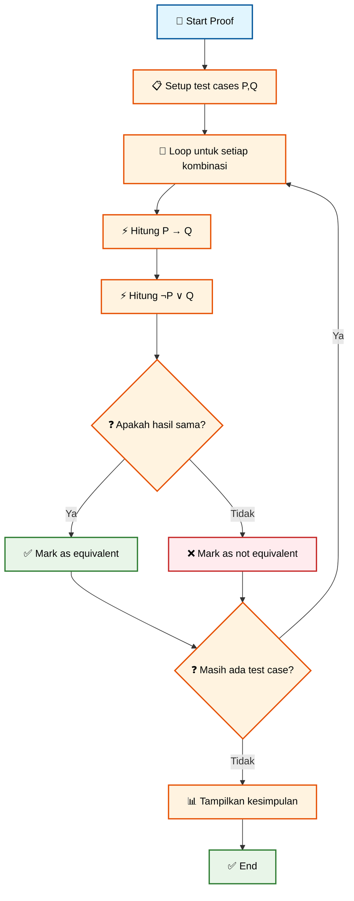

# 🎯 Pertemuan 3: Logical Equivalences dan Simplification


---

## 📋 Informasi Pertemuan

| **Aspek** | **Detail** |
|-----------|------------|
| 🕐 **Durasi** | 3 x 50 menit |
| 🎯 **Capaian Pembelajaran** | Menguasai hukum-hukum logika dan simplifikasi ekspresi |
| 📚 **Materi Utama** | Logical Equivalences, De Morgan's Laws, Boolean Algebra |
| 💻 **Tools** | Python, www.onlineide.pro, Logic Gate Simulators |
| 📖 **Prasyarat** | Pemahaman proposisi dan logical connectives dari pertemuan 2 |

---

## 🌟 Tujuan Pembelajaran

Setelah mengikuti pertemuan ini, mahasiswa diharapkan mampu:

1. **🔍 Mengidentifikasi** logical equivalences menggunakan truth tables
2. **⚡ Menerapkan** hukum-hukum logika (De Morgan's, Distributive, Associative)
3. **🧠 Menyederhanakan** ekspresi logika kompleks menjadi bentuk sederhana
4. **💻 Mengimplementasikan** Boolean algebra dalam digital circuits
5. **🎯 Membedakan** tautologies, contradictions, dan contingencies

---

## 🤔 Apa itu Logical Equivalence?

### 📖 Definisi Sederhana
**Logical Equivalence** adalah dua proposisi yang memiliki **nilai kebenaran yang sama** untuk semua kemungkinan nilai input.

### 🎭 Analogi Sederhana: Berbagai Jalan ke Tujuan yang Sama
Bayangkan Anda ingin pergi dari rumah ke kampus. Ada beberapa rute berbeda:
- **Rute A**: Jalan raya → jembatan → kampus
- **Rute B**: Gang → shortcut → kampus

Meskipun **jalurnya berbeda**, **tujuan akhirnya sama** - sampai di kampus. Begitu juga dengan logical equivalence: ekspresi yang berbeda bisa menghasilkan **hasil logika yang sama**.

### ≡ Simbol Equivalence
Kita gunakan simbol **≡** untuk menunjukkan bahwa dua ekspresi logically equivalent:
```
P → Q ≡ ¬P ∨ Q
```
Artinya: "P implies Q" **setara dengan** "NOT P OR Q"

---

## ⚖️ Cara Membuktikan Logical Equivalence

### 📊 Metode 1: Truth Table Comparison

```python
# Program untuk membuktikan logical equivalence menggunakan truth table
def check_logical_equivalence():
    """
    Program untuk membuktikan bahwa P → Q ≡ ¬P ∨ Q
    """
    print("🔍 PROOF: P → Q ≡ ¬P ∨ Q")
    print("="*50)
    
    # Header tabel
    print(f"{'P':<5} {'Q':<5} {'P→Q':<7} {'¬P':<5} {'¬P∨Q':<7} {'Equivalent?':<12}")
    print("-"*50)
    
    # Semua kombinasi nilai P dan Q
    test_cases = [
        (True, True),
        (True, False),
        (False, True),
        (False, False)
    ]
    
    all_equivalent = True  # Flag untuk cek apakah semua baris equivalent
    
    for p, q in test_cases:
        # Hitung P → Q (implication)
        implication = (not p) or q
        
        # Hitung ¬P ∨ Q (negation of P OR Q)
        not_p = not p
        disjunction = not_p or q
        
        # Cek apakah keduanya equivalent
        is_equivalent = implication == disjunction
        if not is_equivalent:
            all_equivalent = False
        
        # Format output untuk readability
        p_str = 'T' if p else 'F'
        q_str = 'T' if q else 'F'
        impl_str = 'T' if implication else 'F'
        not_p_str = 'T' if not_p else 'F'
        disj_str = 'T' if disjunction else 'F'
        equiv_str = '✅' if is_equivalent else '❌'
        
        print(f"{p_str:<5} {q_str:<5} {impl_str:<7} {not_p_str:<5} {disj_str:<7} {equiv_str:<12}")
    
    print("-"*50)
    if all_equivalent:
        print("🎉 KESIMPULAN: P → Q ≡ ¬P ∨ Q (TERBUKTI EQUIVALENT!)")
    else:
        print("❌ KESIMPULAN: Tidak equivalent")
    
    print("\n💡 Interpretasi:")
    print("   Kedua ekspresi menghasilkan nilai kebenaran yang sama")
    print("   untuk semua kemungkinan input P dan Q.")

# Jalankan program
check_logical_equivalence()
```

**🚀 Coba jalankan kode di atas di: [www.onlineide.pro](https://www.onlineide.pro)**

#### 📊 Alur Kerja Truth Table Comparison



---

## 📜 Hukum-Hukum Logika Fundamental

### 🔄 1. De Morgan's Laws (Hukum De Morgan)

**Hukum paling penting dalam logika!** Ditemukan oleh mathematician Augustus De Morgan.

#### 📖 De Morgan's Laws:
1. **¬(P ∧ Q) ≡ ¬P ∨ ¬Q**
2. **¬(P ∨ Q) ≡ ¬P ∧ ¬Q**

#### 🏠 Analogi Rumah Tangga
Bayangkan aturan: "Tidak boleh makan **DAN** menonton TV secara bersamaan"

**Cara 1**: ¬(Makan ∧ Menonton TV)
**Cara 2**: (Tidak makan) ∨ (Tidak menonton TV)

Keduanya artinya sama: Anda harus **tidak makan** ATAU **tidak menonton TV** (atau keduanya).

```python
# Implementasi dan Proof De Morgan's Laws
def de_morgan_laws_demo():
    """
    Demonstrasi dan pembuktian De Morgan's Laws
    """
    print("🔬 DE MORGAN'S LAWS DEMONSTRATION")
    print("="*45)
    
    # De Morgan's Law 1: ¬(P ∧ Q) ≡ ¬P ∨ ¬Q
    print("📜 Law 1: ¬(P ∧ Q) ≡ ¬P ∨ ¬Q")
    print("   Negasi dari (P AND Q) = (NOT P) OR (NOT Q)")
    print()
    
    print(f"{'P':<5} {'Q':<5} {'P∧Q':<7} {'¬(P∧Q)':<10} {'¬P':<5} {'¬Q':<5} {'¬P∨¬Q':<10} {'Equal?':<8}")
    print("-"*60)
    
    test_cases = [(True, True), (True, False), (False, True), (False, False)]
    
    for p, q in test_cases:
        # Left side: ¬(P ∧ Q)
        p_and_q = p and q
        not_p_and_q = not p_and_q
        
        # Right side: ¬P ∨ ¬Q
        not_p = not p
        not_q = not q
        not_p_or_not_q = not_p or not_q
        
        # Check equivalence
        is_equal = not_p_and_q == not_p_or_not_q
        
        # Format untuk display
        p_str = 'T' if p else 'F'
        q_str = 'T' if q else 'F'
        and_str = 'T' if p_and_q else 'F'
        not_and_str = 'T' if not_p_and_q else 'F'
        not_p_str = 'T' if not_p else 'F'
        not_q_str = 'T' if not_q else 'F'
        or_str = 'T' if not_p_or_not_q else 'F'
        equal_str = '✅' if is_equal else '❌'
        
        print(f"{p_str:<5} {q_str:<5} {and_str:<7} {not_and_str:<10} {not_p_str:<5} {not_q_str:<5} {or_str:<10} {equal_str:<8}")
    
    print("\n" + "="*45)
    
    # De Morgan's Law 2: ¬(P ∨ Q) ≡ ¬P ∧ ¬Q  
    print("📜 Law 2: ¬(P ∨ Q) ≡ ¬P ∧ ¬Q")
    print("   Negasi dari (P OR Q) = (NOT P) AND (NOT Q)")
    print()
    
    print(f"{'P':<5} {'Q':<5} {'P∨Q':<7} {'¬(P∨Q)':<10} {'¬P':<5} {'¬Q':<5} {'¬P∧¬Q':<10} {'Equal?':<8}")
    print("-"*60)
    
    for p, q in test_cases:
        # Left side: ¬(P ∨ Q)
        p_or_q = p or q
        not_p_or_q = not p_or_q
        
        # Right side: ¬P ∧ ¬Q
        not_p = not p
        not_q = not q
        not_p_and_not_q = not_p and not_q
        
        # Check equivalence
        is_equal = not_p_or_q == not_p_and_not_q
        
        # Format untuk display
        p_str = 'T' if p else 'F'
        q_str = 'T' if q else 'F'
        or_str = 'T' if p_or_q else 'F'
        not_or_str = 'T' if not_p_or_q else 'F'
        not_p_str = 'T' if not_p else 'F'
        not_q_str = 'T' if not_q else 'F'
        and_str = 'T' if not_p_and_not_q else 'F'
        equal_str = '✅' if is_equal else '❌'
        
        print(f"{p_str:<5} {q_str:<5} {or_str:<7} {not_or_str:<10} {not_p_str:<5} {not_q_str:<5} {and_str:<10} {equal_str:<8}")
    
    print("\n🎉 KEDUA HUKUM DE MORGAN TERBUKTI BENAR!")
    
    print("\n💡 Aplikasi Praktis:")
    print("   - Simplifikasi circuit design")
    print("   - Optimasi database queries")  
    print("   - Debugging logical conditions")

# Jalankan demonstrasi
de_morgan_laws_demo()
```

**🚀 Coba jalankan kode di atas di: [www.onlineide.pro](https://www.onlineide.pro)**

#### 📊 Alur Kerja De Morgan's Laws

```mermaid
flowchart TD
    A[🎯 Start De Morgan Demo] --> B[📜 Law 1: ¬(P ∧ Q) ≡ ¬P ∨ ¬Q]
    B --> C[🔄 Test all P,Q combinations]
    C --> D[⚡ Calculate P ∧ Q]
    D --> E[🚫 Calculate ¬(P ∧ Q)]
    E --> F[🚫 Calculate ¬P, ¬Q]
    F --> G[🎯 Calculate ¬P ∨ ¬Q]
    G --> H{❓ Left = Right?}
    H -->|Ya| I[✅ Mark equivalent]
    H -->|Tidak| J[❌ Mark not equivalent]
    I --> K{❓ More combinations?}
    J --> K
    K -->|Ya| C
    K -->|Tidak| L[📜 Law 2: ¬(P ∨ Q) ≡ ¬P ∧ ¬Q]
    L --> M[🔄 Repeat process for Law 2]
    M --> N[📊 Display conclusions]
    N --> O[✅ End]
    
    style A fill:#e1f5fe,stroke:#01579b,stroke-width:2px,color:#000
    style B fill:#fff3e0,stroke:#e65100,stroke-width:2px,color:#000
    style C fill:#fff3e0,stroke:#e65100,stroke-width:2px,color:#000
    style D fill:#fff3e0,stroke:#e65100,stroke-width:2px,color:#000
    style E fill:#fff3e0,stroke:#e65100,stroke-width:2px,color:#000
    style F fill:#fff3e0,stroke:#e65100,stroke-width:2px,color:#000
    style G fill:#fff3e0,stroke:#e65100,stroke-width:2px,color:#000
    style H fill:#fff3e0,stroke:#e65100,stroke-width:2px,color:#000
    style I fill:#e8f5e8,stroke:#2e7d32,stroke-width:2px,color:#000
    style J fill:#ffebee,stroke:#c62828,stroke-width:2px,color:#000
    style K fill:#fff3e0,stroke:#e65100,stroke-width:2px,color:#000
    style L fill:#fff3e0,stroke:#e65100,stroke-width:2px,color:#000
    style M fill:#fff3e0,stroke:#e65100,stroke-width:2px,color:#000
    style N fill:#fff3e0,stroke:#e65100,stroke-width:2px,color:#000
    style O fill:#e8f5e8,stroke:#2e7d32,stroke-width:2px,color:#000
```

### 🔀 2. Distributive Laws (Hukum Distributif)

Seperti distributif dalam matematika: a(b + c) = ab + ac

#### 📖 Distributive Laws:
1. **P ∧ (Q ∨ R) ≡ (P ∧ Q) ∨ (P ∧ R)**
2. **P ∨ (Q ∧ R) ≡ (P ∨ Q) ∧ (P ∨ R)**

#### 🛒 Analogi Berbelanja
Anda ke mall dengan aturan: "Beli baju **DAN** (sepatu **ATAU** tas)"

**Cara 1**: Beli baju DAN (sepatu ATAU tas)
**Cara 2**: (Beli baju DAN sepatu) ATAU (Beli baju DAN tas)

Keduanya menghasilkan hasil belanja yang sama!

```python
# Implementasi Distributive Laws
def distributive_laws_demo():
    """
    Demonstrasi Distributive Laws dengan contoh praktis
    """
    print("🔀 DISTRIBUTIVE LAWS DEMONSTRATION")
    print("="*40)
    
    # Contoh dengan proposisi yang mudah dipahami
    print("📝 Proposisi:")
    print("P: 'Cuaca cerah'")
    print("Q: 'Bawa kamera'") 
    print("R: 'Bawa payung'")
    print()
    
    print("🔀 Law 1: P ∧ (Q ∨ R) ≡ (P ∧ Q) ∨ (P ∧ R)")
    print("   Artinya: 'Cerah DAN (kamera ATAU payung)' =")
    print("            '(Cerah DAN kamera) ATAU (Cerah DAN payung)'")
    print()
    
    # Test untuk semua kombinasi (8 kombinasi untuk 3 variabel)
    test_cases = [
        (True, True, True),
        (True, True, False),
        (True, False, True),
        (True, False, False),
        (False, True, True),
        (False, True, False),
        (False, False, True),
        (False, False, False)
    ]
    
    print(f"{'P':<5} {'Q':<5} {'R':<5} {'Q∨R':<7} {'P∧(Q∨R)':<12} {'P∧Q':<7} {'P∧R':<7} {'(P∧Q)∨(P∧R)':<15} {'Equal?':<8}")
    print("-"*80)
    
    all_equal = True
    
    for p, q, r in test_cases:
        # Left side: P ∧ (Q ∨ R)
        q_or_r = q or r
        left_side = p and q_or_r
        
        # Right side: (P ∧ Q) ∨ (P ∧ R)
        p_and_q = p and q
        p_and_r = p and r
        right_side = p_and_q or p_and_r
        
        # Check equivalence
        is_equal = left_side == right_side
        if not is_equal:
            all_equal = False
        
        # Format output
        p_str = 'T' if p else 'F'
        q_str = 'T' if q else 'F'
        r_str = 'T' if r else 'F'
        qor_str = 'T' if q_or_r else 'F'
        left_str = 'T' if left_side else 'F'
        pq_str = 'T' if p_and_q else 'F'
        pr_str = 'T' if p_and_r else 'F'
        right_str = 'T' if right_side else 'F'
        equal_str = '✅' if is_equal else '❌'
        
        print(f"{p_str:<5} {q_str:<5} {r_str:<5} {qor_str:<7} {left_str:<12} {pq_str:<7} {pr_str:<7} {right_str:<15} {equal_str:<8}")
    
    if all_equal:
        print("\n🎉 DISTRIBUTIVE LAW 1 TERBUKTI BENAR!")
    
    print("\n💡 Interpretasi praktis:")
    print("   Jika cuaca cerah, Anda akan jalan-jalan.")
    print("   Anda akan bawa kamera ATAU payung (atau keduanya).")
    print("   Hasil akhir sama: jalan-jalan dengan persiapan yang tepat!")

# Jalankan demonstrasi
distributive_laws_demo()
```

**🚀 Coba jalankan kode di atas di: [www.onlineide.pro](https://www.onlineide.pro)**

### 🔁 3. Associative Laws (Hukum Asosiatif)

Urutan pengelompokan tidak mengubah hasil.

#### 📖 Associative Laws:
1. **(P ∧ Q) ∧ R ≡ P ∧ (Q ∧ R)**
2. **(P ∨ Q) ∨ R ≡ P ∨ (Q ∨ R)**

#### 👥 Analogi Kelompok Belajar
Membentuk grup belajar 3 orang: Ali, Budi, Citra

**Cara 1**: (Ali + Budi) + Citra
**Cara 2**: Ali + (Budi + Citra)

Hasilnya tetap sama: grup belajar dengan 3 orang yang sama!

### 🔑 4. Identity Laws (Hukum Identitas)

#### 📖 Identity Laws:
1. **P ∧ T ≡ P** (AND dengan True = P itu sendiri)
2. **P ∨ F ≡ P** (OR dengan False = P itu sendiri)

#### 🔢 Analogi Matematika
- P + 0 = P (0 adalah identity untuk penjumlahan)
- P × 1 = P (1 adalah identity untuk perkalian)

---

## 🎯 Tautologies, Contradictions, dan Contingencies

### ✅ Tautology
**Proposisi yang selalu BENAR** untuk semua kemungkinan nilai input.

```python
# Contoh Tautology: P ∨ ¬P (Law of Excluded Middle)
def tautology_demo():
    """
    Demonstrasi tautology: P ∨ ¬P
    """
    print("✅ TAUTOLOGY DEMO: P ∨ ¬P")
    print("="*30)
    print("'P atau tidak P' - selalu benar!")
    print()
    
    print(f"{'P':<5} {'¬P':<5} {'P ∨ ¬P':<10}")
    print("-"*20)
    
    for p in [True, False]:
        not_p = not p
        tautology = p or not_p  # Selalu True!
        
        p_str = 'T' if p else 'F'
        not_p_str = 'T' if not_p else 'F'
        result_str = 'T' if tautology else 'F'
        
        print(f"{p_str:<5} {not_p_str:<5} {result_str:<10}")
    
    print("\n💡 Contoh dalam kehidupan:")
    print("   'Hari ini hujan ATAU tidak hujan' - pasti benar!")
    print("   'Lampu menyala ATAU tidak menyala' - pasti benar!")

tautology_demo()
```

**🚀 Coba jalankan kode di atas di: [www.onlineide.pro](https://www.onlineide.pro)**

### ❌ Contradiction
**Proposisi yang selalu SALAH** untuk semua kemungkinan nilai input.

```python
# Contoh Contradiction: P ∧ ¬P
def contradiction_demo():
    """
    Demonstrasi contradiction: P ∧ ¬P
    """
    print("❌ CONTRADICTION DEMO: P ∧ ¬P")
    print("="*32)
    print("'P dan tidak P' - selalu salah!")
    print()
    
    print(f"{'P':<5} {'¬P':<5} {'P ∧ ¬P':<10}")
    print("-"*20)
    
    for p in [True, False]:
        not_p = not p
        contradiction = p and not_p  # Selalu False!
        
        p_str = 'T' if p else 'F'
        not_p_str = 'T' if not_p else 'F'
        result_str = 'T' if contradiction else 'F'
        
        print(f"{p_str:<5} {not_p_str:<5} {result_str:<10}")
    
    print("\n💡 Contoh dalam kehidupan:")
    print("   'Hari ini hujan DAN tidak hujan' - mustahil!")
    print("   'Saya ada DAN tidak ada di sini' - mustahil!")

contradiction_demo()
```

**🚀 Coba jalankan kode di atas di: [www.onlineide.pro](https://www.onlineide.pro)**

### ⚖️ Contingency
**Proposisi yang bisa BENAR atau SALAH** tergantung nilai input.

```python
# Contoh Contingency: P → Q
def contingency_demo():
    """
    Demonstrasi contingency: P → Q
    """
    print("⚖️ CONTINGENCY DEMO: P → Q")
    print("="*28)
    print("'Jika P maka Q' - tergantung nilai P dan Q")
    print()
    
    print(f"{'P':<5} {'Q':<5} {'P → Q':<10} {'Keterangan':<20}")
    print("-"*45)
    
    test_cases = [(True, True), (True, False), (False, True), (False, False)]
    
    for p, q in test_cases:
        implication = (not p) or q
        
        p_str = 'T' if p else 'F'
        q_str = 'T' if q else 'F'
        result_str = 'T' if implication else 'F'
        
        if p and q:
            explanation = "Janji ditepati ✅"
        elif p and not q:
            explanation = "Janji dilanggar ❌"
        elif not p and q:
            explanation = "Tidak janji, hasil bagus"
        else:
            explanation = "Tidak janji, hasil biasa"
        
        print(f"{p_str:<5} {q_str:<5} {result_str:<10} {explanation:<20}")
    
    print("\n💡 Contingency artinya:")
    print("   Nilai kebenaran tergantung pada input")
    print("   Bukan selalu benar (tautology)")
    print("   Bukan selalu salah (contradiction)")

contingency_demo()
```

**🚀 Coba jalankan kode di atas di: [www.onlineide.pro](https://www.onlineide.pro)**

---

## 🔧 Boolean Algebra dan Digital Circuits

### ⚡ Aplikasi dalam Digital Electronics

Boolean algebra adalah **jantung** dari semua komputer modern!

```python
# Simulasi Digital Circuit menggunakan Boolean Algebra
def digital_circuit_simulator():
    """
    Simulator sederhana untuk digital logic gates
    """
    print("⚡ DIGITAL CIRCUIT SIMULATOR")
    print("="*35)
    
    # Input signals (dalam dunia nyata ini voltage: 5V = True, 0V = False)
    A = True   # Input A (switch/sensor)
    B = False  # Input B (switch/sensor)
    C = True   # Input C (switch/sensor)
    
    print(f"📥 Input Signals:")
    print(f"A = {A} ({'5V' if A else '0V'})")
    print(f"B = {B} ({'5V' if B else '0V'})")
    print(f"C = {C} ({'5V' if C else '0V'})")
    print()
    
    # Basic Logic Gates
    print("🔌 Basic Logic Gates:")
    and_gate = A and B
    or_gate = A or B
    not_gate_A = not A
    nand_gate = not (A and B)
    nor_gate = not (A or B)
    xor_gate = (A and not B) or (not A and B)  # Exclusive OR
    
    print(f"AND Gate (A ∧ B):     {and_gate}")
    print(f"OR Gate (A ∨ B):      {or_gate}")
    print(f"NOT Gate (¬A):        {not_gate_A}")
    print(f"NAND Gate (¬(A ∧ B)): {nand_gate}")
    print(f"NOR Gate (¬(A ∨ B)):  {nor_gate}")
    print(f"XOR Gate (A ⊕ B):     {xor_gate}")
    print()
    
    # Complex Circuit Example: Full Adder (simplified)
    print("🏗️ Complex Circuit: Simplified Full Adder")
    print("   Input: A, B, C (Carry-in)")
    print("   Output: Sum, Carry-out")
    
    # Sum = A ⊕ B ⊕ C (XOR all three)
    sum_bit = (A and not B and not C) or (not A and B and not C) or (not A and not B and C) or (A and B and C)
    
    # Carry = (A ∧ B) ∨ (A ∧ C) ∨ (B ∧ C)
    carry_out = (A and B) or (A and C) or (B and C)
    
    print(f"   Sum Output:   {sum_bit}")
    print(f"   Carry Output: {carry_out}")
    print()
    
    # Simplification Example menggunakan De Morgan
    print("🔬 Circuit Simplification using De Morgan's Law:")
    print("   Original: ¬(A ∧ B)")
    print("   Simplified: ¬A ∨ ¬B")
    
    original = not (A and B)
    simplified = (not A) or (not B)
    
    print(f"   Original result:   {original}")
    print(f"   Simplified result: {simplified}")
    print(f"   Are they equal? {'✅ Yes' if original == simplified else '❌ No'}")
    
    print("\n💡 Real Applications:")
    print("   - CPU arithmetic operations")
    print("   - Memory address decoding")
    print("   - Control unit logic")
    print("   - Digital signal processing")

# Jalankan simulator
digital_circuit_simulator()
```

**🚀 Coba jalankan kode di atas di: [www.onlineide.pro](https://www.onlineide.pro)**

#### 📊 Alur Kerja Digital Circuit

```mermaid
flowchart TD
    A[📥 Input: A, B, C] --> B[⚡ Basic Logic Gates]
    B --> C[🤝 AND Gate: A ∧ B]
    B --> D[🎯 OR Gate: A ∨ B]
    B --> E[🚫 NOT Gate: ¬A]
    B --> F[🔄 NAND Gate: ¬(A ∧ B)]
    B --> G[↔️ XOR Gate: A ⊕ B]
    
    C --> H[🏗️ Complex Circuit: Full Adder]
    D --> H
    E --> H
    F --> H
    G --> H
    
    H --> I[⚡ Calculate Sum]
    H --> J[⚡ Calculate Carry]
    
    I --> K[📊 Display Results]
    J --> K
    
    K --> L[🔬 Apply Simplification]
    L --> M[✅ Verify Equivalence]
    M --> N[📤 Output Final Results]
    
    style A fill:#e1f5fe,stroke:#01579b,stroke-width:2px,color:#000
    style B fill:#fff3e0,stroke:#e65100,stroke-width:2px,color:#000
    style C fill:#fff3e0,stroke:#e65100,stroke-width:2px,color:#000
    style D fill:#fff3e0,stroke:#e65100,stroke-width:2px,color:#000
    style E fill:#fff3e0,stroke:#e65100,stroke-width:2px,color:#000
    style F fill:#fff3e0,stroke:#e65100,stroke-width:2px,color:#000
    style G fill:#fff3e0,stroke:#e65100,stroke-width:2px,color:#000
    style H fill:#fff3e0,stroke:#e65100,stroke-width:2px,color:#000
    style I fill:#fff3e0,stroke:#e65100,stroke-width:2px,color:#000
    style J fill:#fff3e0,stroke:#e65100,stroke-width:2px,color:#000
    style K fill:#fff3e0,stroke:#e65100,stroke-width:2px,color:#000
    style L fill:#fff3e0,stroke:#e65100,stroke-width:2px,color:#000
    style M fill:#fff3e0,stroke:#e65100,stroke-width:2px,color:#000
    style N fill:#e8f5e8,stroke:#2e7d32,stroke-width:2px,color:#000
```

---

## 🧮 Logic Expression Simplifier

Mari kita buat tool untuk menyederhanakan ekspresi logika!

```python
# Logic Expression Simplifier Tool
def logic_simplifier():
    """
    Tool untuk menyederhanakan ekspresi logika menggunakan Boolean laws
    """
    print("🧮 LOGIC EXPRESSION SIMPLIFIER")
    print("="*40)
    
    print("📚 Available Simplification Rules:")
    print("1. Identity Laws:")
    print("   - P ∧ T ≡ P")
    print("   - P ∨ F ≡ P")
    print("2. Domination Laws:")
    print("   - P ∧ F ≡ F")
    print("   - P ∨ T ≡ T")
    print("3. Idempotent Laws:")
    print("   - P ∧ P ≡ P")
    print("   - P ∨ P ≡ P")
    print("4. Complement Laws:")
    print("   - P ∧ ¬P ≡ F")
    print("   - P ∨ ¬P ≡ T")
    print("5. De Morgan's Laws:")
    print("   - ¬(P ∧ Q) ≡ ¬P ∨ ¬Q")
    print("   - ¬(P ∨ Q) ≡ ¬P ∧ ¬Q")
    print()
    
    # Contoh simplification
    print("🔧 Example Simplifications:")
    print()
    
    # Example 1: P ∧ T ≡ P
    print("Example 1: P ∧ T")
    for p in [True, False]:
        original = p and True
        simplified = p
        p_str = 'T' if p else 'F'
        orig_str = 'T' if original else 'F'
        simp_str = 'T' if simplified else 'F'
        print(f"  P={p_str}: P ∧ T = {orig_str}, simplified to P = {simp_str}")
    print("  ✅ Rule applied: Identity Law")
    print()
    
    # Example 2: P ∨ ¬P ≡ T
    print("Example 2: P ∨ ¬P")
    for p in [True, False]:
        original = p or (not p)
        simplified = True  # Always True (Tautology)
        p_str = 'T' if p else 'F'
        orig_str = 'T' if original else 'F'
        simp_str = 'T' if simplified else 'F'
        print(f"  P={p_str}: P ∨ ¬P = {orig_str}, simplified to T = {simp_str}")
    print("  ✅ Rule applied: Complement Law (Tautology)")
    print()
    
    # Example 3: ¬(P ∧ Q) using De Morgan
    print("Example 3: ¬(P ∧ Q) using De Morgan's Law")
    print(f"{'P':<5} {'Q':<5} {'P∧Q':<7} {'¬(P∧Q)':<10} {'¬P∨¬Q':<10} {'Simplified?':<12}")
    print("-"*55)
    
    for p in [True, False]:
        for q in [True, False]:
            # Original: ¬(P ∧ Q)
            original = not (p and q)
            # Simplified using De Morgan: ¬P ∨ ¬Q
            simplified = (not p) or (not q)
            
            p_str = 'T' if p else 'F'
            q_str = 'T' if q else 'F'
            and_str = 'T' if (p and q) else 'F'
            orig_str = 'T' if original else 'F'
            simp_str = 'T' if simplified else 'F'
            equal = '✅' if original == simplified else '❌'
            
            print(f"{p_str:<5} {q_str:<5} {and_str:<7} {orig_str:<10} {simp_str:<10} {equal:<12}")
    
    print("  ✅ Rule applied: De Morgan's Law")
    print()
    
    print("💡 Why Simplify?")
    print("   - Fewer logic gates needed (cheaper circuits)")
    print("   - Faster computation (less processing steps)")
    print("   - Easier debugging (simpler expressions)")
    print("   - Lower power consumption (fewer operations)")

# Jalankan simplifier
logic_simplifier()
```

**🚀 Coba jalankan kode di atas di: [www.onlineide.pro](https://www.onlineide.pro)**

---

## 🎯 Latihan Interaktif

### 🧩 Latihan 1: Identifikasi Equivalences

**Instruksi**: Tentukan apakah pasangan ekspresi berikut equivalent atau tidak!

1. **P → Q** dan **¬P ∨ Q**
2. **¬(P ∧ Q)** dan **¬P ∨ ¬Q**
3. **P ∧ (Q ∨ R)** dan **(P ∧ Q) ∨ (P ∧ R)**
4. **P ∨ P** dan **P**
5. **P ∧ ¬P** dan **False**

**Jawaban**:
1. ✅ **Equivalent** (Definition of implication)
2. ✅ **Equivalent** (De Morgan's Law)
3. ✅ **Equivalent** (Distributive Law)
4. ✅ **Equivalent** (Idempotent Law)
5. ✅ **Equivalent** (Contradiction/Complement Law)

### 🧩 Latihan 2: Simplification Challenge

```python
# Latihan Simplification
def simplification_challenge():
    """
    Challenge untuk menyederhanakan ekspresi logika kompleks
    """
    print("🏆 SIMPLIFICATION CHALLENGE")
    print("="*35)
    
    # Challenge 1: (P ∧ Q) ∨ (P ∧ ¬Q)
    print("Challenge 1: (P ∧ Q) ∨ (P ∧ ¬Q)")
    print("Hint: Gunakan Distributive Law")
    print()
    
    print(f"{'P':<5} {'Q':<5} {'P∧Q':<7} {'¬Q':<5} {'P∧¬Q':<8} {'(P∧Q)∨(P∧¬Q)':<18} {'Simplified':<12}")
    print("-"*70)
    
    for p in [True, False]:
        for q in [True, False]:
            p_and_q = p and q
            not_q = not q
            p_and_not_q = p and not_q
            original = p_and_q or p_and_not_q
            simplified = p  # (P ∧ Q) ∨ (P ∧ ¬Q) ≡ P ∧ (Q ∨ ¬Q) ≡ P ∧ T ≡ P
            
            p_str = 'T' if p else 'F'
            q_str = 'T' if q else 'F'
            pq_str = 'T' if p_and_q else 'F'
            notq_str = 'T' if not_q else 'F'
            pnotq_str = 'T' if p_and_not_q else 'F'
            orig_str = 'T' if original else 'F'
            simp_str = 'T' if simplified else 'F'
            
            print(f"{p_str:<5} {q_str:<5} {pq_str:<7} {notq_str:<5} {pnotq_str:<8} {orig_str:<18} {simp_str:<12}")
    
    print("\n✅ Answer: (P ∧ Q) ∨ (P ∧ ¬Q) ≡ P")
    print("   Explanation: P ∧ (Q ∨ ¬Q) = P ∧ T = P")
    print()
    
    # Challenge 2: ¬(¬P ∧ ¬Q)
    print("Challenge 2: ¬(¬P ∧ ¬Q)")
    print("Hint: Gunakan De Morgan's Law")
    print()
    
    print(f"{'P':<5} {'Q':<5} {'¬P':<5} {'¬Q':<5} {'¬P∧¬Q':<8} {'¬(¬P∧¬Q)':<12} {'P∨Q':<7}")
    print("-"*55)
    
    for p in [True, False]:
        for q in [True, False]:
            not_p = not p
            not_q = not q
            not_p_and_not_q = not_p and not_q
            original = not not_p_and_not_q
            simplified = p or q  # ¬(¬P ∧ ¬Q) ≡ P ∨ Q (De Morgan)
            
            p_str = 'T' if p else 'F'
            q_str = 'T' if q else 'F'
            notp_str = 'T' if not_p else 'F'
            notq_str = 'T' if not_q else 'F'
            and_str = 'T' if not_p_and_not_q else 'F'
            orig_str = 'T' if original else 'F'
            simp_str = 'T' if simplified else 'F'
            
            print(f"{p_str:<5} {q_str:<5} {notp_str:<5} {notq_str:<5} {and_str:<8} {orig_str:<12} {simp_str:<7}")
    
    print("\n✅ Answer: ¬(¬P ∧ ¬Q) ≡ P ∨ Q")
    print("   Explanation: De Morgan's Law applied")

# Jalankan challenge
simplification_challenge()
```

**🚀 Coba jalankan kode di atas di: [www.onlineide.pro](https://www.onlineide.pro)**

### 🧩 Latihan 3: Real-World Logic Optimization

```python
# Optimasi Logika untuk Sistem Nyata
def real_world_optimization():
    """
    Contoh optimasi logika dalam sistem dunia nyata
    """
    print("🌍 REAL-WORLD LOGIC OPTIMIZATION")
    print("="*40)
    
    # Scenario: Smart Home Security System
    print("🏠 Scenario: Smart Home Security System")
    print()
    print("📝 Variables:")
    print("   D: Door sensor activated")
    print("   W: Window sensor activated")
    print("   M: Motion detector triggered")
    print("   T: Time is night (after 10 PM)")
    print()
    
    # Original complex condition
    print("🔧 Original Alarm Condition (kompleks):")
    print("   Alarm = (D ∧ T) ∨ (W ∧ T) ∨ (M ∧ T)")
    print("   'Alarm jika ada aktivitas DAN malam hari'")
    print()
    
    # Test scenarios
    scenarios = [
        (True, False, False, True, "Door opened at night"),
        (False, True, False, True, "Window opened at night"), 
        (False, False, True, True, "Motion detected at night"),
        (True, False, False, False, "Door opened during day"),
        (False, False, False, True, "Night time, no activity"),
        (True, True, True, True, "Multiple sensors at night")
    ]
    
    print(f"{'D':<5} {'W':<5} {'M':<5} {'T':<5} {'Original':<10} {'Simplified':<12} {'Scenario':<25}")
    print("-"*75)
    
    for d, w, m, t, description in scenarios:
        # Original: (D ∧ T) ∨ (W ∧ T) ∨ (M ∧ T)
        original = (d and t) or (w and t) or (m and t)
        
        # Simplified using Distributive Law: (D ∨ W ∨ M) ∧ T
        simplified = (d or w or m) and t
        
        d_str = 'T' if d else 'F'
        w_str = 'T' if w else 'F'
        m_str = 'T' if m else 'F'
        t_str = 'T' if t else 'F'
        orig_str = 'T' if original else 'F'
        simp_str = 'T' if simplified else 'F'
        
        print(f"{d_str:<5} {w_str:<5} {m_str:<5} {t_str:<5} {orig_str:<10} {simp_str:<12} {description:<25}")
    
    print()
    print("✅ Simplified Condition:")
    print("   Alarm = (D ∨ W ∨ M) ∧ T")
    print("   'Alarm jika (ada aktivitas apapun) DAN malam hari'")
    print()
    
    print("💰 Benefits of Simplification:")
    print("   - Fewer logic operations (faster processing)")
    print("   - Less complex code (easier maintenance)")
    print("   - Lower power consumption")
    print("   - Easier to understand and debug")
    print()
    
    # Database Query Optimization Example
    print("🗄️ Database Query Optimization:")
    print("   Original SQL WHERE clause:")
    print("   WHERE (age > 18 AND city = 'Jakarta') OR")
    print("         (age > 18 AND city = 'Bandung') OR")
    print("         (age > 18 AND city = 'Surabaya')")
    print()
    print("   Optimized using Distributive Law:")
    print("   WHERE age > 18 AND (city = 'Jakarta' OR")
    print("                      city = 'Bandung' OR")
    print("                      city = 'Surabaya')")
    print("   or even better:")
    print("   WHERE age > 18 AND city IN ('Jakarta', 'Bandung', 'Surabaya')")

# Jalankan optimasi
real_world_optimization()
```

**🚀 Coba jalankan kode di atas di: [www.onlineide.pro](https://www.onlineide.pro)**

---

## 📚 Daftar Istilah dan Singkatan

| **Istilah/Singkatan** | **Pengertian** |
|----------------------|----------------|
| **Associative Laws** | Hukum yang menyatakan urutan pengelompokan tidak mengubah hasil |
| **Boolean Algebra** | Sistem aljabar untuk operasi logika dengan nilai True/False |
| **Complement Laws** | Hukum tentang negasi: P ∧ ¬P ≡ F, P ∨ ¬P ≡ T |
| **Contingency** | Proposisi yang bisa True atau False tergantung input |
| **Contradiction** | Proposisi yang selalu False untuk semua input |
| **De Morgan's Laws** | Hukum distribusi negasi: ¬(P∧Q) ≡ ¬P∨¬Q, ¬(P∨Q) ≡ ¬P∧¬Q |
| **Distributive Laws** | Hukum distribusi: P∧(Q∨R) ≡ (P∧Q)∨(P∧R) |
| **Domination Laws** | Hukum dominasi: P ∧ F ≡ F, P ∨ T ≡ T |
| **Equivalence (≡)** | Dua proposisi yang memiliki nilai kebenaran sama |
| **Full Adder** | Circuit digital untuk menjumlahkan tiga bit binary |
| **Identity Laws** | Hukum identitas: P ∧ T ≡ P, P ∨ F ≡ P |
| **Idempotent Laws** | Hukum idempoten: P ∧ P ≡ P, P ∨ P ≡ P |
| **Logic Gate** | Komponen elektronik yang melakukan operasi Boolean |
| **Logical Equivalence** | Kesetaraan dua ekspresi logika |
| **NAND** | NOT AND gate - kebalikan dari AND |
| **NOR** | NOT OR gate - kebalikan dari OR |
| **Simplification** | Proses menyederhanakan ekspresi logika |
| **Tautology** | Proposisi yang selalu True untuk semua input |
| **Truth Table Method** | Metode pembuktian menggunakan tabel kebenaran |
| **XOR (⊕)** | Exclusive OR - True jika input berbeda |

---

## 🏆 Rangkuman Pertemuan 3

### ✅ Apa yang Sudah Kita Pelajari?

1. **🔍 Logical Equivalence**: Dua proposisi dengan nilai kebenaran yang sama
2. **📜 Hukum-hukum Logika**: De Morgan's, Distributive, Associative, Identity
3. **🎯 Klasifikasi Proposisi**: Tautologies, Contradictions, Contingencies
4. **🔧 Boolean Algebra**: Aplikasi dalam digital circuits dan optimasi
5. **💻 Practical Applications**: Database queries, security systems, circuit design

### 🔑 Hukum-Hukum Utama

| **Hukum** | **Formula** | **Aplikasi** |
|-----------|-------------|-------------|
| **De Morgan's** | ¬(P∧Q) ≡ ¬P∨¬Q | Circuit simplification |
| **Distributive** | P∧(Q∨R) ≡ (P∧Q)∨(P∧R) | Query optimization |
| **Identity** | P∧T ≡ P, P∨F ≡ P | Code optimization |
| **Complement** | P∧¬P ≡ F, P∨¬P ≡ T | Contradiction detection |

### 🎯 Key Takeaways

- **Equivalence = Same truth values for all inputs**
- **De Morgan's Laws = Fundamental for circuit design**
- **Simplification = Fewer operations, better performance**
- **Tautology = Always True (like P ∨ ¬P)**
- **Contradiction = Always False (like P ∧ ¬P)**

### 🚀 Persiapan Pertemuan Selanjutnya

Pada pertemuan berikutnya (Pertemuan 4), kita akan mempelajari:
- **Introduction to Proofs** - Struktur dan teknik dasar pembuktian
- **Direct Proofs** - Pembuktian langsung dengan examples
- **Proof Writing** - Mathematical writing yang baik dan benar
- **Applications in CS** - Pembuktian dalam konteks programming

---

## 📚 Referensi dan Sumber Belajar

### 📖 Buku Referensi Utama

1. **Rosen, K. H.** (2019). *Discrete Mathematics and Its Applications* (8th ed.). McGraw-Hill Education.
   - Chapter 1.3: Propositional Equivalences

2. **Lehman, E., Leighton, F. T., & Meyer, A. R.** (2017). *Mathematics for Computer Science*. MIT Press.
   - Chapter 3: Logical Formulas
   - 🔗 Online: https://ocw.mit.edu/courses/6-042j-mathematics-for-computer-science-fall-2010/

3. **Ben-Ari, M.** (2012). *Mathematical Logic for Computer Science* (3rd ed.). Springer.
   - Chapter 2.3: Logical Equivalence and Normal Forms

4. **Shoenfield, J. R.** (2001). *Mathematical Logic*. CRC Press.
   - Chapter 1: Propositional Logic

### 🌐 Sumber Online

1. **MIT OpenCourseWare**: Mathematics for Computer Science
   - 🔗 https://ocw.mit.edu/courses/6-042j-mathematics-for-computer-science-fall-2010/video_galleries/video-lectures/

2. **Stanford CS103**: Mathematical Foundations of Computing  
   - 🔗 https://cs103.stanford.edu/
   - 🔗 https://web.stanford.edu/class/cs103/tools/truth-table-tool/

3. **GeeksforGeeks**: Logical Equivalence
   - 🔗 https://www.geeksforgeeks.org/logical-equivalence-of-propositional-formulas/

4. **Brilliant.org**: Logic Course
   - 🔗 https://brilliant.org/courses/logic/

### 🛠️ Interactive Tools dan Simulators

1. **Logic Gate Simulator**:
   - 🔗 https://logic.ly/
   - 🔗 https://www.falstad.com/circuit/

2. **Boolean Algebra Calculator**:
   - 🔗 https://www.boolean-algebra.com/
   - 🔗 https://web.stanford.edu/class/cs103/tools/truth-table-tool/

3. **Circuit Simplification Tools**:
   - 🔗 https://www.32x8.com/
   - 🔗 https://www.allaboutcircuits.com/tools/karnaugh-map-builder/

4. **Truth Table Generators**:
   - 🔗 https://web.stanford.edu/class/cs103/tools/truth-table-tool/
   - 🔗 https://www.mathsisfun.com/definitions/truth-table.html

### 📱 Mobile Apps untuk Practice

1. **LogicLike**: Logic puzzles dan exercises
2. **Boolean Algebra**: Practice app untuk Android/iOS
3. **Logic Gates**: Digital circuit simulator
4. **Truth Table**: Mobile truth table generator

---

## 💡 Tips Sukses Menguasai Logical Equivalences

### 🎯 Strategi Belajar Efektif

1. **🧩 Practice Pattern Recognition**: Latihan mengenali pola equivalences setiap hari
2. **🔄 Apply Laws Systematically**: Gunakan hukum-hukum secara bertahap, jangan sekaligus
3. **📝 Write Step-by-Step**: Tuliskan setiap langkah simplification dengan jelas
4. **🤝 Work in Groups**: Diskusi proof dan simplification dengan teman

### 🚀 Memory Techniques

**Mnemonics untuk De Morgan's Laws:**
- **"Break the line, change the sign"**
  - Break: Ubah ∧ menjadi ∨ (atau sebaliknya)
  - Change: Tambahkan negasi pada setiap term

**Mnemonics untuk Distributive Law:**
- **"Factor out like in algebra"**
  - P ∧ (Q ∨ R) = P × (Q + R) = P×Q + P×R = (P ∧ Q) ∨ (P ∧ R)

### 🔧 Practical Application Tips

1. **Start Simple**: Mulai dengan equivalences sederhana sebelum yang kompleks
2. **Use Truth Tables**: Ketika ragu, selalu verifikasi dengan truth table  
3. **Check Your Work**: Substitusi nilai sederhana untuk validasi cepat
4. **Think Circuits**: Visualisasikan sebagai logic gates untuk pemahaman lebih baik

---

## 📝 Assignment 2: Logical Equivalences dan Simplification

### 🎯 Petunjuk Pengerjaan

**Deadline**: Sebelum pertemuan ke-4  
**Format**: Upload file Python (.py) dan document PDF untuk proof manual  
**Platform**: Submit di Learning Management System  
**Bobot**: 7 marks

### 📋 Soal-soal

#### **Soal 1** (2 marks): Truth Table Proof
Buktikan menggunakan truth table bahwa: **¬(P → Q) ≡ P ∧ ¬Q**

#### **Soal 2** (2 marks): Step-by-Step Simplification  
Sederhanakan ekspresi berikut menggunakan hukum-hukum logika (tunjukkan setiap langkah):
**¬(¬P ∨ Q) ∧ (P ∨ ¬Q)**

#### **Soal 3** (2 marks): Programming Implementation
Buat program Python yang:
1. Menerima input tiga proposisi P, Q, R
2. Mengevaluasi ekspresi: **(P ∧ Q) ∨ (¬P ∧ R) ∨ (Q ∧ R)**
3. Menggunakan hukum distributif untuk menyederhanakan
4. Menampilkan perbandingan kompleksitas (jumlah operasi)

#### **Soal 4** (1 mark): Real-world Application
Buatlah skenario sistem keamanan gedung dengan 4 sensor berbeda. Tulis kondisi alarm dalam bentuk logical expression yang kompleks, kemudian sederhanakan menggunakan hukum-hukum logika.

### 📤 Template Submission

```python
# Assignment 2: Logical Equivalences dan Simplification
# Nama: [Nama Lengkap]
# NIM: [Nomor Induk Mahasiswa]  
# Kelas: [Kelas]

print("="*60)
print("ASSIGNMENT 2: LOGICAL EQUIVALENCES DAN SIMPLIFICATION")
print("="*60)

# SOAL 1: Truth Table Proof
def soal_1():
    """
    Buktikan: ¬(P → Q) ≡ P ∧ ¬Q
    """
    print("\nSOAL 1: TRUTH TABLE PROOF")
    print("="*30)
    # Your code here
    pass

# SOAL 2: Step-by-Step Simplification
def soal_2():
    """
    Sederhanakan: ¬(¬P ∨ Q) ∧ (P ∨ ¬Q)
    """
    print("\nSOAL 2: STEP-BY-STEP SIMPLIFICATION")
    print("="*35)
    # Your code here - tunjukkan setiap langkah
    pass

# SOAL 3: Programming Implementation
def soal_3():
    """
    Program evaluasi dan simplifikasi expression
    """
    print("\nSOAL 3: PROGRAMMING IMPLEMENTATION")
    print("="*35)
    # Your code here
    pass

# SOAL 4: Real-world Application  
def soal_4():
    """
    Skenario sistem keamanan gedung
    """
    print("\nSOAL 4: REAL-WORLD APPLICATION")
    print("="*35)
    # Your code here
    pass

# Jalankan semua soal
if __name__ == "__main__":
    soal_1()
    soal_2() 
    soal_3()
    soal_4()
    print("\n" + "="*60)
    print("ASSIGNMENT 2 COMPLETED")
    print("="*60)
```

### 📊 Rubrik Penilaian

| **Kriteria** | **Excellent (A)** | **Good (B)** | **Satisfactory (C)** | **Needs Improvement (D)** |
|--------------|-------------------|--------------|----------------------|---------------------------|
| **Truth Table Construction** | Sempurna, semua nilai benar | Minor errors, konsep benar | Beberapa kesalahan | Banyak kesalahan fundamental |
| **Logical Laws Application** | Menggunakan hukum dengan tepat | Sebagian besar benar | Beberapa hukum salah aplikasi | Tidak memahami hukum-hukum |
| **Code Implementation** | Berfungsi sempurna, efisien | Berfungsi dengan minor bugs | Berfungsi tapi tidak optimal | Banyak bugs atau tidak jalan |
| **Real-world Application** | Kreatif dan relevan | Baik dan applicable | Cukup memadai | Tidak relevan atau terlalu sederhana |

---

*🎓 Selamat belajar! Logical equivalences adalah kunci untuk optimasi dan simplification dalam computer science. Master these laws, optimize everything! 🚀*
